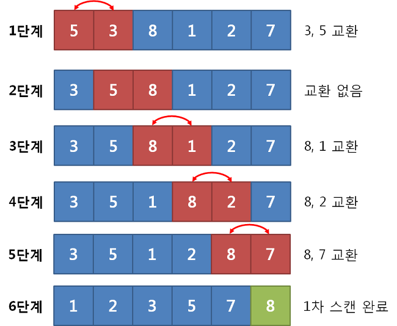
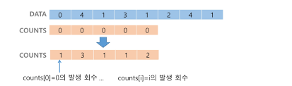

## 알고리즘
- 유한한 단계를 통해 문제를 해결하기 위한 절차나 방법
- 주로 컴퓨터용어로 쓰이며, 컴퓨터가 어떤 일을 수행하기 위한 단계적 방법
- 어떠한 문제를 해결하기 위한 절차

- 표현방식
    - 의사코드(Pseudocode), 순서도
- 좋은 알고리즘이란
    - 정확성 : 얼마나 정확하게 동작하는가
    - 작업량 : 얼마나 적은 연산으로 원하는 결과를 얻어내는가
    - 메모리 사용량 : 얼마나 적은 메모리를 사용하는가
    - 단순성 : 얼마나 단순한가
    - 최적성 : 더 이상 개선할 여지없이 최적화되었는가

### 시간복잡도

- 알고리즘의 작업량을 표현할 때 사용
- 실제 걸리는 시간을 측정
- 실행되는 명령문의 개수를 계산

### 빅-오(O) 표기법

- 시간 복잡도 함수 중에서 가장 큰 영량력을 주는 n에 대한 항만을 표시
- 계수는 생략하여 표시
    
    
    

## 배열

- 일정한 자료형의 변수들을 하나의 이름으로 열거하여 사용하는 자료구조
- 필요성
    - 프로그램 내에서 여러 개의 변수가 필요할 때, 일일이 다른 변수명을 이용하여 자료에 접근하는 것은 매우 비효율적
    - 배열을 사용하면 하나의 선언을 통해 둘 이상의 변수를 선언
    - 다수의 변수 선언을 의미하는 것이 아니라, 다수의 변수로는 하기 힘든 작업을 배열을 활용해 쉽게 할 수 있다.

- 1차원 배열의 선언
    - 별도의 선언방법이 없으며 변수에 처음 값을 할당할 때 생성

- 연습 문제
    
    [SW Expert Academy) 16504. Gravity](https://swexpertacademy.com/main/code/userProblem/userProblemDetail.do?fromProbList=N&deleteYn=N&contestProbId=AYZOEkza5qMDFARc&topPath=code&lastPath=problemDetail&secondPath=problem&menuBreakDown=swea.code.menu&menuBreakDown=swea.code.problem.menu&menuDesc=swea.code.desc&menuDesc=swea.code.problem.desc&contextPath=/main&locale=ko-kr,ko;q=0.9,en-us;q=0.8,en;q=0.7&serverName=localhost&localeLanguage=ko_KR&localeLanguage2=Ko_KR&remoteAddr=175.209.62.8&scripts=/js/init/jquery-debug.js&scripts=/js/init/jquery-ui.js&scripts=/js/init/jquery.validate.js&scripts=/js/common.js&NOTICE_NEW_COUNT=0&ssoLogin=false&hasSDPAdminLinkAuth=false&systemAdmin=false&backendAdmin=false&isTechBlogManager=false&CURRENT_MENU_AUTHORIZATION=READ&CURRENT_MENU_AUTHORIZATION=UPDATE&CURRENT_MENU_AUTHORIZATION=EXECUTE&CURRENT_MENU_AUTHORIZATION=DOWNLOAD&logoMainfileName=logo_company.png)

    ```python
    T = int(input())
    
    for t in range(T):
        N = int(input())        # 상자가 쌓여있는 가로 길이
        arr = list(map(int,input().split()))
    
        # 해당 상자보다 높이가 낮은 상자들의 개수가 답
    
        max_v = 0       # 가장 큰 낙차
    
        for i in range(N-1):
            cnt = 0     # 오른쪽에 있는 더 낮은 높이의 개수
            for j in range(i+1, N):
                if arr[j] < arr[i]:
                    cnt += 1
            if max_v < cnt:
                max_v = cnt
        
            print(cnt, max_v)
        print(f'#{t+1} {max_v}')
    ```
    
    


## 정렬

- 2개 이상의 자료를 특정 기준에 의해 작은 값부터 큰 값(오름차순) , 혹은 그 반대의 순서(내림차순)으로 재배열하는 것
- 키 : 자료의 정렬하는 기준이 되는 특정 값
- 정렬 방식의 종류 : 버블 정렬, 카운팅 정렬, 선택 정렬, 퀵 정렬, 삽입 정렬, 병합 정렬

### 버블 정렬(Bubble Sort)

- 인접한 두 개의 원소를 비교하며 자리를 계속 교환하는 방식
- 과정
    - 첫번째 원소부터 인접한 원소끼리 계속 자리를 교환하면서 맨 마지막 자리까지 이동
    - 한 단계가 끝나면 가장 큰 원소가 마지막 자리로 정렬
    - 교환하며 자리를 이동하는 모습이 물 위에 올라오는 거품 모양과 같다고 하여 버블정렬
        
        
        
        - 가장 큰 애가 가장 오른쪽에 위치하게 됨
- 시간 복잡도 : $O(n^2)$

### 카운팅 정렬

- 항목들의 순서를 결정하기 위해 집합에 각 항목이 몇 개씩 있는지 세는 작업을 하여, 선형 시간에 정렬하는 효율적인 알고리즘
- 제한 사항
    - 정수나 정수로 표현할 수 있는 자료에 대해서만 적용 가능
        - 각 항목의 발생 회수를 기록하기 위해, 정수 항목으로 인덱스 되는 카운트들의 배열을 사용하기 때문
    - 카운트들을 위한 충분한 공간을 할당하려면 집합 내의 가장 큰 정수를 알아야 한다.
- 시간복잡도 : O(n+k)
    - n은 리스트 길이, k는 정수의 최대값
- 과정
    1. Data에서 각 항목들의 발생 회수를 세고, 정수 항목들로 직접 인덱스 되는 카운트 배열 counts에 저장
        
        
        
        - Data가 0~4 정수로 구성
            
            → counts는 4+1개!
            
        - ❗주의❗ count의 인덱스가 남는 것은 되지만, 모자라는건 안된다!!!
    2. 정렬된 집합에서 각 항목의 앞에 위치할 항목의 개수를 반영하기 위해 counts의 원소 조정
        - COUNTS =
            
            
            | index | 0 | 1 | 2 | 3 | 4 |
            | --- | --- | --- | --- | --- | --- |
            | 원소 | 1 | 4 | 5 | 6 | 8  |
        - 해당 인덱스의 앞에 몇 개가 있는지 누적해서 넣어주기
    3. counts[1]을 감소시키고 temp에 1 삽입
        - DATA의 뒤에서 원소 접근해서 돌린다!
        - COUNTS =
            
            
            | index | 0 | 1 | 2 | 3 | 4 |
            | --- | --- | --- | --- | --- | --- |
            | 원소 | 1 → 0 | 4 → 3 → 2 → 1 | 5 → 4 | 6 → 5 | 8 → 7 → 6 |
        - temp =
            
            
            | index | 0 | 1 | 2 | 3 | 4 | 5 | 6 | 7 |
            | --- | --- | --- | --- | --- | --- | --- | --- | --- |
            | 원소 | 0 | 1 | 1 | 1 | 2 | 3 | 4 | 4 |
        
        ⇒ 정렬 완!
        

```python
def Counting_Sort(DATA, TEMP, k):
    # DATA [] -> 입력 배열 (0 to k)
    # TEMP [] -> 정렬된 배열
    # COUNTS [] -> 카운트 배열

    COUNTS = [0] * (k+1)

    for i in range(0, len(DATA)):
        COUNTS[DATA[i]] += 1
    
    for i in range(1, k+1):
        COUNTS[i] += COUNTS[i-1]
    
    for i in range(len(TEMP)-1, -1, -1):
        COUNTS[DATA[i]] -= 1
        TEMP[COUNTS[DATA[i]]] = DATA[i]
    return TEMP

DATA = [0, 4, 1, 3, 1, 2, 4, 1]
k = 4
TEMP = [0] * (8)

print(Counting_Sort(DATA, TEMP, k))
# [0, 1, 1, 1, 2, 3, 4, 4]
```

### 정렬 알고리즘 비교

| 알고리즘 | 평균 수행시간 | 최악 수행시간 | 알고리즘 기법 | 비고 |
| --- | --- | --- | --- | --- |
| 버블 정렬 | $O(n^2)$ | $O(n^2)$ | 비교와 교환 | 코딩이 가장 손쉽다. |
| 카운팅 정렬 | $O(n+k)$ | $O(n+k)$ | 비교환 방식 | n이 비교적 작을 때만 가능하다 |
| 선택 정렬 | $O(n^2)$ | $O(n^2)$ | 비교와 교환 | 교환의 회수가 버블, 삽입정렬보다 작다 |
| 퀵 정렬 | $O(n log n)$ | $O(n^2)$ | 분할 정복 | 최악의 경우 $O(n^2)$이지만, 평균적으로는 가장 빠르다 |
| 삽입 정렬 | $O(n^2)$ | $O(n^2)$ | 비교와 교환 | n의 개수가 작을 때 효과적 |
| 병합 정렬 | $O(n log n)$ | $O(n log n)$ | 분할 정복 | 연결리스트의 경우 가장 효율적인 방식 |

