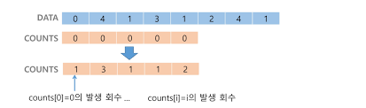

### 카운팅 정렬

- 항목들의 순서를 결정하기 위해 집합에 각 항목이 몇 개씩 있는지 세는 작업을 하여, 선형 시간에 정렬하는 효율적인 알고리즘
- 제한 사항
    - 정수나 정수로 표현할 수 있는 자료에 대해서만 적용 가능
        - 각 항목의 발생 회수를 기록하기 위해, 정수 항목으로 인덱스 되는 카운트들의 배열을 사용하기 때문
    - 카운트들을 위한 충분한 공간을 할당하려면 집합 내의 가장 큰 정수를 알아야 한다.
- 시간복잡도 : O(n+k)
    - n은 리스트 길이, k는 정수의 최대값
- 과정
    1. Data에서 각 항목들의 발생 회수를 세고, 정수 항목들로 직접 인덱스 되는 카운트 배열 counts에 저장
        
        
        
        - Data가 0~4 정수로 구성
            
            → counts는 4+1개!
            
        - ❗주의❗ count의 인덱스가 남는 것은 되지만, 모자라는건 안된다!!!
    2. 정렬된 집합에서 각 항목의 앞에 위치할 항목의 개수를 반영하기 위해 counts의 원소 조정
        - COUNTS =
            
            
            | index | 0 | 1 | 2 | 3 | 4 |
            | --- | --- | --- | --- | --- | --- |
            | 원소 | 1 | 4 | 5 | 6 | 8  |
        - 해당 인덱스의 앞에 몇 개가 있는지 누적해서 넣어주기
    3. counts[1]을 감소시키고 temp에 1 삽입
        - DATA의 뒤에서 원소 접근해서 돌린다!
        - COUNTS =
            
            
            | index | 0 | 1 | 2 | 3 | 4 |
            | --- | --- | --- | --- | --- | --- |
            | 원소 | 1 → 0 | 4 → 3 → 2 → 1 | 5 → 4 | 6 → 5 | 8 → 7 → 6 |
        - temp =
            
            
            | index | 0 | 1 | 2 | 3 | 4 | 5 | 6 | 7 |
            | --- | --- | --- | --- | --- | --- | --- | --- | --- |
            | 원소 | 0 | 1 | 1 | 1 | 2 | 3 | 4 | 4 |
        
        ⇒ 정렬 완!
        

```python
def Counting_Sort(DATA, TEMP, k):
    # DATA [] -> 입력 배열 (0 to k)
    # TEMP [] -> 정렬된 배열
    # COUNTS [] -> 카운트 배열

    COUNTS = [0] * (k+1)

    for i in range(0, len(DATA)):
        COUNTS[DATA[i]] += 1
    
    for i in range(1, k+1):
        COUNTS[i] += COUNTS[i-1]
    
    for i in range(len(TEMP)-1, -1, -1):
        COUNTS[DATA[i]] -= 1
        TEMP[COUNTS[DATA[i]]] = DATA[i]
    return TEMP

DATA = [0, 4, 1, 3, 1, 2, 4, 1]
k = 4
TEMP = [0] * (8)

print(Counting_Sort(DATA, TEMP, k))
# [0, 1, 1, 1, 2, 3, 4, 4]
```

### 정렬 알고리즘 비교

| 알고리즘 | 평균 수행시간 | 최악 수행시간 | 알고리즘 기법 | 비고 |
| --- | --- | --- | --- | --- |
| 버블 정렬 | $O(n^2)$ | $O(n^2)$ | 비교와 교환 | 코딩이 가장 손쉽다. |
| 카운팅 정렬 | $O(n+k)$ | $O(n+k)$ | 비교환 방식 | n이 비교적 작을 때만 가능하다 |
| 선택 정렬 | $O(n^2)$ | $O(n^2)$ | 비교와 교환 | 교환의 회수가 버블, 삽입정렬보다 작다 |
| 퀵 정렬 | $O(n log n)$ | $O(n^2)$ | 분할 정복 | 최악의 경우 $O(n^2)$이지만, 평균적으로는 가장 빠르다 |
| 삽입 정렬 | $O(n^2)$ | $O(n^2)$ | 비교와 교환 | n의 개수가 작을 때 효과적 |
| 병합 정렬 | $O(n log n)$ | $O(n log n)$ | 분할 정복 | 연결리스트의 경우 가장 효율적인 방식 |

---

## Baby-gin Game

[SW Expert Academy](https://swexpertacademy.com/main/code/userProblem/userProblemDetail.do?contestProbId=AYZS3UfKuQgDFARc)

- 0~9 사이의 숫자 카드에서 임의의 카드 6 장을 뽑았을 때 , 3 장의 카드가 연속적인 번호를 갖는 경우를 run 이라 하고 , 3 장의 카드가 동일한 번호를 갖는 경우를 triplet 이라고 한다
    
    그리고 , 6 장의 카드가 run 과 triplet 로만 구성된 경우를 baby gin으로 부른다
    
    6 자리의 숫자를 입력 받아 baby gin 여부를 판단하는 프로그램을 작성하라
    

### 완전 검색

- 문제의 해법으로 생각할 수 있는 **모든 경우를 나열해보고 확인**하는 기법
- Brute-force 혹은 generate-and-test 기법이라고도 불림
- 모든 경우의 수를 테스트한 후, 최종 해법을 도출
- **경우의 수가 상대적으로 작을 때 유용**
- 장단점
    - 장점 :해답을 찾아내지 못할 확률이 작음
    - 단점 : 모든 경우의 수를 생성하고 테스트하기 때문에 수행 속도는 느림
- 문제를 풀 때, 완전 검색으로 접근하여 해답을 도출한 후, 성능 개선을 위해 다른 알고리즘을 사용하고 해답을 확인하는 것이 바람직함!

### 완전 검색을 활용한 Baby-gin 접근

- 고려할 수 있는 모든 경우의 수 생성하기
    - 6개의 숫자로 만들 수 있는 모든 숫자 나열 (중복 포함)
    - ex) 입력 = [2,3,5,7,7,7]
        
        순열 = 235777, 237577, 237757, … , 777532
        
- 앞의 3자리와 뒤의 3자리를 잘라 run과 triplet 여부를 테스트하고 최종적으로 baby-gin 판단

### 순열 (Permutation)

- 서로 다른 것들 중 몇 개를 뽑아서 한 줄로 나열하는 것
- 서로 다른 n개 중 r 개를 택하는 순열 = nPr
- nPr = n * (n-1) * (n-2) * … *(n-r+1) = n!
    
    ```python
    # {1, 2, 3}을 포함하는 모든 순열을 생성하는 함수
    for i1 in range(1, 4):
        for i2 in range(1, 4):
            if i2 != i1:
                for i3 in range(1, 4):
                    if i3 != i1 and i3 != i2:
                        print(i1, i2, i3)
    '''
    1 2 3
    1 3 2
    2 1 3
    2 3 1
    3 1 2
    3 2 1
    '''
    ```
    

---

### 탐욕(Greedy) 알고리즘

- 최적해를 구하는 데 사용되는 근시안적인 방법
- 여러 경우 중 하나를 결정해야 할 때마다 그 순간에 최적이라고 생각되는 것을 선택해 나가는 방식으로 진행하여 최종적인 해답에 도달
- 각 선택의 시점에서 이루어지는 결정은 지역적으로는 최적이지만, 그 선택들은 계속 수집하여 최종적인 해답을 만들었다고 하여, 최적이라는 보장은 없다
- 동작 과정
    1. 해 선택 : 현재 상태에서 부분 문제의 최적 해를 구한 뒤, 이를 부분 해 집합(Solution Set)에 추가
    2. 실행 가능성 검사 : 새로운 부분 해 집합이 실행 가능한지를 확인. 곧, 문제의 제약 조건을 위반하지 않는지 검사
    3. 해 검사 : 새로운 부분 해 집합이 문제의 해가 되는지 확인. 아직 전체 문제의 해가 완성되지 않았다면 1의 해 선택부터 다시 시작

### Baby-gin을 완전검색이 아닌 방법으로!

- counts 배열의 각 원소를 체크하여 run과 triplet 및 baby-gin 여부를 판단
    
    ex) 444345
    
    counts = 
    
    | 숫자 | 1 | 2 | 3 | 4 | 5 | 6 | 7 | 8 | 9 | 0 |
    | --- | --- | --- | --- | --- | --- | --- | --- | --- | --- | --- |
    | counts |  |  | 1 | 4 | 1 |  |  |  |  |  |
    
    - run 확인
    
    | 숫자 | 1 | 2 | 3 | 4 | 5 | 6 | 7 | 8 | 9 | 0 |
    | --- | --- | --- | --- | --- | --- | --- | --- | --- | --- | --- |
    | counts |  |  |  | 3 |  |  |  |  |  |  |
    - triplet 확인 → baby-gin!!
    
    ```python
    num = 456789
    c = [0] * 12    # 각 자리수를 추출하여 개수를 누적할 리스트
    
    for i in range(6):
        c[num%10] += 1
        num //= 10
    
    i = 0
    tri = run = 0
    
    while i < 10:
        if c[i] >= 3:       # triplete 조사
            c[i] -= 3
            tri += 1
            continue
        if c[i] >= 1 and c[i+1] >= 1 and c[i+2] >= 1:       # run 조사
            c[i] -= 1
            c[i+1] -= 1
            c[i+2] -= 1
            run += 1
            continue
        i += 1
    
    if run + tri == 2:
        print("Baby Gin")
    else:
        print('Lose')
    ```
    

- 입력받은 숫자를 정렬한 후, 앞뒤 3자리씩 끊어서 run 및 triplet을 확인하는 방법
    
    → [1, 2, 3, 1, 2, 3] 인 경우 정렬하면 [1, 1, 2, 2, 3, 3] 이므로 Baby-Gin 판단 못함