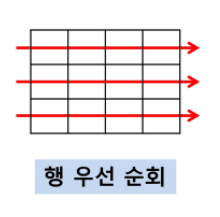
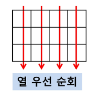
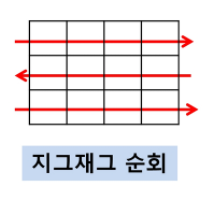

## 2차원 배열

- 1차원 list를 묶어놓은 list
- 2차원 이상의 다차원 list는 차원에 따라 index 선언
- 2차원은 세로길이(행의 개수), 가로길이(열의 개수)를 필요로 함
- 파이썬에서는 데이터 초기화를 통해 변수선언와 초기화가 가능

### 배열 순회

- nXm 배열의 n*m개의 모든 원소를 빠짐없이 조사하는 방법

- 행 우선 순회
    
    ```python
    for i in range(n):
    	for j in range(m):
    		f(array[i][j])   
    ```
    

    

- 열 우선 순회
    
    ```python
    for j in range(m):
    	for i in range(n):
    		f(array[i][j])
    ```
    

    

- 지그재그 순회
    
    ```python
    for i in range(n):
    	for j in range(m):
    		f(array[i][j+(m-1-2*j) * (i%2)])
    ```
    

    

- 델타를 이용한 2차 배열 탐색
    - 한 좌표에서 4방향의 인접 배열 요소를 탐색하는 방법
    
    ```
    arr[0...N-1][0...N]   # NxN 배열
    di[] <- [0, 1, 0, -1]
    dj[] <- [1, 0, -1, 0]
    for i: 0 -> N-1
    	for j: 0 -> N-1
    		for k in range(4):
    			ni <- i + di[k]
    			nj <- j + dj[k]
    			if 0 <= ni < N and 0< nj < N:    # 유효한 인덱스면
    				f(arr[ni][nj])
    ```
    

- 전치 행렬
    
    ```python
    arr = [[1, 2, 3], [4, 5, 6], [7, 8, 9]]     # 3*3 행렬
    
    for i in range(3):
        for j in range(3):
            if i < j:
                arr[i][j], arr[j][i] = arr[j][i], arr[i][j]
    print(arr)
    
    # [[1, 4, 7], [2, 5, 8], [3, 6, 9]]
    ```
    


## 부분집합 합 예제


- 유한 개의 정수로 이루어진 집합이 있을 때, 이 집합의 부분집합 중에서 그 집합의 원소를 모두 더한 값이 0이 되는 경우가 있는지를 알아내는 문제
    - ex) [-7, -3, -2, 5, 8]의 부분집합 [-3, -2, 5]
- 완전검색으로 풀면 집합의 모든 부분집합을 생성한 후에 각 부분집합의 합을 계산해야함

### 부분집합의 수

- 집합의 원소가 n개일 때, 공집합을 포함한 부분집합의 수는 $2^n$개이다.
- 이는 각 원소를 부분집합에 포함시키거나 포함시키지 않는 2가지 경우를 모든 원소에 적용한 경우의 수와 같다.
- 각 원소가 부분집합에 포함되었는지를 loop 이용하여 확인하고 부분집합을 생성하는 방법
    
    ```python
    bit = [0, 0, 0, 0]
    for i in range(2):
        bit[0] = i                          # 0번 원소
        for j in range(2):
            bit[1] = j                      # 1번 원소
            for k in range(2):
                bit[2] = k                  # 2번 원소
                for l in range(2):
                    bit[3] = l              # 3번 원소
                    print(bit)       # 생성된 부분집합 출력
    ```
    

### 비트 연산자

- 데이터를 나타내는 최소 단위. 모든 데이터는 0과 1의 조합으로 구성되는데, 이 0 또는 1이 하나의 비트가 됨.
- 연산자
    | | |
    | -- | -- |
    | & | 비트 단위로 AND 연산 <br>같은 위치의 bit을 비교하여 둘 다 1이면 1, 아니면 0 |
    | \| | 비트 단위로 OR 연산 <br>같은 위치의 bit을 비교하여 둘 중 하나라도 1이면 1, 아니면 0 |
    | << | 피연산자의 비트 열을 왼쪽으로 이동 (shift) |
    | >> | 피연산자의 비트 열을 오른쪽으로 이동 |
- 1 << n : $2^n$. 즉 원소가 n개일 경우의 모든 부분집합의 수를 의미
- i & (1 << j) : i의 j번째 비트가 1인지 아닌지를 검사

```python
arr = [3, 6, 7, 1, 5, 4]

n = len(arr)

for i in range(1<<n):       # 1<<n : 부분집합의 개수
    for j in range(n):      # 원소의 수만큼 비트를 비교
        if i & (1<<j):      # i의 j번 비트가 1인 경우
            print(arr[j], end=' ')
    print()
print()
```