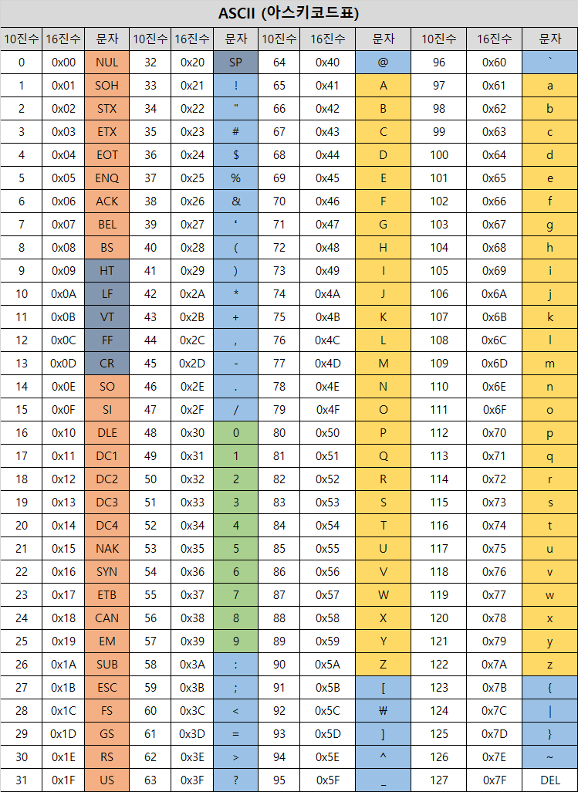
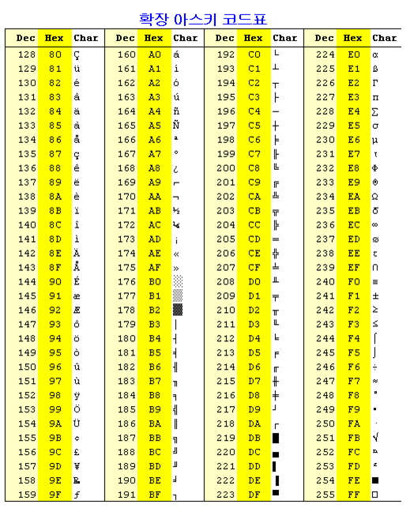

## 문자의 표현

- 문자를 메모리에 저장하는 방법
    - 각 문제에 대해 대응되는 숫자를 정해 놓고 이것을 메모리에 저장
    - 영어가 대소문자 합쳐서 52이므로 6(64가지)비트면 모두 표현 가능
        - 이를 코드 체계라고 함
- 네트워크가 발전되기 전 미국의 각 지역 별로 코드체계를 정해놓고 사용했지만 네트워크가 발전하면서 서로간에 정보를 주고 받을 때 정보를 달리 해석하는 문제가 생김

### 아스키

- 혼동을 피하기 위해 표준안 만듦
    - ASCII라는 문자 인코딩 표준이 제정됨
- ASCII는 7bit 인코딩으로 128문자를 표현하여 33개의 출력 불가능한 제어 문자들과 공백을 비롯한 95개의 출력 가능한 문자들로 이루어져있음
    
    
    
- 확장 아스키는 표준 문자 이외의 악센트 문자, 도형 문자, 특수 문자, 특수 기호등 부가적인 문자를 128개 추가할 수 있게 하는 부호
    - 표준 아스키는 7bit / 확장 아스키는 1byte내의 8-bit을 모두 사용함으로써 추가적인 문자를 표현
    - 컴퓨터 생산자와 소프트웨어 개발자가 여러가지 다양한 문자에 할당할 수 있도록 하고 있음.
    - 이렇게 할당된 확장 부호는 표준 아스키와 같이 서로 다른 프로그램이나 컴퓨터 사이에 교환되지 못함
    - 표준 아스키는 마이크로컴퓨터 하드웨어 및 소프트웨어 사이에서 세계적으로 통용되는데 비해, 확장 아스키는 프로그램이나 컴퓨터 또는 프린터가 그것을 해독할 수 있도록 설계되어 있어야만 올바로 해독될 수 있음
        
        
        
- 오늘날 컴퓨터는 문자를 읽고 쓰는데 ASCII형식을 사용
- 우리나라도 한글 코드체계를 만들어 사용. 조합형, 완성형 두 종류

### 유니코드

- 자국의 코드체계를 타 국가가 가지고 있지 않으면 정보를 잘못 해석할 수 있음
- 다국어 처리를 위해 표준 마련
    - 유니코드라고 함
- 유니코드도 다시 character set으로 분류
    - UCS-2(Universal Character Set 2)
    - UCS-4
    - 유니코드를 저장하는 변수의 크기를 정의
    - 바이트 순서에 대해서 표준화하지 못했음
    - 파일을 인식 시 이 파일이 UCS-2, UCS-4인지 인식하고 각 경우를 구분해 모두 다르게 구현해야 하는 문제 발생
    - → 유니코드의 적당한 외부 인코딩이 필요!
- big-endian, little-endian
    - 저장하는 순서를 endian이라고 함
    - 앞쪽에 해당하는 애를 먼저(앞쪽 저장소) 저장하는 것이 big-endian
    - 그 반대가 little-endian
- 유니코드 인코딩(UTF : Unicode Transformation Format)
    - UTF-8 (in web)
    - UTF-16 (in windows, java)
    - UTF-32 (in unix)
- Python 인코딩
    - 2.x버전 - ASCII
    - 3.x버전 - 유니코드 UTF-8
    - 다른 인코딩 방식으로 처리 시 첫 줄에 작성하는 위 항목에 원하는 인코딩 방식을 지정해주면 됨


## 문자열

- C언어에서 문자열 처리
    - 문자열은 문자들의 배열 형태로 구현된 응용 자료형
    - 문자 배열에 문자열을 저장할 때는 항상 마지막에 끝을 표시하는 널문자(’\0’)을 넣어줘야 함
        
        ```c
        char ary[] = {'a', 'b', 'c', '\0'};
        // 또는
        char ary=[] = 'abc';
        ```
        
    - 문자열 처리에 필요한 연산을 함수 형태로 제공
- Java(객체지향 언어)에서의 문자열 처리
    - 문자열 데이터를 저장, 처리해주는 클래스 제공
    - String클래스 사용
        
        ```java
        String str = 'abc'
        // 또는
        String str = new String('abc');
        ```
        
    - 문자열 처리에 필요한 연산을 연산자, 메소드 형태로 제공
        - +, length(), replace(), split(), substring() …
- Python에서의 문자열 처리
    - char 타입 없음
    - 텍스트 데이터의 취급방법이 동일되어 있음
    - 문자열 기호
        - ‘, “, ‘’’, “””
        - + : 연결 : 이어 붙여주는 역할
        - * : 반복 : 수만큼 문자열이 반복
    - 문자열은 시퀀스 자료형으로 분류되고, 시퀀스 자료형에서 사용할 수 있는 인덱싱, 슬라이싱 연산을 사용할 수 있음
    - 제공되는 메소드
        - replace(), split(), isalpha(), find()
    - 요소값을 변경할 수 없음(immutable)
- C, Java의 String 처리의 기본적인 차이점
    - c는 아스키 코드로 저장
    - java는 유니코드(UTF16)으로 저장
    - 파이썬은 유니코드(UTF8)로 저장


### 문자열 뒤집기

- 자기 문자열에서 뒤집는 방법 / 새로운 빈 문자열을 만들어 소스의 뒤에서부터 읽어서 타겟에 쓰는 방법
- 자기 문자열을 이용할 경우는 swap을 위한 임시변수가 필요. 반복 수행을 문자열 길이의 반만 수행
- Python에서 문자열 뒤집기
    
    ```python
    s = 'Reverse this strings'
    s = s[::-1]
    ```
    
    ```python
    s = 'abcd'
    s = list(a)
    s.reverse()
    s = ''.join(s)
    ```
    

### 문자열 비교

- C에서는 strcmp()함수 제공
- Java에서는 equals() 메소드 제공
    - 문자열 비교에서 == 연산은 메모리 참조가 같은지를 묻는 것
- 파이썬에서는 == 연산자와 is 연산자 제공
    - == 연산자는 내부적으로 특수 메서드 `__eq__()`를 호출
    - **== 는 값이 같은지, is는 메모리 주소가 같은지를 판단함!!!**
    
    ```python
    s1 = 'abc'
    s2 = 'abc'
    s3 = 'def'
    s4 = s1
    s5 = s1[:2]+'c'
    
    print(s1 is s2)     # True
    print(s1 is s3)     # False
    print(s1 is s4)     # True
    print(s1 is s5)     # False
    
    print(s1 == s2)     # True
    print(s1 == s3)     # False
    print(s1 == s4)     # True
    print(s1 == s5)     # True
    ```
    

### 문자열 숫자를 정수로 변환하기

- 숫자와 문자 변환 함수 제공
    - int(’123’), float(’3.14’), str(123), repr(123)
- atoi()함수 만들기
    
    ```python
    def atoi(s):
        i = 0
        for x in s:
            i = i * 10 + ord(x)-ord('0')
        return i
    
    s = '123'
    a = atoi(s)
    print(a+1)
    ```
    
- itoa() 구현
    ```py
    def itoa(a):
        s = ''
        while a > 0:
            s = chr(a%10 + ord('0')) + s
            a //= 10
        return s

    ans = itoa(123)
    print(ans)
    ```