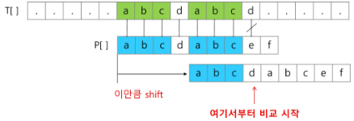
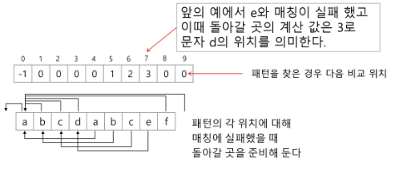
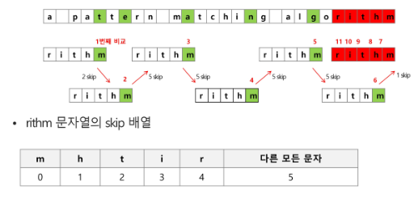

## 패턴 매칭

- 종류
    - 고지식한 패턴 검색 알고리즘
    - 카프-라빈 알고리즘
    - KMP 알고리즘
    - 보이어-무어 알고리즘


## 고지식한 알고리즘(Brute Force)
- 본문 문자열을 처음부터 끝까지 차례대로 순회하면서 패턴 내의 문자들을 일일이 비교하는 방식으로 동작
    
    ```python
    p = 'is'    # 찾을 패턴
    t = 'This is a book~!'     # 전체 텍스트
    M = len(p)  # 찾을 패턴의 길이
    N = len(t)  # 전체 텍스트의 길이
    
    def BruteForce(p, t):
        i = 0   # t의 인덱스
        j = 0   # p의 인덱스
        while j < M and i < N:
            if t[i] != p[j]:
                i = i - j
                j = -1
            i = i + 1
            j = j + 1
        if j == M:
            return i-M      # 검색 성공
        else:
            return -1       # 검색 실패
    ```
    

### 시작복잡도

- 최악의 경우 시간 복잡도는 텍스트의 모든 위치에서 패턴을 비교해야 하므로 O(MN)이 됨
- 길이가 10000인 문자열에서 길이 80인 패턴을 찾는다고 할 때, 최악의 경우 약 10000*80 = 800,000번의 비교가 일어남


## KMP 알고리즘


- 불일치가 발생한 텍스트 스트링의 앞 부분에 어떤 문자가 있는지를 미리 알고 있으므로, 불일치가 발생한 앞 부분에 대하여 다시 비교하지 않고 매칭을 수행
- 패턴을 전처리하여 배열 next[M]을 구해서 잘못된 시작을 최소화
    - next[M] : 불일치가 발생했을 경우 이동할 다음 위치
- 시간복잡도 O(M+N)

---

- 텍스트에서 abcdabc까지는 매치되고, e에서 실패한 상황 패턴의 맨 앞의 abc와 실패 직전의 abc는 동일함을 이용할 수 있다.
- 실패한 텍스트 문자와 P[4]를 비교
    
    
    
- 매칭이 실패했을 때 돌아갈 곳을 계산
    
    
    
    ```python
    def kmp(t, p):
        N = len(t)
        M = len(p)
        lps = [0] * (M+1)
        # preprocessting
        j = 0   # 일치한 개수 == 비교할 패턴 위치
        lps[0] = -1
    
        for i in range(1, M):
            lps[i] = j      # p[i] 이전에 일치한 개수
            if p[i] == p[j]:
                j += 1
            else:
                j = 0
        lps[M] = j
        # search
        while i < N and j <= M:
            if j==-1 or t[i] == p[j]:
                i += 1
                j += 1
            else:       # 불일치
                j = lps[j]
            if j == M:  # 패턴 찾은 경우
                print(i-M, end=' ')
                j = lps[j]
        print()
        return
    
    t = 'zzzabcdabcdabcefabcd'
    p = 'abcdabcef'
    kmp(t, p)
    ```
    
    ```py
    # LPS 테이블 만들기(라이브에서 2번째로 소개해준 내용)
    def make_LPS(pattern):  # pattern 비교대상 문자열
        M = len(pattern)
        LPS = [0] * M       # Longest proper prefix witch is also suffix

        same_p_idx = 0      # 동일 패턴 인덱스
        idx = 1             # 패턴 체크 인덱스

        while idx < M:
            if pattern[same_p_idx] == pattern[idx]:     # 같은 패턴을 가지고 있으면
                same_p_idx += 1                         # 같은 패턴을 발견해서 1 증가
                LPS[idx] = same_p_idx                   # 일치하는 인덱스가 존재해서 LPS값 추가
                idx += 1                                # 다음 자리를 확인하기 위해 증가
            else:                                       # 일치하는 패턴이 없을 때
                if same_p_idx != 0:                     # 현재 동일 패턴이 있으면
                    same_p_idx = LPS[same_p_idx-1]      # 이전 LPS값 이용해서 동일 패턴이 맞는지 확인
                else:
                    LPS[idx] = 0                        # 일치하지 않기에 0
                    idx += 1
        # print(LPS)
        return LPS

    # make_LPS('abcdabcef')       # [0, 0, 0, 0, 1, 2, 3, 0, 0]
    # make_LPS('aaacaaaa')        # [0, 1, 2, 0, 1, 2, 3, 3]

    def KMP(P, T):
        M = len(P)      # pattern (찾고자하는 패턴 문장)
        N = len(T)      # target (패턴이 있는지 확인하려는 긴 문장)
        LPS = make_LPS(P)   # LPS 테이블 만들기 (전처리)

        p_idx = 0
        t_idx = 0

        while t_idx < N and p_idx < M:
            if P[p_idx] == T[t_idx]:    # 같은 문자
                # 다음 문자 체크
                p_idx += 1
                t_idx += 1

            else:
                if p_idx != 0:
                    p_idx = LPS[p_idx-1]    # 이전 값이 동일한 패턴의 개수(그만큼 비교하지 않고 패턴 찾을 수 있음)
                else:           # 처음부터 틀렸다면
                    t_idx += 1
        # 패턴과 일치하는 문자열이 있는지 확인
        if p_idx == M:      # 찾음
            # 찾은 문자열의 시작 인덱스
            return t_idx - p_idx
        else:
            return -1

    target = 'xxxaaacaaaa'
    pattern = 'aaacaaaa'
    print(KMP(pattern, target))

    target = 'xxxaaxacaaaa'
    pattern = 'aaacaaaa'
    print(KMP(pattern, target))
    ```


## 보이어 무어 알고리즘

- 오른쪽에서 왼쪽으로 비교
- 대부분 상용 소프트웨어에서 채택하고 있는 알고리즘
- 패턴에 오른쪽 끝에 있는 문자가 불일치하고 이 문자가 패턴 내에 존재하지 않는 경우, 이동 거리는 무려 패턴의 길이만큼이 된다.
    
    

### 문자열 매칭 알고리즘 비교

- 찾고자 하는 문자열 패턴의 길이m, 총 문자열 길이 n일 때
- 고지식한 패턴 검색 알고리즘 : O(mn)
- 카프-라빈 알고리즘 : Θ(n)
    - Θ : 항상 이만큼!
- KMP 알고리즘 : Θ(n)

### 보이어-무어 알고리즘

- 앞의 두 매칭 알고리즘들의 공통점 텍스트 문자열의 문자를 적어도 한번씩 훑는다는 것.
    - 최선의 경우에도 Ω(n)
- 보이어-무어 알고리즘은 텍스트 문자를 다 보지 않아도 된다
- 발상의 전환 : 패턴의 오른쪽부터 비교
- 최악의 경우 수행시간 : Θ(mn)
- 입력에 따라 다르지만 일반적으로 Θ(n)보다 시간이 덜 든다.


## 문자열 암호화

### 시저 암호(Ceasar cipher)

- 줄리어스 시저가 사용했다고 하는 암호
- 시저 암호에서는 평문으로 사용되고 있는 알파벳을 일정한 문자수만큼 평행이동 시킴으로써 암호화 행함

    
- 1만큼 평행했을 때 1을 키값이라 함
- 시저 암호문에 대한 전사공격
    


### 문자 변환표를 이용한 암호화(단일 치환 암호)

- 단순한 카이사르 암호화보다 훨씬 강력한 암호화 기법
    
    
- 복호화하기 위해서는 모든 키의 조합(key space)가 필요
- 단일 치환 암호의 키의 총 수는
26x25x24x23x…x1 = 26!

### bit열의 암호화

- 배타적 논리합(exclusive-or) 연산 사용
    

### 문자열 압축

- 저장소의 크기를 줄이며 정확한 정보를 저장하는 방법
- Run-length encoding 알고리즘
- 같은 값이 몇 번 반복되는가를 나타냄으로써 압축

- 이미지 파일포맷중 BMP 파일포맷의 압축 방법
    - 흑백 이미지
- 좀 더 효율적이고 일반적인 압축 방법  = 허프만 코딩 알고리즘