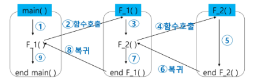

## 스택
- 물건을 쌓아 올리듯 자료를 쌓아 올린 형태의 자료구조
- 스택에 저장된 자료는 선형 구조를 가짐
    - 선형구조 : 자료 간의 관계가 1대1의 관계  → 한줄로 이어 붙인 형태를 의미함!!
    - 비선형구조 : 자료 간이 관계가 1대N의 관계를 갖는다(ex 트리)
- 스택에 자료를 삽입하거나 스택에서 자료를 꺼낼 수 있다.
- 마지막에 삽입한 자료를 가장 먼저 꺼냄 → LIFO(후입선출, Last in First Out)


### 스택을 구현하기 위한 필요한 자료구조와 연산

- 자료구조 : 자료를 선형으로 저장할 저장소
    - 배열을 사용할 수 있음
    - 저장소 자체를 스택이라 부르기도 함
    - 마지막 삽입된 원소의 위치를 top이라 부름
- 연산
    - 삽입 : 저장소에 자료 저장 = push
    - 삭제 : 저장소에서 자료 꺼냄 = pop
    - 스택이 공백인지 아닌지 확인 = isEmpty
    - 스택의 top에 있는 item(원소)를 반환하는 연산 = peek

### 스택의 구현

- 삽입/삭제 과정
    
    
    
#### push 알고리즘
- append 메소드를 통해 리스트의 마지막에 데이터 삽입

```python
def push(item):
    s.append(item)
```

```python
def push(item, size):
    global top
    top += 1
    if top == size:
        print('overflow!')
    else:
        stack[top] = item
        
size = 10
stack = [0] * size
top = -1

# push(20)
top += 1
stack[top] = 20

# push(10)
push(10, size)
```
    
#### pop 알고리즘
    
```python
def pop():
    if len(s) == 0:
        # underflow
        return 
    else:
        return s.pop()
```

```python
def pop():
    global top
    if top == -1:
        print('overflow!')
        return 0
    else:
        top -= 1
        return stack[top+1]
    
print(pop())

if top > -1:
    top -= 1
    print(stack[top+1])
```
    

#### append와 pop을 사용하지 않고 스택 구현
    
```python
def push(n):
    global top
    top += 1
    if top == size:
        print('Overflow')
    else:
        stack[top] = n

top = -1
size = 10
stack = [0] * size

# push(10)
top += 1
stack[top] = 10

# push(20)
top += 1
stack[top] = 20

push(30)

while top >= 0:
    print(stack[top])
    top -= 1
```
    

### 스택 구현 고려 사항

- 1차원 배열을 사용하여 구현할 경우 구현이 용이하다는 장점 / 스택의 크기를 변경하기 어렵다는 단점
- 해결하기 위한 방법으로 저장소를 동적으로 할당하여 스택을 구현하는 방법
    - 동적 연결리스트를 이용하여 구현하는 방법을 의미
    - 구현이 복잡하다는 단점이 있지만 메모리를 효율적으로 사용한다는 장점
    

### 예시 1) 괄호 검사

- 조건
    - 왼쪽 괄호의 개수와 오른쪽 괄호의 개수가 같아야 함
    - 같은 괄호에서는 왼쪽 괄호는 오른쪽 괄호보다 먼저 나와야 함
    - 괄호 사이에는 포함 관계만 존재
- 스택을 이용한 괄호 검사

    

    
    - 문자열에 있는 괄호를 차례대로 조사하면서 왼쪽 괄호를 만나면 스택에 삽입,
    오른쪽 괄호를 만나면 스택에서 top 괄호를 삭제한 후 오른쪽 괄호와 짝이 맞는지 검사
    - 스택이 비어있으면 조건 1 또는 조건 2에 위배
    - 괄호의 짝이 맞지 않으면 조건 3에 위배
    - 마지막 괄호까지 조사 후 스택에 괄호가 남아있으면 조건 1 위배


### Function call

- 프로그램에서의 함수 호출과 복귀에 따른 수행 순서 관리
    - 가장 마지막에 호출 된 함수가 가장 먼저 실행을 완료하고 복귀하는 후입선출 구조이므로
        
        후입선출 구조의 스택을 이용하여 수행순서 관리
        
        
        
- 함수 호출이 발생하면 호출한 함수 수행에 필요한 지역변수, 매개변수 및 수행 후 복귀할 주소 등의 정보를 스택 프레임(stack frame)에 저장하여 시스템 스택에 삽입
    
    
    
- 함수의 실행이 끝나면 시스템 스택의 top원소(스택 프레임)을 삭제(pop)하면서 프레임에 저장되어 있던 복귀주소를 확인하고 복귀
- 함수 호출과 복귀에 따라 이 과정을 반복하여 전체 프로그램 수행이 종료되면 시스템 스택은 공백 스택이 됨


## 재귀호출
- 필요한 함수가 자신과 같은 경우 자신을 다시 호출하는 구조
- 함수에서 실행해야 하는 작업의 특성에 따라 일반적인 호출방식보다 재귀호출방식을 사용하여 프로그램을 만들면 프로그램의 크기를 줄이고 간단하게 작성 가능
    - 대표적인 예) factorial, 피보나치 수열

### factorial

- n에 대한 factorial : 1부터 n까지의 모든 자연수를 곱하여 구하는 연산

    
- 마지막에 구한 하위 값을 이용하여 상위 값을 구하는 작업을 반복
    
    
    

### 피보나치

- 0과 1로 시작하고 이전의 두 수 합을 다음 항으로 하는 수열
- 피보나치 수열의 i번째 값을 계산하는 함수 F를 정의하면,
    
    $F_0 = 0$ , $F_1 = 1$
    
    $F_i = F_{i-1} + F_{i-2}$ for i ≥ 2
    
- 피보나치 수열의 i번째 항을 반환하는 함수를 재귀함수로 구현 가능!!
    
    ```python
    def fibo(n):
        if n < 2:
            return n
        else:
            return fibo(n-1) + fibo(n-2)
    ```
    

## Memoization

- 재귀함수는 엄청난 중복 호출이 존재함
    - 피보나치 수열  → $Θ(2^n)$
        
- 메모이제이션은 컴퓨터 프로그램을 실행할 때 이전에 계산한 값을 메모리에 저장해서 매번 다시 계산하지 않도록 하여 전체적인 실행속도를 빠르게 하는 기술
- 동적 계획법의 핵심이 되는 기술
- memoization = 메모리에 넣기 라는 의미 (to put in memory)
- 피보나치 수를 구하는 알고리즘을 메모이제이션을 사용하면 실행시간을 Θ(n)으로 줄일 수 있음
    
    ```python
    # memo를 위한 배열을 할당하고 0으로 초기화
    # memo[0] = 0, memo[1] = 1
    
    def fibo(n):
        global memo
        if n >= 2 and memo[n] == 0:
            memo[n] = fibo(n - 1) + fibo(n - 2)
        return memo[n]
    
    cnt = 0
    n = 7
    
    memo = [0] * (n + 1)
    memo[0] = 0
    memo[1] = 1
    ```
    

- 메모이제이션 vs 재귀
    ```py
    def fibo_memo(n):
        global cnt
        cnt += 1
        if n >= 2 and memo[n] == 0:
            memo[n] = fibo_memo(n - 1) + fibo_memo(n - 2)
        return memo[n]

    def fibo(n):
        global cnt
        cnt += 1
        if n < 2:
            return n
        else:
            return fibo(n-1) + fibo(n-2)

    cnt = 0
    n = 7

    memo = [0] * (n + 1)
    memo[0] = 0
    memo[1] = 1
    print(fibo(n), cnt)     # 13, 41
    cnt = 0
    print(fibo_memo(n),cnt) # 13 13
    ```