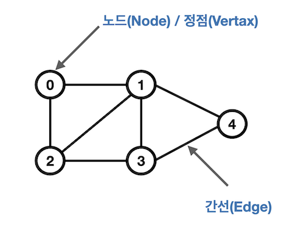

## 목차
1. [DP(다이나믹 프로그래밍)](#dpdynamic-programming)
2. [DFS(깊이 우선 탐색)](#dfs)


## DP(Dynamic Programming)
- 최적화 문제를 해결하는 알고리즘
- 입력 크기가 작은 부분 문제들을 모두 해결한 후 그 해들을 이용하여 보다 큰 크기의 부분 문제들을 해결해서 최종적으로 원래 주어진 입력의 문제를 해결하는 알고리즘


### 피보나치 수 DP 적용

1. 문제를 부분 문제로 분할
    - Fibonacci(n)은 Fibonacci(n-1)과 Fibonacci(n-2), … , Fibonacci(2), Fibonacci(1), Fibonacci(0)의 부분집합으로 나뉨
2. 부분 문제를 나누는 일을 끝냈으면 가장 작은 부분 문제부터 해를 구함
3. 그 결과를 테이블에 저장하고, 테이블에 저장된 부분 문제의 해를 이용하여 상위 문제의 해를 구함


```python
def fibo2(n):
    f = [0] * (n+1)
    f[0] = 0
    f[1] = 1
    
    for i in range(2, n+1):
        f[i] = f[i-1] + f[i-2]
        
    return f[n]
```

- 구현 방식
    - recursive 방식 : fib1()
    - iterative 방식 : fib2()
> memoization을 재귀적 구조에 사용하는 것보다 반복적 구조로 dp를 구현한 것이 성능 면에서 보다 효율적임!<br>
재귀적 구조는 내부에 시스템 호출 스택을 사용하는 오버헤드가 발생하기 때문


## DFS

- 비선형구조인 그래프 구조는 그래프로 표현된 모든 자료를 빠짐없이 검색하는 것이 중요
    
- 검색하는 두가지 방법
    - 깊이 우선 탐색(Depth First Search, DFS)
    - 너비 우선 탐색(Breadth First Search, BFS)

- 시작 정점의 한 방향으로 갈 수 있는 경로가 있는 곳까지 깊이 탐색해 가다가 더 이상 갈 곳이 없게 되면, 가장 마지막에 만났던 갈림길 간선이 있는 정점으로 되돌아와서 다른 방향의 정점으로 탐색을 계속 반복하여 결국 모든 정점을 방문하는 순회방법
    
    
    
- 가장 마지막에 만났던 갈림길의 정점으로 되돌아가서 다시 깊이 우선 탐색을 반복해야 하므로 후입선출 구조의 **스택 사용**

### 구현

1. 시작 정점 v를 결정하여 방문
2. 정점 v에 인접한 정점 중에서
    1. 방문하지 않은 정점 w가 있으면, 정점 v를 스택에 push하고 정점 w를 방문
    그리고 w를 v로 하여 다시 2 반복
    2. 방문하지 않은 정점이 없으면, 탐색의 방향을 바꾸기 위해서 스택을 pop하여 받은 가장 마지막 방문 정점을 v로 하여 다시 2 반복
3. 스택이 공백이 될 때까지 2 반복

```py
'''
input =
(정점 개수, 간선 개수)
7 8
1 2 1 3 2 4 2 5 4 6 5 6 6 7 3 7
'''
# 스택 사용
def dfs(v, e):
    visited = [0] * (e + 1)
    stack = []

    # 방문 처리
    visited[v] = 1
    stack.append(v)
    print(v)

    while True:
        for w in graph[v]:
            # 방문해보지 못한 정점
            if not visited[w]:
                # 방문 처리
                visited[w] = 1
                stack.append(v)
                print(w)

                # 다음은 w를 따라가야하므로 v를 업데이트
                v = w
                break       # for w

        # for문을 다 돌았는데 방문안한 정점이 없으면
        else:
            # 스택이 차있다면 다른 깊이를 향해 출발
            if stack:
                v = stack.pop()
            # 스택이 비어있다면 = 출발점
            else:
                break


v, e = map(int,input().split())
arr = list(map(int,input().split()))

# 인접 리스트
# graph[i] = i 노드에 인접해있는 노드 번호가 들어있음
graph = [[] for _ in range(v+1)]

for i in range(e):
    n1, n2 = arr[i*2], arr[i*2+1]
    # 양방향
    graph[n1].append(n2)
    graph[n2].append(n1)

dfs(1,v)
```

또 다른 방법
```py
def dfs(v):
    stack = [v]
    visited[v] = 1

    while stack:
        n = stack.pop()
        for next_node in graph[n]:
            if not visited[next_node]:
                visited[next_node] = 1
                stack.append(next_node)
```

재귀를 사용한 방법
```py
'''
7 8
1 2 1 3 2 4 2 5 4 6 5 6 6 7 3 7
'''


def dfs(i):   # 시작 i, 마지막 v
    visited[i] = 1
    print(i)
    for w in adjl[i]:
        if visited[w] == 0:
            dfs(w)


v,e = map(int,input().split())
arr = list(map(int,input().split()))

# 인접리스트
adjl = [[] for _ in range(v+1)]     # ardl[i] 행에 인접인 정점 번호
for i in range(e):
    n1, n2 = arr[i*2], arr[i*2+1]
    adjl[n1].append(n2)
    adjl[n2].append(n1)     # 방향이 없는 경우만 넣어야함

visited = [0] * (v+1)
dfs(1)
```