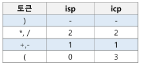
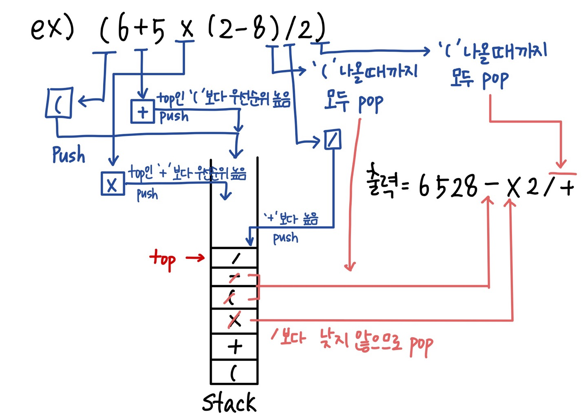
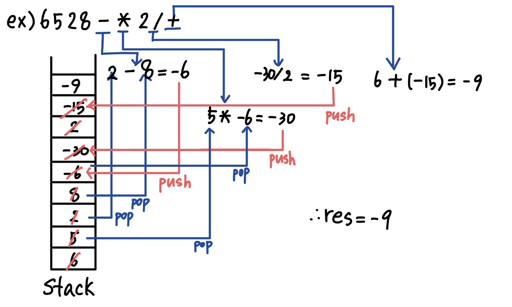
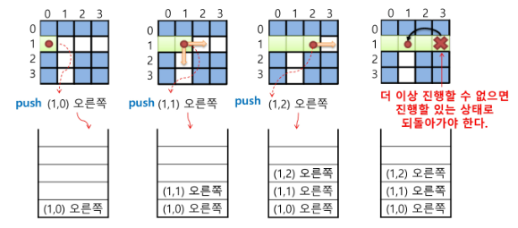
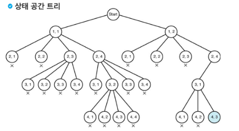
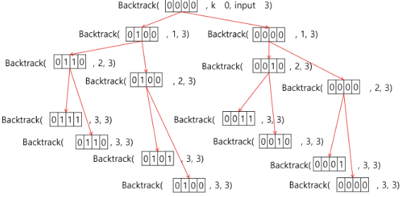

## 계산기

### 문자열 수식 계산의 일반적 방법

step1) 중위 표기법의 수식을 후위 표기법으로 변경 (스택 이용)

> 중위 표기법(infix notation) = 연산자를 피연산자 가운데 표기하는 방법   ex) a+b <br>
> 후위 표기법(postfix notation) = 연산자를 피연산자 뒤에 표기하는 방법  ex) ab+

- 변환방법1
    - 수식의 각 연산자에 대해서 우선순위에 따라 괄호를 사용하여 다시 표현
    - 각 연산자를 그에 대응하는 오른쪽 괄호의 뒤로 이동
    - 괄호를 제거
    - ex) A*B-C/D
        1. ( (A*B) - (C/D))
        2. ( (A B)* (C D)/ )-
        3. AB*CD/-
- 변환방법2
    - 입력 받은 중위 표기식에서 토큰을 읽음
    - 토큰이 피연산자이면 토큰 출력
    - 토큰이 연산자(괄호포함)일 때, 이 토큰이 스택의 top에 저장되어 있는 연산자보다 우선순위가 높으면 스택에 push, <br>그렇지 않으면 스택 top의 연산자의 우선순위가 토큰의 우선순위보다 작을 때까지 스택에서 pop한 후 연산자 push<br>
    만약 top에 연산자가 없으면 push
    - 토큰이 오른쪽 괄호 ‘)’이면 스택 top에 왼쪽 괄호 ‘(’가 올 때까지 스택에 pop연산을 수행하고 pop한 연산자 출력. 
    왼쪽 괄호를 만나면 pop만하고 출력 X
    - 중위 표기식에 더 읽을 것이 없다면 중지하고, 더 읽을 것이 있다면 맨 처음부터 다시 반복
    - 스택에 남아있는 연산자를 모두 pop하여 출력
    
    - 스택 밖의 왼쪽 괄호는 우선순위가 가장 높으며, 스택 안의 왼쪽 괄호는 우선순위가 가장 낮음
        
        
        
        
        
    
    ```python
    top = -1
    stack = [0] * 100
    
    # 스택 밖 우선순위
    icp = {'(':3, '*':2, '/':2, '+':1, '-':1}
    # 스택 안 우선순위
    isp = {'(':0, '*':2, '/':2, '+':1, '-':1}
    
    fx = '(6+5*(2-8)/2)'
    postfix = ''
    for tk in fx:
        #여는 괄호 push, 연산자이고 top 원소보다 우선순위가 높으면 push
        if tk == '(' or (tk in '*/+-' and isp[stack[top]] < icp[tk]):
            top += 1
            stack[top] = tk
        # 연산자이고 top 원소보다 우선순위가 높지 않으면 (같아도 해당)
        elif tk in '*/+-' and isp[stack[top]] >= icp[tk]:
            # top 원소의 우선순위가 낮을때까지 pop
            while isp[stack[top]] >= icp[tk]:
                top -= 1
                postfix += stack[top+1]
            top += 1
            stack[top] = tk
        # 닫는 괄호
        elif tk == ')':
            while stack[top] != '(':
                top -= 1
                postfix += stack[top+1]
            top -= 1        # 여는 괄호 pop
        # 피연산자
        else:
            postfix += tk
    print(postfix)
    ```
    

step2) 후위 표기법의 수식을 스택을 이용하여 계산

- 피연산자를 만나면 스택에 push
- 연산자를 만나면 필요한 만큼의 피연산자를 스택에서 pop하여 연산하고, 연산결과를 다시 스택에 push
- 수식이 끝나면 마지막으로 스택을 pop하여 출력
    
    
    


## 백트래킹


- 해를 찾는 도중에 ‘막히면’ (즉, 해가 아니면) 되돌아가서 다시 해를 찾아 가는 기법
- 최적화(optimization)문제와 결정(decision)문제를 해결
- 결정 문제 : 문제의 조건을 만족하는 해가 존재하는지 여부를 ‘yes’ 또는 ‘no’로 답하는 문제
    - ex) 미로 찾기, n-Queen, map coloring, 부분집합의 합 문제

### 미로찾기

- 입구와 출구가 주어진 미로에서 입구부터 출구까지의 경로를 찾는 문제
- 이동할 수 있는 방향은 4방향으로 제한
    
    

### 백트래킹 vs 깊이우선탐색

- 어떤 노드에서 출발하는 경로가 해결책으로 이어질 것 같지 않으면 더 이상 그 경로를 따라가지 않음으로써 시도의 횟수를 줄임 (Prunning 가지치기)
- 깊이우선탐색이 모든 경로를 추적하는데 비해 백트래킹은 불필요한 경로를 조기에 차단
- 깊이우선탬색을 가하기에는 경우의 수가 너무나 많음.
즉, n!가지의 경우의 수를 가진 문제에 대해 깊이우선탐색을 가하면 당연히 처리 불가능한 문제
- 백트래킹 알고리즘을 적용하면 일반적으로 경우의 수가 줄어들지만 이 역시 최악의 경우에는 여전히 지수시간을 요하므로 처리 불가능

    

    - 깊이 우선 검색 = 155노드
    - 백트래킹 = 27노드

### 기법

- 어떤 노드의 유망성을 점검한 후 유망(promising)하지 않다고 결정되면 그 노드의 부모로 되돌아가(backtracking) 다음 노드로 감
- 어떤 노드를 방문하였을 때 그 노드를 포함한 경로가 해답이 될 수 없으면 그 노드는 유망하지 않다고 하며, 반대로 해답의 가능성이 있으면 유망성이 있다고 함
- 가지치기(pruning) : 유망하지 않은 노드가 포함되는 경로는 더 이상 고려하지 않음

### 코드 작성 방법

1. 상태 공간 틑리의 깊이 우선 검색을 실시
2. 각 노드가 유망한지 점검
3. 그 노드가 유망하지 않으면 그 노드의 부모 노드로 돌아가서 검색 계속함


## 부분집합


- 어떤 집합의 공집합과 자기자신을 포함한 모든 부분집합을 powerset이라고 하며
    
    어떤 집합의 원소 개수가 n일 경우 부분집합의 개수는 $2^n$개
    

### 백트래킹 기법으로 powerset 만들기

- n개의 원소가 들어있는 집합의 $2^n$개의 부분집합을 만들 때는, true 또는 faluse값을 가지는 항목들로 구성된 n개의 배열을 만드는 방법을 이용
- 배열의 i번째 항목은 i번째의 원소가 부분집합의 값인지 아닌지를 나타내는 값
    