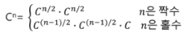
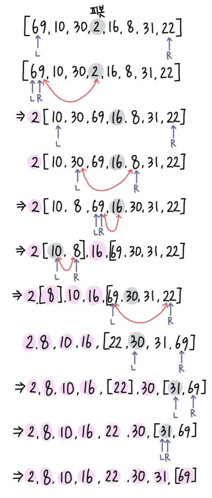

## 순열

```python
def f(i, k):
    if i == k:
        print(*p)
    else:
        for j in range(i, k):
            p[i], p[j] = p[j], p[i]
            f(i+1, k)
            p[i], p[j] = p[j], p[i]     # 교환 전으로 복구

n = 3
p = [1, 2, 3]
f(0,n)

'''
1 2 3
1 3 2
2 1 3
2 3 1
3 2 1
3 1 2
'''
```

- 순열의 합의 최소값 찾는 문제
    
    ```python
    def f(i, k):
        global min_v
        if i == k:
            # print(*p)
            s = 0
            for j in range(k):
                s += arr[k][p[j]]
            if min_v > s:
                min_v = s
        else:
            for j in range(i, k):
                p[i], p[j] = p[j], p[i]
                f(i+1, k)
                p[i], p[j] = p[j], p[i]     # 교환 전으로 복구
    
    n = int(input())
    arr = [list(map(int,input().split())) for _ in range(n)]
    p = [i for i in range(n)]
    min_v = 100
    f(0, n)
    print(min_v)
    ```
    
    ```python
    # 백트래킹으로 구현
    def f(i, k, s):
        global min_v
        global cnt
        cnt += 1
        if i == k:
            # print(*p)
            if min_v > s:
                min_v = s
        elif s >= min_v:
            return
        else:
            for j in range(i, k):
                p[i], p[j] = p[j], p[i]
                f(i+1, k, s+arr[i][p[i]])
                p[i], p[j] = p[j], p[i]     # 교환 전으로 복구
    
    n = int(input())
    arr = [list(map(int,input().split())) for _ in range(n)]
    p = [i for i in range(n)]
    min_v = 100
    cnt = 0
    f(0, n, 0)
    print(min_v, cnt)
    ```
    

<br>

## 분할 정복 알고리즘
### 설계 전략

- 분할(Divide) : 해결할 문제를 여러 개의 **작은 부분으로 나눔**
- 정복(Conquer) : 나눈 작은 문제를 각각 해결
- 통합(Combine) : (필요하다면) 해결된 해답을 모음

### 거듭 제곱 예제

```python
def power(base, exponent):
    if base == 0:
        return 1
    result = 1      # base^0 = 1
    for i in range(exponent):
        result *= base
    return result
```

- 분할 정복 기반의 시간복잡도 = $O(log_2n)$
    
    - $C^8$ = $C^4 * C^4$ = $((C^2)^2)^2$
    - $C^n = (C^{{n-1}/2})^2 * C$
    - 즉,
        
    
    ```python
    def power(base, exponent):
        if exponent == 0 or base == 0:
            return 1
        
        if exponent % 2 == 0:
            newbase = power(base, exponent//2)
            return newbase * newbase
        else:
            newbase = power(base, exponent//2)
            return (newbase * newbase) * base
    ```
    

### 퀵 정렬

- 주어진 배열을 두 개로 분할하고 각각을 정렬

#### 합병정렬과 차이점

- 합병정렬은 그냥 두 부분으로 나누지만 퀵정렬은 분할할 때, **기준 아이템(pivot item) 중심**으로, 이보다 작은 것은 왼편, 큰 것은 오른편에 위치
- 각 부분 정렬이 끝난후, 합병정렬은 ‘합병’이란 후처리 작업이 필요하나 퀵정렬은 필요하지 않음

```python
def quicksort(a, begin, end):
    if begin < end:
        p = partition(a, begin, end)        # 기준점의 최종 위치
        quicksort(a, begin, p-1)
        quicksort(a, p+1, end)
        
def partition(a,begin, end):
    pivot = (begin + end) // 2
    L = begin
    R = end
    
    while L < R:
        while (L<R and a[L] < a[pivot]): L += 1     # 기준보다 큰 값을 찾을 때 까지 왼쪽 탐색
        while (L<R and a[R] >= a[pivot]) : R -= 1   # 기준보다 작은 값을 찾을 때까지 오른쪽 탐색
        if L < R:
            if L == pivot:
                pivot = R
            a[L], a[R] = a[R], a[L]     # 큰값, 작은값 교환
    a[pivot], a[R] = a[R], a[pivot]
    return R        # 최종 피봇 위치
```

#### 수행 과정

- {69, 10, 30, 2, 16, 8, 31, 22}
- 원소의 개수가 8개이므로 네번째 자리에 있는 2를 첫번째 피봇으로 선택하고 퀵정렬 시작

1. 원소 2를 피봇으로 선택하고 퀵정렬 시작
    - L이 오른쪽으로 이동하면서 피봇보다 크거나 같은 원소를 찾고, R은 왼쪽으로 이동하면서 피봇보다 작은 원소를 찾음      
    - L은 69를 찾았지만, R은 피봇보다 작은 원소를 찾지 못한 채로 원소 69에서 L과 만남
    - **L과 R이 만났으므로**, 원소 69를 피봇과 교환하여 피봇원소 2의 위치를 확정

        
2. 피봇 2의 왼쪽 부분 집합은 공집합이므로 퀵정렬을 수행하지 않고 오른쪽 부분 집합에 대해 퀵정렬 수행
    - 오른쪽 부분 집합의 원소가 7개 이므로 가운데 있는 원소 16을 피봇으로 선택
    - L이 찾은 30과 R이 찾은 8을 서로 교환

    - 현재 위치에서 L과 R 작업 반복
    - L은 원소 69 찾았지만 R은 피봇보다 작은 원소 찾지 못한 채로 69에서 L과 만남
    - L과 R이 만났으므로, 원소 69와 피봇 교환하여 피봇 원소 16의 위치 확정
        
3. 피봇 16의 왼쪽 집합에서 원소 10을 피봇으로 선택하여 퀵정렬 수행
    - L의 원소 10과 R의 원소 8을 교환하는데 L의 원소가 피봇이므로  피봇 원소에 대한 자리교환이 발생한 것이므로 교환한 자리를 피봇 원소 10의 위치로 확정
        
4. 피봇 10의 확정된 위치에서의 왼쪽 부분 집합은 원소가 한 개 이므로 퀵정렬 수행하지 않고, 오른쪽 부분 집합은 공집합이므로 역시 퀵정렬 수행하지 않음
5. 2단계의 피봇이였던 원소 16에 대한 오른쪽 부분 집합에 대해 퀵정렬 수행
    - 오른쪽 부분 집합의 원소가 4개이므로 두번째 원소 30을 피봇으로 선택
    - L이 찾은 69와 R이 찾은 22 서로 교환
    - 현재 위치에서 L과 R 작업 반복
    - L은 30찾고, R은 찾지 못하고 30에서 L과 만남
    - L과 R이 만났으므로 피봇과 교환. 이 경우 R의 원소가 피봇이므로 피봇 자리 확정
6. 피봇 30의 확정 위치에서 왼쪽은 1개이므로 퀵정렬 수행 X. 오른쪽 부분에 대해서 퀵정렬 수행
    - 원소 31을 피봇으로 선택
    - L 은 31 찾음. R은 못찾고 31에서 L 과 만남
    - L과 R이 만났으므로 피봇과 교환. 이 경우 R의 원소가 피봇이므로 피봇 자리 확정
7. 31의 오른쪽 부분 집합이 1개이므로 퀵정렬 수행 X    →  정렬 완성

    
    

#### 퀵정렬 시간복잡도

- 최악의 경우 $O(n^2)$
- 하지만 평균 복잡도는 $nlogn$