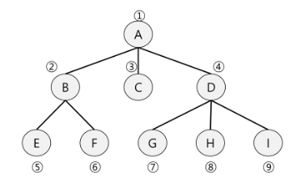

## BFS

탐색 시작점의 인접한 정점들을 먼저 모두 차례로 방문한 후에, 방문했던 정점을 시작점으로 하여 다시 인접한 정점들을 차례로 방문하는 방식



- 인접한 정점들에 대해 탐색을 한 후, 차례로 다시 너비우선탐색을 진행해야 하므로, 선입선출 형태의 자료구조인 큐 활용
```python
'''
7 8
1 2 1 3 2 4 2 5 4 6 5 6 6 7 3 7
'''
def bfs(s, n): # 시작 정점 s, 노드개수 n
    q = []
    visited = [0] * (n+1)
    q.append(s)
    visited[s] = 1
    while q:
        t = q.pop(0)
        print(t)
        for i in adjl[t]:
            if visited[i] == 0:
                q.append(i)
                visited[i] = 1 + visited[t]

v, e = map(int,input().split())
arr = list(map(int,input().split()))
adjl = [[] for _ in range(v+1)]
for i in range(e):
    n1, n2 = arr[i*2], arr[i*2+1]
    adjl[n1].append(n2)
    adjl[n2].append(n1)

bfs(1,v)
```