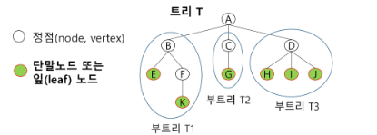

## 트리
비선형 구조로 원소들 간에 1:n 관계와 계층관계를 가지는 계층형 자료구조

- 상위 원소에서 하위 원소로 내려가면서 확장되는 트리모양의 구조

### 정의

- 한개 이상의 노드로 이루어진 유한 집합
- 노드 중 최상위 노드를 루트(root)라고 함
- 나머지 노드들은 n(≥0)개의 분리집합 T1, … ,TN으로 분리될 수 있음.
- 이들  T1, … ,TN은 각각 하나의 트리가 되며 (재귀적 정의) 루트를 부 트리(subtree)라 함
    
    
    

### 용어

- 노드(node) : 트리의 원소
- 간선(edge) : 노드를 연결하는 선. 부모 노드와 자식 노드를 연결
- 루트 노드(root node) : 트리의 시작 노드
- 형제 노드(sibling node) : 같은 부모 노드의 자식 노드들
- 조상 노드 : 간선을 따라 루트 노드까지 이르는 경로에 있는 모든 노드들
- 서브 트리(subtree) : 부모 노드와 연결된 간선을 끊었을 때 생성되는 트리
- 자손 노드 : 서브 트리에 있는 하위 레벨의 노드들
- 차수(degree)
    - 노드의 차수 : 노드에 연결된 자식 노드의 수
    - 트리의 차수 : 트리에 있는 노드의 차수 중 가장 큰 값
    - 단말 노드(리프 노드) : 차수가 0인 노드. 자식 노드가 없는 노드
    - 아래 예시에선 B의 차수 = 2, C의 차수 = 1, 리프노드는 초록색 칠해진 노드들
         

- 높이
    - 노드의 높이 : 루트에서 노드에 이르는 간선의 수. 노드의 레벨
    - 트리의 높이 : 트리에 있는 노드의 높이 중에서 갖아 큰 값. 최대 레벨
    
    
    


## 이진 트리


모든 노드들이 2개의 서브트리를 갖는 특별한 형태의 트리

- 각 노드가 자식 노드를 최대한 2개까지만 가질 수 있는 트리
    - 왼쪽 자식 노드(left child node)
    - 오른쪽 자식 노드(right child node)
    
### 특성

- 레벨 i에서의 노드의 최대 개수는 $2^i$개
- 높이가 h인 이진 트리가 가질 수 있는 노드의 최소 개수는 (h+1)개가 되며, 최대 개수는 $(2^{h+1}-1)$개가 됨


### 종류

- 포화 이진 트리(Full Binary Tree)
    - 모든 레벨에 노드가 포화상태로 차 있는 이진 트리
    - 높이가 h일 때, 최대의 노드 개수인  $(2^{h+1}-1)$의 노드를 가진 이진 트리
        - 높이가 3일 때 $2^{3+1}-1 = 15$개의 노드
    - 루트를 1번으로 하여 $(2^{h+1}-1)$까지 정해진 위치에 대한 노드 번호를 가짐
    
    
    
- 완전 이진 트리(Complete Binary Tree)
    - 높이가 h이고 노드 수가 n개일 때($2^h$ ≤ n ≤ $2^{h+1}-1$), 포화 이진 트리의 노드 번호 1번부터 n번까지 빈 자리가 없는 이진 트리
    - 예) 노드가 10개인 완전 이진 트리
        
        
        
- 편향 이진 트리(Skewed Binary Tree)
    - 높이 h에 대한 최소 개수의 노드를 가지면서 한쪽 방향의 자식 노드만을 가진 이진 트리
        - 왼쪽 편향 이진 트리
            
            
            
        - 오른쪽 편향 이진 트리
            
            
            


### 순회(Traversal)

트리의 각 노드를 중복되지 않게 전부 방문하는 것

- 트리는 비선형구조이기 때문에 선형구조에서와 같이 선후 연결관계를 알 수 없음

- 3가지 기본적인 순회방법
    - 전위순회(preorder traversal) : VLR
        - 부모 노드 방문 후, 자식 노드를 좌, 우 순서로 방문
    - 중위순회(inorder traversal) : LVR
        - 왼쪽 자식노드, 부모노드, 오른쪽 자식노드 순으로 방문
    - 후위순회(postorder traversal) : LRV
        - 자식 노드를 좌우순서로 방문 후, 부모 노드 방문

    


#### 전위 순회
- 수행 방법
    1. 현재 노드 n 을 방문 처리 → V
    2. 현재 노드 n의 왼쪽 서브트리로 이동 → L
    3. 현재 노드 n의 오른쪽 서브트리로 이동 → R

```python
def preorder_traverse(T):   # 전위순회
    if T:
        visit(T)
        preorder_traverse(T.left)
        preorder_traverse(T.right)
```

- 예시

    
    - A B D E H I C F G
        
        

    

#### 중위 순회

- 수행 방법
    1. 현재 노드 n의 왼쪽 서브트리로 이동 → L
    2. 현재 노드 n을 방문하여 처리 → V
    3. 현재 노드 n의 오른쪽 서브트리로 이동 → R

```python
def inorder_traverse(T):
    if T:
        inorder_traverse(T.left)
        visit(T)
        inorder_traverse(T.right)
```

- 예시

    
    - D B H E I A F C G
        


#### 후위 순회

- 수행 방법
    1. 현재 노드 n의 왼쪽 서브트리로 이동 → L
    2. 현재 노드 n의 오른쪽 서브트리로 이동 → R
    3. 현재 노드 n을 방문하여 처리 → V

```python
def postorder_traverse(T):
    if T:
        postorder_traverse(T.left)
        postorder_traverse(T.right)
        visit(T)
```

- 예시

    
    - D H I E B F G C A
        
        

#### 예제


- 전위 순회 = A B D H I E J C F K G L M
- 중위 순회 = H D I B J E A F K C L G M
- 후위 순회 = H I D J E B K F L M G C A


### 이진트리 표현 - 배열

- 루트 번호를 1로 하여 레벨 n에 있는 노드에 대하여 왼쪽부터 오른쪽으로 $2^n$ 부터 $2^{n+1}-1$까지 번호를 차례로 부여
    
    
    

- 노드 번호의 성질
    - 노드 번호가 i인 노드의 부모 노드 번호 = i / 2
    - 노드 번호가 i인 노드의 왼쪽 자식 노드 = i * 2
    - 노드 번호가 i인 노드의 오른쪽 자식 노드 = i * 2 + 1
    - 레벨 n이 노드 번호 시작 = $2^n$

- 노드 번호를 배열의 인덱스로 사용
- 높이가 h인 이진 트리를 위한 배열이 크기는 $(2^{h+1}-1)$

    

```py
'''
13
1 2 1 3 2 4 3 5 3 6 4 7 5 8 5 9 6 10 6 11 7 12 11 13
'''
def preorder_traverse(T):   # 전위순회
    if T:
        print(T, end =' ')
        preorder_traverse(left[T])
        preorder_traverse(right[T])


n = int(input())
e = n-1
arr = list(map(int,input().split()))
left = [0] * (n+1)      # 부모를 인덱스로 왼쪽자식번호 저장
right = [0] * (n+1)
par = [0] * (n+1)       # 자식을 인덱스로 부모 저장

for i in range(e):
    p, c = arr[i*2], arr[i*2+1]
    if left[p] == 0:
        left[p] = c
    else:
        right[p] = c
    par[c] = p

c = n
while par[c] != 0:      # 부모가 있으면
    c = par[c]          # 부모를 새로운 자식으로 두고
root = c                # 더이상 부모가 없으면 root
print(root)
preorder_traverse(root)
```

- 배열을 이용한 이진 트리의 표현의 단점
    - 편향 이진 트리의 경우 사용하지 않는 배열 원소에 대한 메모리 공간 낭비 발생
    - 트리의 중간에 새로운 노드를 삽입하거나 기존의 노드를 삭제할 경우 배열의 크기 변경 어려워 비효율적

### 이진 트리의 표현 - 연결리스트

- 이진 트리의 모든 노드는 최대 2개의 자식 노드를 가지므로 일정한 구조의 단순 연결 리스트 노드를 사용하여 구현
    