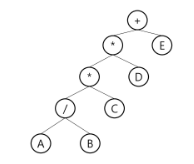
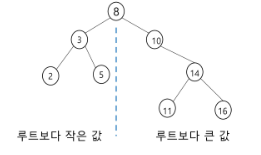
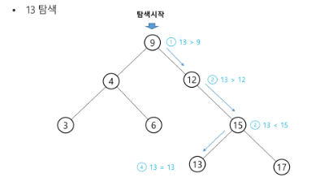
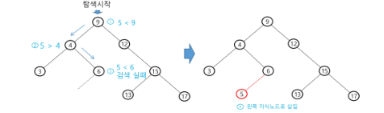
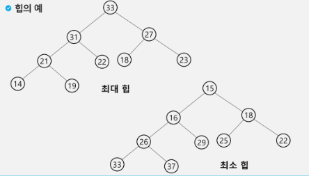
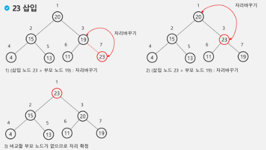
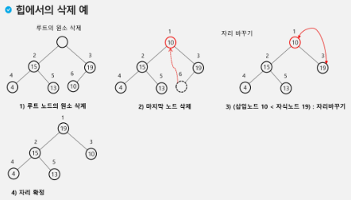

## 수식 트리
수식을 표현하는 이진 트리

- 수식 이진 트리(expression binary tree)라고도 부름
- 연산자는 루트노드이거나 가지노드
- 피연산자는 모두 잎노드

### 수식트리의 순회

- 중위 순회
    - A / B * C * D + E
- 후위 순회
    - A B / C * D * E +
- 전위 순회
    - +**/A B C D E


## 이진 탐색 트리
탐색작업을 효율적으로 하기 위한 자료구조

- 모든 원소는 서로 다른 유일한 키를 가짐
- key(왼쪽 서브트리) < key(루트 노드) < key(오른쪽 서브트리)
- 왼쪽 서브트리와 오른쪽 서브트리도 이진 탐색 트리
- 중위 순회하면 오름차순으로 정렬된 값을 얻을 수 있음




### 탐색 연산
- 루트에서 시작
- 탐색할 키 값 x를 루트 노드의 키 값과 비교
    - 키 값 x = 루트노드의 키 값 : 원하는 원소를 찾았으므로 탐색 연산 성공
    - 키 값 x < 루트노드의 키 값 : 루트노드의 왼쪽 서브트리에 대해서 탐색 연산 수행
    - 키 값 x > 루트노드의 키 값 : 루트노드의 오른쪽 서브트리에 대해서 탐색 연산 수행
- 서브트리에 대해서 순환적으로 탐색 연산을 반복!!

    

### 삽입 연산

1. 먼저 탐색 연산을 수행
    - 삽입할 원소와 같은 원소가 트리에 있으면 삽입할 수 없으므로, 같은 원소가 트리에 있는지 탐색하여 확인
    - 탐색에서 탐색 실패가 결정되는 위치가 삽입 위치
2. 탐색 실패한 위치에 원소 삽입

    


### 성능
- 탐색, 삽입, 삭제 시간은 트리의 높이만큼 시간이 걸림  →  O(h)
    - h = BST의 깊이(height)
- 평균의 경우  →  O(log n)
    - 이진트리가 균형적으로 생성되어 있는 경우
- 최악의 경우  → O(n)
    - 한쪽으로 치우친 경사 이진트리의 경우
    - 순차탐색과 시간복잡도가 같음


### 검색 알고리즘의 비교
- 배열에서의 순차 검색 : O(N)
- 정렬된 배열에서의 순차 검색 : O(N)
- 정렬된 배열에서의 이진탐색 : O(log N)
    - 고정 배열 크기와 삽입, 삭제시 추가 연산 필요
- 이진 탐색트리에서의 평균 : O(log N)
    - 최악의 경우 : O(N)
    - 완전 이진 트리 또는 균형트리로 바꿀 수 있따면 최악의 경우를 없앨 수 있음
        - 새로운 원소를 삽입할 때 삽입 시간을 줄임
        - 평균과 최악의 시간이 같음!!
- 해쉬 검색 : O(1)
    - 추가 저장 공간이 필요


## 힙(heap)
**완전 이진 트리**에 있는 노드 중에서 키값이 가장 큰 노드나 키값이 가장 작은 노드를 찾기 위해서 만든 자료구조

- 최대 힙(max heap)
    - 키값이 가장 큰 노드를 찾기 위한 완전 이진 트리
    - 부모노드의 키 값 > 자식노드의 키 값
    - 루트노드 = 키값이 가장 큰 노드
- 최소 힙(min heap)
    - 키값이 가장 작은 노드를 찾기 위한 완전 이진 트리
    - 부모노드의 키 값 < 자식노드의 키 값
    - 루트노드 = 키값이 가장 작은 노드



### 삽입
1. 빈 자리에 노드 추가하기
2. 삽입노드와 부모 노드를 계속 확인하여 삽입노드 > 부모 노드면 자리 바꿔주기



### 삭제
- 힙에서는 루트 노드의 원소만을 삭제할 수 있음
- 루트노드의 원소를 삭제하여 반환
- 힙의 종류에 따라 최대값 / 최소값을 구할 수 있음


```py
# 최대힙
def enq(n):
    global last
    # 마지막 노드 추가(완전이진트리 유지)
    last += 1
    # 마지막 노드에 데이터 삽입
    h[last] = n
    # 부모 > 자식 비교를 위해
    c = last
    # 부모 번호 계산
    p = c // 2

    # 부모가 있는데 더 작으면 교환
    while p >= 1 and h[p] < h[c]:
        h[p], h[c] = h[c], h[p]
        c = p
        p = c // 2

def deq():
    global last
    tmp = h[1]   # 루트의 키 값 보관
    h[1] = h[last]
    last -= 1
    p = 1       # 새로 옮긴 루트
    c = p * 2
    # 자식이 있으면
    while c <= last:
        # 오른쪽 자식이 있고 그게 더 크면 오른쪽 자식과 비교해야함
        if c+1 <= last and h[c] < h[c+1]:
            c += 1
        if h[p] < h[c]:
            h[p], h[c] = h[c], h[p]
            p = c
            c = p * 2
        else:
            break
    return tmp

n = 10              # 필요한 노드 수
h = [0] * (n+1)     # 최대 힙
last = 0            # 힙의 마지막 노드 번호

enq(2)
enq(5)
enq(3)
enq(6)
enq(4)

while last > 0:
    print(deq())
```