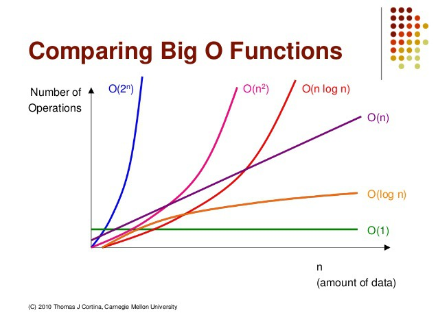
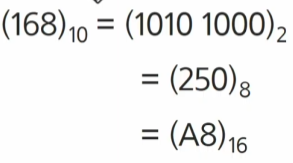

## SW 문제 해결

### 문제해결 역량이란?

- 프로그램을 하기 위한 많은 제약 조건과 요구사항을 이해하고 최선의 방법을 찾아내는 능력
- 프로그래머가 사용하는 언어나 라이브러리, 자료구조, 알고리즘에 대한 지식을 연결하여 큰 그림을 만드는 능력

- 문제 해결 과정
    1. 문제 이해
    2. 문제를 익숙한 용어로 재정의
    3. 해결 계획 세우기
    4. 계획 검증
    5. 프로그램으로 구현
    6. 어떻게 풀었는지 돌아보고 개선 방법 찾아보기

- 문제해결 능력을 기르는 이유
    - 코딩을 잘 하기 위해서!!!

## 복잡도 분석

### 알고리즘

- 유한한 단계를 통해 **문제를 해결하기 위한 절차나 방법**
- 주로 컴퓨터 용어로 쓰이며, 컴퓨터가 어떤 일을 수행하기 위한 단계적 방법

### 알고리즘 효율

- 공간적 효율성은 연산량 대비 얼마나 적은 메모리 공간을 요하는가
- 시간적 효율성은 연산량 대비 얼마나 적은 시간 요하는가
- 효율성 반대 = 복잡도
    - 복잡도가 높을수록 효율성 저하
- 시간이 빠르고 공간을 조금 사용 → 성능 좋은 알고리즘

### 복잡도의 점근적 표기

- 시간복잡도는 입력 크기에 대한 함수로 표기. → 여러개의 항을 가지는 다항식
- 단순한 함수로 표현하기 위해 점근적 표기 사용
- 입력 크기 n이 뭏나대로 커질 때의 복잡도를 간단히 표현하기 위해 사용하는 표기법
    - O(big-Oh) 표기
    - Ω(big-Omega) 표기
    - Θ(big-Theta) 표기

### O(big-Oh) 표기

- 복잡도의 점근적 상한
- 복잡도가 $f(n) = 2n^2 - 7n+4$라면 O-표기는 $O(n^2)$
    - 최고차항의 상수 배제 후 표기
- 성능을 미세하기 비교하고 싶은 경우 상수는 표기하기도 함!

- 자주 사용하는 O-표기
    - O(1) : 상수 시간
    - O(log n) : 로그 시간
    - O(n) : 선형 시간
    - O(n log n) : 로그 선형 시간
    - O(n^2) : 제곱 시간
    - O(n^3) : 세제곱 시간

- O(log n)은 O(1)보다 느리지만 유사한 성능
- O(n log n)은 O(n)보다 느리지만 유사한 성능
    
    
    

## 진수

- 10진수 : 사람이 사용하는 진수 : 0~9로 표현
- 2진수 : 컴퓨터가 사용하는 진수 : 0,1로 표현
- 16진수 : 2진수를 더 가독성있게 사용 : 0~9,A,B,C,D,E,F 로 표현
    
    
    
- 16진수 사용 이유
    - 2진수를 10진수로 변환 시 연산이 오래걸림
    - 2진수를 16진수로 변환 시 연산 속도가 매우 빠름
- 용어
    - HEX : 16진수
    - DEC : 10진수
    - OCT : 8진수
    - BIN : 2진수
- 10진수 → 2진수
    - 10진수를 지속적으로 2로 나누고
    - 마지막으로 list 거꾸로 뒤집기
