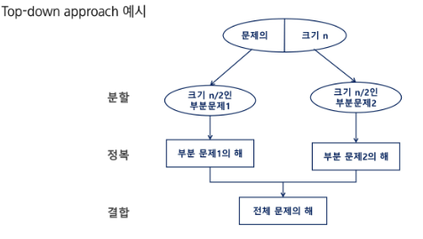

## 알고리즘 설계 기법의 종류

1. 전체를 그냥 다 보자. (Brute Force - 완전탐색)
    - 배열 : for문, while 문
    - 그래프(관계가 있는 데이터)
        - BFS, DFS

  ---

완전 탐색을 구현하면, 시간 or 메모리 초과가 된다!!

2. 상황마다 좋은 걸 고르자 (Greedy - 그리디)
    - 규칙 + 증명 → 구현
3. 큰 문제를 작은 문제로 나누어 부분적으로 해결하자 (Dynamic Programming)
    - 분할 정복과 다르게 작은 문제가 중복
    - 중복된 문제의 해답을 저장해놓고 재활용하자! (Memoization)
4. 큰 문제를 작은 문제로 나누어 부분적으로 해결하자 (분할 정복)
5. 전체 중 가능성 없는 것을 빼자 (Backtracking - 백트래킹)

→ 이 기본들을 기반으로 더 고급 알고리즘들이 개발됨


## 분할 정복

### 설계 전략

- 분할(Divide) : 해결할 문제를 여러 개의 작은 부분으로 나눈다.
- 정복(Conquer) : 나눈 작은 문제를 각각 해결한다.
- 통합(combine) : (필요하다면) 해결된 해답을 모은다.
    
    → 재귀 형식으로 많이 구현된다!!
    
    
    
    - 분할 시 꼭 절반으로 나누지 않아도 되지만, 보통 절반으로 나눠야 효율적임

### 예시

- 거듭 제곱
    - 반복(Iterative) 알고리즘 : O(n)
      
      ```
      Iterative_Power(x, n)
        result <- 1

        FOR i in 1 -> n
          result <- result * x
        
        RETURN result
      ```
        
    - 분할 정복 기반 알고리즘 : O($log_2 n$)
        
      ```
      Recursive_Power(x, n)
        IF n == 1: RETURN x
        IF n is even
          y <- Recursive_Power(x, n/2)
          RETURN y * y
        ELSE
          y <- Recursive_Power(x, (n-1)/2)
          RETURN y * y * x
      ```
        

## 병합 정렬(Merge Sort)

여러 개의 정렬된 자료의 집합을 병합하여 한 개의 정렬된 집합으로 만드는 방식

- 자료를 최소 단위의 문제까지 나눈 후에 차례대로 정렬하여 최종 결과를 얻어냄
- top-down 방식
- 시간 복잡도 : O(n log n)

### 병합 정렬 과정

- {69, 10, 30, 2, 16, 8, 31, 22}를 병합 정렬하는 과정
- 분할 단계 : 전체 자료 집합에 대하여, **최소 크기의 부분집합이 될 때까지** 분할 작업을 계속함!
    
    
    
- #병합 단계 : 2개의 부분집합을 정렬하면서 하나의 집합으로 병합
    
    
    

```
// 분할 과정
merge_sort(LIST m)
	IF length(m) == 1 : RETURN m
	
	LIST left, right
	middle <- length(m) / 2
	FOR x in m before middle
		add x to left
	FOR x in m after or equal middle
		add x to right
	
	left <- merge_sort(left)
	right <- merge_sort(right)
	
	RETURN merge(left, right)
```

```
// 병합 과정
merge(LIST left, LIST right)
	LIST result
	
	WHILE length(left) > 0 OR length(right) > 0
		IF length(left) > 0 and length(right) > 0
			IF first(left) <= first(right)
				append popfirst(left) to result
			ELSE
				append popfirst(right) to result
		ELIF length(left) > 0
			append popfirst(left) to result
		ELIF length(right) > 0
			append popfirst(right) to result
	RETURN result
```

## 퀵 정렬

주어진 배열을 두개로 분할하고, 각각을 정렬

- 평균적으로 효율이 굉장히 좋음
- 병합 정렬과 다른점
    1. 병합 정렬은 그냥 두 부분으로 나누는 반면에, 퀵 정렬은 분할할 때, 기준 아이템(pivot item) 중심으로 분할
        - 기준보다 작은 것은 왼편, 큰 것은 오른편에 위치
    2. 각 부분이 정렬이 끝난 후, 병합정렬은 ‘병합’이라는 후처리 작업이 필요하나, 퀵정렬은 필요하지 않음

```
quickSort(A[], l, r)
	if l < r
		s <- partition(a, l, r)
		quickSort(A[], l, s-1)
		quickSort(A[], s+1, r)
		
		
	partition(A[], l, r)
		p <- A[l]      // p : 피봇 값
		i <- l, j <- r
		WHILE i <= j
			WHILE i <= j and A[i] <= p : i++
			WHILE i <= j and A[j] >= p : j--
			IF i < j : swap(A[i], A[j])
			
		swap(A[l], A[j])
		RETURN j
```

### 아이디어

- P(피봇)값들 보다 큰 값은 오른쪽, 작은 값들은 왼쪽 집합에 위치하도록 한다.
    
- 피봇을 두 집합의 가운데에 위치시킨다.
    
- 피봇 선택
    - 왼쪽 끝 / 오른쪽 끝 / 임의의 세 값 중에 중간 값

## 분할 정복 알고리즘 정리

- 병합 정렬
    - 외부 정렬의 기본이 되는 정렬 알고리즘
    - 멀티코어(Multi-Core) CPU나 다수의 프로세서에서 정렬 알고리즘을 병렬화하기 위해 병합 정렬 알고리즘이 활용됨
- 퀵 정렬은 매우 큰 입력 데이터에 대해서 좋은 성능을 보이는 알고리즘
    - 평균 : O(n log n)
    - 최악의 경우 O($n^2$)이 되기도 함
- 파이썬 내장 함수 sort()의 경우,
    - n log n을 보장
    - tim sort를 사용!

## 이진 검색

자료의 가운데에 있는 항목의 키 값과 비교하여 다음 검색의 위치를 결정하고 검색을 계속 진행하는 방법

- 목적 키를 찾을 때까지 이진 검색을 순환적으로 반복 수행함으로써 검색 범위를 반으로 줄여가면서 보다 빠르게 검색을 수행
- 이진 검색을 하기 위해서는 **자료가 정렬된 상태**여야 함

### 검색 과정

1. 자료의 중앙에 있는 원소를 고름
2. 중앙 원소의 값과 찾고자 하는 목표 값을 비교
3. 목표 값이 중앙 원소의 값보다 작으면 자료의 왼쪽 반에 대해서 새로 검색을 수행하고, 크다면 자료의 오른쪽 반에 대해서 새로 검색 수행
4. 찾고자 하는 값을 찾을 때까지 1~3의 과정을 반복

## 이진검색 정리

- 정렬된 데이터를 기준으로 특정 값이나 범위를 검색하는데 사용

추가 )

- Lower Bound, Upper Bound
    - 정렬된 배열에서 특정 값 이상 또는 이하가 처음으로 나타나는 위치를 찾는 알고리즘
    - 특정 데이터의 범위 검색 등에서 활용