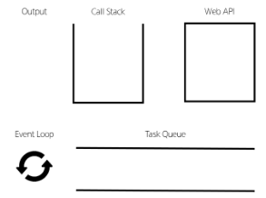

## 비동기

### Synchronous (동기)

프로그램의 실행 흐름이 순차적으로 진행

-> 하나의 작업이 완료된 후에 다음 작업이 실행되는 방식

예시 )

1. 메인 작업이 모두 수행되어야 마지막 작업이 수행됨
2. 함수의 작업이 완료될 때까지 기다렸다가 값을 반환해야 계속 진행 가능

### Asynchronous (비동기)

프로그램의 실행 흐름이 순차적이지 않으며, 작업이 완료되기를 기다리지 않고 다음 작업이 실행되는 방식

-> 작업의 완료 여부를 신경쓰지 않고 동시에 다른 작업들을 수행할 수 있음

#### 특징

병렬적 수행 (응답이 빨리 오는 작업부터 처리함)

## Javascript와 비동기

### Single Thread 언어

Thread = 작업을 처리할 때 실제로 작업을 수행하는 주체, multi-thread라면 업무를 수행할 수 있는 주체가 여러 개라는 의미

즉, JavaScript는 한번에 여러 일을 수행할 수 없다.

-> 어떻게 비동기 처리를 할까요??

### JavaScript Runtime

JS가 동작할 수 있는 환경

JS는 Single Thread이므로 비동기 처리를 할 수 있도록 도와주는 환경이 필요

-> 브라우저 또는 Node와 같은 환경에서 처리

```javascript
console.log("Hi");

setTimeout(function myFunc() {
  console.log("Work");
}, 3000);

console.log("Bye");
```

### 브라우저 환경에서 비동기 처리

#### 요소

1. JavaScript Engine의 Call Stack
   - 요청이 들어올 때마다 순차적으로 처리하는 Stack(LIFO)
   - 기본적인 Javascript의 single thread 작업 처리
2. Web API
   - JS 엔진이 아닌 브라우저에서 제공하는 runtime 환경
   - 시간이 소요되는 작업을 처리 (setTimeout, DOM Event, 비동기 요청 ...)
3. Task Queue
   - 비동기 처리된 Callback 함수가 대기하는 Queue(FIFO)
4. Event Loop
   - 태스크가 들어오길 기다렸다가 태스크가 들어오면 이를 처리하고, 처리할 태스크가 없는 경우 잠드는, 끊임없이 돌아가는 루프
   - Call Stack과 Task Queue를 지속적으로 모니터링
   - Call Stack이 비어있는지 확인 후 비어 있다면 Task Queue에서 대기중인 오래된 작업을 Call Stack으로 Push



#### 방식

1. 모든 작업은 Call Stack(LIFO)으로 들어간 후 처리됨
2. 오래 걸리는 작업이 Call Stack 으로 들어오면 Web API로 보내 별도로 처리하도록 함
3. Web API에서 처리가 끝난 작업들은 곧바로 Call Stack으로 들어가지 못하고 Task Queue(FIFO)에 순서대로 들어감
4. Event Loop가 Call Stack이 비어 있는 것을 계속 체크하고 Call Stack이 빈다면 Task Queue에서 가장 오래된 작업을 Call Stack으로 보냄

#### 정리

Javascript는 한번에 하나의 작업을 수행하는 Single Thread 언어로 동기적 처리를 진행

하지만 브라우저 환경에서는 Web API에서 처리된 작업이 지속적으로 Task Queue를 거쳐 Event Loop에 의해 Call stack에 들어와 순차적으로 실행됨으로써 비동기 작업이 가능한 환경이 됨

## Ajax

Asynchronous JavaScript and XML

XMLHttpRequest 기술을 사용해 복잡하고 동적인 웹 페이지를 구성하는 프로그래밍 방식

#### Ajax 정의

비동기적인 웹 애플리케이션 개발을 위한 기술

브라우저와 서버 간의 데이터를 비동기적으로 교환하는 기술

- Ajax를 사용하면 페이지 전체를 새로고침 하지 않고도 동적으로 데이터를 불러와 화면을 갱신할 수 있음
- Ajax 의 x는 XML이라는 데이터 타입을 의미하긴 하지만, 요즘은 더 가벼운 용량과 JS의 일부라는 장점 때문에 JSON을 더 많이 사용

#### Ajax 목적

전체 페이지가 다시 로드되지 않고 HTML 페이지 일부 DOM만 업데이트

-> 웹 페이지 일부가 다시 로드되는 동안에도 코드가 계속 실행되어, 비동기식으로 작업할 수 있음

### XMLHttpRequest(XHR) 객체

서버와 상호작용 할 때 사용하는 객체

페이지의 새로고침 없이도 데이터를 가져올 수 있음

#### 특징

- JS를 사용하여 서버에 HTTP 요청을 할 수 있는 객체
- 브라우저와 서버 간의 네트워크 요청을 전송할 수 있음
- 사용자의 작업을 방해하지 않고 페이지의 일부를 업데이트 할 수 있음

-> 이름에 XML이라는 데이터 타입이 들어가긴 하지만 모든 종류의 데이터를 가저올 수 있음

#### 기존 기술과의 차이 - 기존 방식

1. 클라이언트(브라우저)에서 form을 채우고 이를 서버로 제출(submit)
2. 서버는 요청 내용에 따라 데이터 처리 후 새로운 웹페이지를 작성하여 응답으로 전달

-> 결과적으로 모든 요청에 따라 새로운 페이지를 응답 받기 때문에 계속해서 새로고침이 발생

-> 기존 페이지와 유사한 내용을 가지고 있는 경우 중복된 코드를 다시 전송받음으로써 대역폭을 낭비하게 되는 경우가 많음

#### 기존 기술과의 차이 - Ajax

1. XHR 객체 생성 및 요청
2. 서버는 새로운 페이지를 응답으로 만들지 않고 필요한 부분에 대한 데이터만 처리 후 응답 (JSON 및 기타 데이터)

-> 새로운 페이지를 받는 것이 아닌 필요한 부분의 데이터만 받아 기존의 페이지의 일부를 수정 (새로고침 X)

-> 서버에서 모두 처리되던 데이터 처리의 일부분이 이제는 클라이언트 쪽에서 처리되므로 교환되는 데이터량과 처리량이 줄어듦

#### 이벤트 핸들러

비동기 프로그래밍의 한 형태

이벤트가 발생할 때마다 호출되는 함수(콜백 함수)를 제공하는 것

HTTP 요청은 응답이 올 때까지의 시간이 걸릴 수 있는 작업이라 비동기며, 이벤트 핸들러를 XHR 객체에 연결해 요청의 진행 상태 및 최종 완료에 대한 응답을 받음

### Axios

HTTP 클라이언트 라이브러리

- 클라이언트 및 서버 사이에 HTTP 요청을 만들고 응답을 처리하는 데 사용되는 자바스크립트 라이브러리
- 서버와의 HTTP 요청과 응답을 간편하게 처리할 수 있도록 도와주는 도구
- 브라우저를 위한 XHR 객체 생성
- 간편한 API를 제공하며 Promise 기반의 비동기 요청을 처리

-> 주로 웹 애플리케이션에서 서버와 통신할 때 사용

#### 클라이언트 서버 간 동작

1. Axios를 활용해 XML 객체 생성 및 요청
2. Ajax 요청 처리
3. 응답 데이터 생성
4. JSON 데이터 응답
5. Axios가 Promise 객체로 응답 데이터 제공
6. 응답 데이터를 활용해 DOM 조작

#### 구조

axios 객체를 활용해 요청을 보낸 후 응답 데이터 promise 객체를 반환

```javascript
// 1.
const promiseObj = axios({
  method: "get",
  url: URL,
});

console.log(promiseObj); // Promise object

promiseObj.then((response) => {
  console.log(response); // Response Object
  console.log(response.data); //Response data
});

// 2.

axios({
  method: "get",
  url: URL,
}).then((response) => {
  console.log(response);
  console.log(response.data);
});
```

- promise 객체는 then과 catch 메서드를 활용해 각각 필요한 로직을 수행
  - then(callback) : 요청한 작업이 성공하면 callback 실행.
  - catch(callback) : then이 하나라도 실패하면 callback 실행, 남은 then 중단.
- Promise object
  - 자바스크립트에서 비동기 작업을 처리하기 위한 객체
  - 비동기 작업의 성공 또는 실패와 관련된 결과나 값을 나타냄
  ```javascript
  const promiseObj = axios({
    ...
  })
  console.log(promiseObj)
  ```

#### 고양이 사진 가져오기 실습

```javascript
const URL = "https://api.thecatapi.com/v1/images/search";
axios({
  method: "get",
  url: URL,
})
  .then((response) => {
    console.log(response);
    console.log(response.data);
  })
  .catch((error) => {
    console.log(error);
    console.log("실패함");
  });
console.log("야옹");
```

출력 결과

```
야옹
response Object
response data
```

-> cat api로부터 응답을 기다려야 하는 작업은 비동기로 처리하기 때문에 "야옹" 출력 이후 응답 데이터 출력됨

#### 고양이 사진 가져오기 실습 (버튼 누르면 이미지 출력)

```javascript
const URL = "https://api.thecatapi.com/v1/images/search";
const btn = document.querySelector("button");

const getCats = function () {
  axios({
    method: "get",
    url: URL,
  })
    .then((response) => {
      imgUrl = response.data[0].url;
      imgElem = document.createElement("img");
      imgElem.setAttribute("src", imgUrl);
      document.body.appendChild(imgElem);
    })
    .catch((error) => {
      console.log(error);
      console.log("실패함");
    });
  console.log("야옹");
};

btn.addEventListener("click", getCats);
```

### 정리

- Ajax
  - 특정한 기술 하나를 의미하는 것이 아니며 비동기적인 웹 어플리케이션 개발에 사용하는 기술들을 묶어서 지칭
- Axios
  - 클라이언트 및 서버 사이에 HTTP 요청을 만들고 응답을 처리하는데 사용되는 자바스크립트 라이브러리 (promise API 지원)

-> 프론트엔드에서 Axios를 활용해 DRF로 만든 API 서버로 요청을 보내서 데이터를 받아온 후 처리하는 로직을 작성하게 됨

## Callback과 Promise

- 비동기 처리 단점
  - 비동기 처리는 작업이 완료되는 순서에 따라 처리함
  - 이것이 코드의 실행순서가 불명확하다는 단점이 존재하게 된다.

### 비동기 콜백

비동기적으로 처리되는 작업이 완료되었을 때 실행되는 함수

연쇄적으로 발생하는 비동기 작업을 순차적으로 동작할 수 있게 함

-> 작업의 순서와 동작을 제어하거나 결과를 처리하는데 사용

```javascript
const asyncTask = function (callBack) {
  setTimeout(function () {
    console.log("비동기 작업 완료");
    callBack(); // 작업 완료 후 콜백 호출
  }, 2000);
};

asyncTask(function () {
  console.log("작업 완료 후 콜백 실행");
});

// 출력 결과
// 비동기 작업 완료
// 작업 완료 후 콜백 실행
```

#### 한계

비동기 콜백 함수는 보통 어떤 기능의 실행 결과를 받아서 다른 기능을 수행하기 위해 많이 사용됨

-> 이 과정을 작성하다 보면 비슷한 패턴 계속 발생 -> 콜백 지옥

- A를 처리해서 결과가 나오면 첫번째 callback 함수 실행,
- 첫번째 callback 함수가 종료되면 두번째 callback 함수 실행
- 두번째 callback 함수가 종료되면 세번째 callback 함수 실행 ...

#### 정리

콜백함수는 비동기 작업을 순차적으로 실행할 수 있게 하는 반드시 필요한 로직

비동기 코드를 작성하다 보면 콜백 함수로 인한 콜백 지옥은 번번히 나타나는 문제이며, 이는 코드의 가독성을 해치고 유지보수 어려워짐

### 프로미스 (Promise)

비동기 작업의 결과를 나타내는 객체

-> 비동기 작업이 완료되었을 때 결과값을 반환하거나, 실패시 에러를 처리할 수 있는 기능을 제공

#### Promise object

비동기 작업의 성공 또는 실패와 관련된 결과나 값을 나타냄

- 콜백 지옥 문제를 해결하기 위해 등장한 비동기 처리를 위한 객체
- 작업이 끝나면 실행시켜줄게 라는 약속
- Promise 기반의 HTTP 클라이언트 라이브러리가 Axios!!!!
  - 성공에 대한 약속 then()
  - 실패에 대한 약속 catch()

```javascript
// 비동기 콜백 방식
work1(function () {
  // 첫번째 작업 ...
  work2(result1, function (result2) {
    // 두번째 작업 ...
    work3(result2, function (result3) {
      console.log("최종 결과 : " + result3);
    });
  });
});

// promise 방식
work1()
  .then((result1) => {
    // work2
    return result2;
  })
  .then((result2) => {
    // work3
    return result3;
  })
  .catch((error) => {
    // error handling
  });
```

#### then & catch의 chaining

axios로 처리한 비동기 로직은 항상 promise 객체를 반환

-> 즉, then과 catch는 모두 항상 promise 객체를 반환

-> 계속해서 chaining을 할 수 있음

-> then을 계속 이어나가면서 작성 할 수 있게 됨

```javascript
axios({}).then(...).then(...).then(...)
```

- 목적

  - 비동기 작업의 '순차적인' 처리 가능!!
  - 코드를 보다 직관적이고 가독성 좋게 작성할 수 있도록 도움

- 장점
  1. 가독성
     - 비동기 작업의 순서와 의존 관계를 명확히 표현할 수 있어 코드의 가독성 향상
  2. 에러 처리
     - 각각의 비동기 작업 단계에서 발생하는 에러를 분할해서 처리 가능
  3. 유연성
     - 각 단계마다 필요한 데이터를 가공하거나 다른 비동기 작업을 수행할 수 있어서 더 복잡한 비동기 흐름을 구성할 수 있음
  4. 코드 관리
     - 비동기 작업을 분리하여 구성하면 코드를 관리하기 용이

#### 그렇다면, cat api 실습에 적용!

```javascript
const getCats = function () {
  axios({
    method: "get",
    url: URL,
  })
    .then((response) => {
      imgUrl = response.data[0].url;
      return imgUrl;
    })
    .then((imgData) => {
      imgElem = document.createElement("img");
      imgElem.setAttribute("src", imgData);
      document.body.appendChild(imgElem);
    })
    .catch((error) => {
      console.log(error);
      console.log("실패함");
    });
  console.log("야옹");
};
```

#### promise가 보장하는 것

1. 콜백 함수는 JS의 Event Loop가 현재 실행 중인 Call Stack을 완료하기 이전에는 절대 호출되지 않음
2. 비동기 작업이 성공하거나 실패한 뒤에 then 메서드를 이용하여 추가한 경우에도 호출 순서를 보장하며 동작
3. then을 여러 번 사용하여 여러 개의 callback 함수를 추가할 수 있음

## 비동기를 사용하는 이유

동기식 처리는 특정 로직이 실행되는 동안 다른 로직 실행을 차단하기 때문에 마치 프로그램이 응답하지 않는 듯한 사용자 경험을 만듦

비동기로 처리한다면 먼저 처리되는 부분부터 보여줄 수 있으므로, 사용자 경험에 긍정적인 효과를 볼 수 있음

-> 많은 웹 기능은 비동기 로직을 사용하여 구현됨
