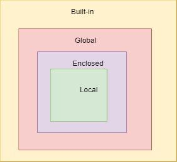

## 함수

- 특정 작업을 수행하기 위한 재사용 가능한 코드 묶음
- 사용하는 이유
    - 코드의 중복을 방지
    - **재사용성**이 높아지고, 코드의 **가독성과 유지보수성** 향상

### 내장함수 (Built-in function)

- 파이썬이 기본적으로 제공하는 함수
- 별도의 import없이 바로 사용 가능
- 함수 호출 : 함수를 실행하기 위해 함수의 이름을 사용하여 해당 함수의 코드 블록을 실행하는 것
    
    `funcion_name(arguments)`
    
    - 무조건 함수 이름과 함께 괄호를 써야 한다.

### 함수의 구조

- 함수 구조
    
    ```python
    def make_sum(pram1, pram2):
    	''' 이것은 두 수를 받아
    	두 수의 합을 반환하는 함수입니다.
    	'''
    	return pram1 + pram2
    ```
    
    - `pram1, parm2` : 매개변수(parameter)
    - `pram1 + pram2` : 반환값(return value)
    - 함수 body에 ‘’’ ‘’’ 를 사용하여 Docstring을 함
        - 함수가 어떤 동작을 하는지 설명하는 것!
        - ‘’’ 는 여러 줄 주석을 의미함
- 함수 정의
    - 함수 정의는 `def` 키워드로 시작
    - def 키워드 이후 함수 이름 작성
    - 괄호 안에 매개변수를 정의할 수 있음
    - 매개변수는 함수에 전달되는 값을 나타냄
- 함수 body
    - 콜론(:) 다음에 들여쓰기 된 코드 블록
    - 함수가 실행 될 때 수행되는 코드를 정의
    - Docstring은 함수 body 앞에 선택적으로 작성 가능한 함수 설명서
- 함수 반환 값
    - 함수는 필요한 경우 결과를 반환 할 수 있음
        - 필수는 아님!
    - return 키워드 이후에 반환할 값을 명시
    - return 문은 함수의 **실행을 종료**하고, 결과를 호출 부분으로 반환
    - return의 기본값은 None
- 함수 호출
    - 함수를 호출하기 위해서는 함수의 이름과 필요한 인자(argument)를 전달해야함
    - 호출 부분에서 전달된 인자는 함수 정의 시 작성한 매개변수에 대입됨

## 매개변수와 인자

- 매개변수 (parameter) : 함수를 **정의할 때**, 함수가 받을 값을 나타내는 변수
- 인자 (argument) : 함수를 **호출할 때**, 실제로 전달되는 값

### 인자의 종류

- 위치인자 (Positional arguments)
    - 함수 호출 시 인자의 위치에 따라 전달되는 인자
    - 위치인자는 함수 호출 시 반드시 값을 전달해야 함
    
    ```python
    def greet(name, age):
    	print(f'안녕하세요, {name}님! {age}살이시군요!')
    
    greet('Alice', 25)      # 안녕하세요, Alice님! 25살이시군요!
    ```
    
- 기본 인자 값 (Default argument values)
    - 함수 정의에서 매개변수에 기본 값을 할당하는 것
    - 함수 호출 시 인자를 전달하지 않으면, 기본값이 매개변수에 할당됨
    
    ```python
    def greet(name, age=30):
        print(f'안녕하세요, {name}님! {age}살이시군요.')
    
    greet('Bob') # 안녕하세요, Bob님! 30살이시군요.
    greet('Charlie', 40) # 안녕하세요, Charlie님! 40살이시군요.
    ```
    
- 키워드 인자 (Keyword arguments)
    - 함수 호출 시 인자의 이름과 함께 값을 전달하는 인자
    - 매개변수와 인자를 일치시키지 않고, 특정 매개변수에 값을 할당할 수 있음
    - 인자의 순서는 중요하지 않으며, 인자의 이름을 명시하여전달
    - **호출시 키워드 인자는 위치 인자 뒤에 위치해야 함**
    
    ```python
    def greet(name, age):
        print(f'안녕하세요, {name}님! {age}살이시군요.')
    
    greet(name='Dave', age=35)  # 안녕하세요, Dave님! 35살이시군요.
    greet(age=35, 'Dave')       # positional argument follows keyword argument
    greet(name='Dave',35)       # positional argument follows keyword argument
    ```
    
- 임의의 인자 목록 (Arbitrary argument list)
    - 정해지지 않은 개수의 인자를 처리하는 인자
    - 함수 정의 시 매개변수 앞에 ‘*’를 붙여 사용하며, 여러 개의 인자를 **tuple**로 처리
    
    ```python
    def calculate_sum(*args):
        print(args)
        total = sum(args)
        print(f'합계: {total}')
    
    calculate_sum(1, 2, 3)
    
    """
    (1, 2, 3)
    합계: 6
    """
    ```
    
- 임의의 키워드 인자 목록 (Arbitrary keyword argument list)
    - 함수 정의 시 매개변수 앞에 ‘**’ 를 붙여 사용하며, 여러 개의 인자를 **dictionary**로 묶어 처리
    
    ```python
    def print_info(**kwargs):
        print(kwargs)
    
    print_info(name='Eve', age=30)   # {'name': 'Eve', 'age': 30}
    ```
    

### 인자 권장 작성순서

- 위치 → 기본 → 가변 → 가변 키워드
- 호출 시 인자를 전달하는 과정에서 혼란을 줄일 수 있도록 함
- 모든 상황에 적용되는 절대적인 규칙은 아니며, 상황에 따라 유연하게 조정될 수 있음
    - **but 위치함수는 항상 제일 높은 우선순위!!!**

    ```python
    def func(pos1, pos2, age = 30, *args, **kwargs):
        print(pos1, pos2, age, args, kwargs)

    func(1, 2, 3, 4, 5)               # 1 2 3 (4, 5) {}
    func(1, 2, 3, a = 100, b = 200)   # 1 2 3 () {'a': 100, 'b': 200}
    ```

## 함수와 Scope

- Python의 범위(scope)
    - 함수는 코드 내부에 **local scope**를 생성하며, 그 외의 공간인 **global scope**로 구분
- scope
    - global scope(전역 공간) : 코드 어디에서든 참조할 수 있는 공간
    - local scope : 함수가 만든 scope (함수 내부에서만 참조 가능)
- variable
    - global variable : global scope에 정의된 변수
    - local variable : local scope에 정의된 변수

- scope 예시
    - num은 local scope에 존재하기 때문에 global에서 사용할 수 없음
    - 이는 변수의 **수명주기와** 연관이 있음
    
    ```python
    def func():
        num = 20
        print('local', num)  # local 20
    
    func()
    
    print('global', num)  # NameError: name 'num' is not defined
    ```
    

### 변수 수명주기(lifecycle)

- 변수의 수명주기는 변수가 선언되는 위치와 스코프에 따라 결정됨
1. built-in scope
    - 파이썬이 실행된 이후부터 영원히 유지
2. global scope
    - 모듈이 호출된 시점 이후 혹은 인터프리터가 끝날 때까지 유지
3. local scope
    - 함수가 호출될 때 생성되고, 함수가 종료될 때까지 유지

### 이름 검색 규칙 (Name Resolution)

- 사용되는 이름(식별자)들은 특정한 이름공간(namespace)에 저장되어 있음
- 아래와 같은 순서로 이름을 찾아 나가며, LEGB Rule이라고 부름

    1. Local scope : 지역 범위
    2. Enclosed scope : 지역 범위 한 단계 위 범위
    3. Global scope : 최상단에 위치한 범위
    4. Built-in scope : 모든 것을 담고 있는 범위(정의하지 않고 사용할 수 있는 모든 것)
- 밖으로는 찾아나갈 수 있지만 그 반대는 안된다!


```python
print(sum) # <built-in function sum>
print(sum(range(3))) # 3

sum = 5

print(sum) # 5
print(sum(range(3))) # TypeError: 'int' object is not callable
```

```python
a = 1
b = 2

def enclosed():
    a = 10
    c = 3

    def local(c):
        print(a, b, c) # 10 2 500

    local(500)
    print(a, b, c) # 10 2 3

enclosed()
print(a, b) # 1 2
```

### ’global’ 키워드

- 변수의 스코프를 전역 범위로 지정하기 위해 사용
- 일반적으로 함수 내에서 전역 변수를 수정하려는 경우에 사용
    
    ```python
    num = 0  # 전역 변수
    
    def increment():
        global num  # num를 전역 변수로 선언
        num += 1
    
    print(num)  # 0
    increment()
    print(num)  # 1
    ```
    
- 주의 사항
    - global 선언 전에 접근
    - 매개변수에 global 사용 불가
- global 키워드는 가급적 사용하지 않는 것을 권장
- 함수로 값을 바꾸고자 한다면 **인자**로 넘기고 함수의 **반환값**을 사용하는것을 권장


## 재귀 함수


- 함수 내부에서 자기 자신을 호출하는 함수
- 특징
    - 알고리즘 식을 표현할 때 변수의 사용이 줄어들며, 코드의 가독성이 높아짐
    - 1개 이상의 base case(종료되는 상황)가 존재하고, **수렴**하도록 작성
- 예시) 팩토리얼 / 피보나치
    
    ```python
    def factorial(n):
        # 종료 조건: n이 0이면 1을 반환
        if n == 0:
            return 1
        # 재귀 호출: n과 n-1의 팩토리얼을 곱한 결과를 반환
        return n * factorial(n - 1)
    
    # 팩토리얼 계산 예시
    result = factorial(5)
    print(result)  # 120
    ```
    
- 재귀함수는
    1. 종료 조건을 명확히
        - 아니면 무한루프 돌게 됨!
    2. 반복되는 호출이 종료 조건을 향하도록


## 유용한 함수

### 유용한 내장 함수

- `map(function, iterable)` : 순회 가능한 데이터구조(iterable)의 모든 요소에 함수를 적용하고, 그 결과를 map object로 반환
    - iterable : 반복 가능한 친구. 대표적으로 시퀀스들!
    
    ```python
    numbers = [1, 2, 3]
    result = map(str, numbers)
    
    print(result)       # <map object at 0x00000239C915D760>
    print(list(result)) # ['1', '2', '3']
    ```
    
- `zip(*iterables)` : 임의의 iterable을 모아 **튜플**을 원소로 하는 zip object를 반환
    
    ```python
    girls = ['jane', 'ashley']
    boys = ['peter', 'jay']
    pair = zip(girls, boys)
    
    print(pair)       # <zip object at 0x000001C76DE58700>
    print(list(pair)) # [('jane', 'peter'), ('ashley', 'jay')]
    ```
    

### lambda 함수

- 이름없이 정의되고 사용되는 익명 함수
- `lambda 매개변수: 표현식`
    - lambda 키워드 : 람다 함수를 선언하기 위해 사용되는 키워드
    - 매개변수 : 함수에 전달되는 매개변수들. 여러개일 경우 쉼표로 구분
    - 표현식: 함스의 실행되는 코드 블록, 결과값을 반환하는 표현식으로 작성
- 간단한 연산이나 함수를 한 줄로 표현할 때 사용
- 일회성으로 함수를 쓸 때 많이 사용!
- 함수를 매개변수로 전달하는 경우에도 유용하게 활용
    
    ```python
    addition = lambda x, y : x + y
    
    result = addition(3,5)
    print(result)            # 8
    ```
    


## Packing & Unpacking

### Packing

- 여러 개의 값을 하나의 변수에 묶어서 담는 것
- 가변인자에서 묶는 것을 packing이라 함
- * 을 활용한 패킹
    
    ```python
    numbers = [1, 2, 3, 4, 5]
    a, *b, c = numbers
    
    print(a) # 1
    print(b) # [2, 3, 4]
    print(c) # 5
    ```
    
    - `*b`는 남은 요소들을 리스트로 패킹하여 할당
    

### Unpacking

- 패킹된 변수의값을 개별적인 변수로 분리하여 할당하는 것
- 객체의 요소들을 개별 변수에 할당
- '*' 을 활용한 언패킹
    - 리스트의 요소를 언패킹
    
    ```python
    names = ['alice', 'jane', 'peter']
    print(*names)  # alice jane peter
    ```
    
- ** 을 활용한 언패킹
    - 딕셔너리의 키-값 쌍을 함수의 키워드 인자로 언패킹
    - 매개변수 이름과 key명이 같아야 가능!
    
    ```python
    def my_function(x, y, z):
        print(x, y, z)
    
    my_dict = {'x': 1, 'y': 2, 'z': 3}
    my_function(**my_dict)  # 1 2 3
    ```
    

### ‘*’과 ‘**’ 정리
|  | * | ** |
| :---: | :---: | :---: |
| 패킹 | 여러 개의 인자를 하나의 튜플로 묶는 역할 | X |
| 언패킹 | 시퀀스나 반복 가능한 객체를 각각의 요소로 언패킹하여 함수의 인자로 전달 | 딕셔딕셔너리의 키-값 쌍을 함수의 키워드 인자로 언패킹하여 함수의 인자로 전달하는 역할 |


