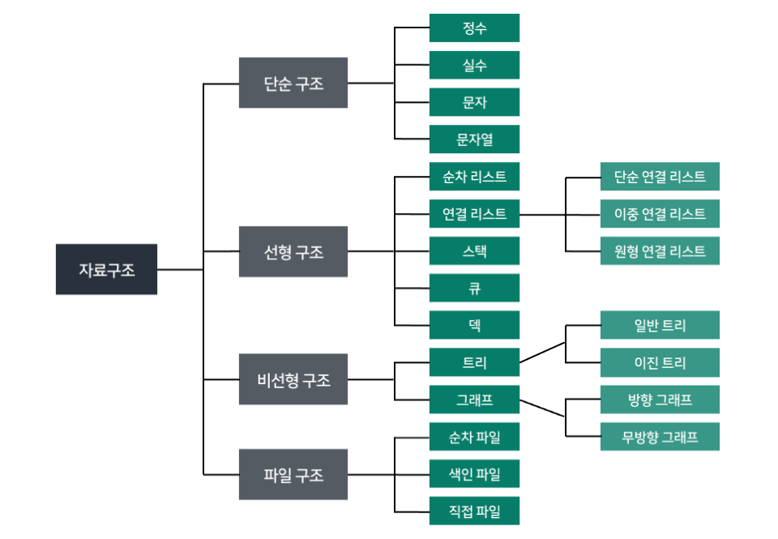

# Data Structure

- 여러 데이터를 효과적으로 사용, 관리하기 위한 구조

### 자료구조

- 컴퓨터 공학에서는 자료구조라고 한다!
- 각 데이터의 효율적인 저장, 관리를 위한 구조를 나눠 놓은 것

- 데이터 구조 활용
    - 문자열, 리스트, 딕셔너리 등 각 데이터 구조의 메서드를 호출하여 다양한 기능 활용

    

### 메서드

- 객체에 속한 **함수**
- 객체의 상태를 조작하거나 동작을 수행

- 매서드 vs 함수
    - 일반 함수는 누구나 호출 가능
    - 메서드는 해당 객체만 사용 가능함!

---

- 특징
    - 클래스(class) 내부에 정의되는 **함수**
    - 클래스는 파이썬에서 ‘타입을 표현하는 방법’이며, 이미 은연중에 사용해왔음
        - help 함수를 통해 str을 호출해보면 class였다는 것을 확인 가능!
        
        ```python
        print(type('1'))    # <class 'str'>
        
        print(help(str))    
        
        '''
        class str(object)
         |  str(object='') -> str
         |  str(bytes_or_buffer[, encoding[, errors]]) -> str
         |  
         |  Create a new string object from the given object. If encoding or
         |  errors is specified, then the object must expose a data buffer
         |  that will be decoded using the given encoding and error handler.
         |  Otherwise, returns the result of object.__str__() (if defined)
         |  or repr(object).
         |  encoding defaults to sys.getdefaultencoding().
         |  errors defaults to 'strict'.
         |
         |  Methods defined here:
         |
         |  __add__(self, value, /)
         |      Return self+value.
         |
        -- More  --
        '''
        ```
        
- `__add()` : 언더바 두개 = 매직매서드
- 즉,
    - 메서드는 어딘가(클래스)에 속해있는 **함수**이며, 각 데이터 타입별로 다양한 기능을 가진 메서드가 존재
- 메서드 호출 방법
    - `데이터 타입 객체.메서드()`
        - `'hello'.capitalize()`
        
        ```python
        # 문자열 메서드 예시
        print('hello'.capitalize())    # Hello
        
        def append():
        	pass
        
        append()    # 함수 호출
        
        # 리스트 메서드 예시
        numbers = [1, 2, 3]
        numbers.append(4)    # 메서드 호출
        
        print(numbers)    # [1, 2, 3, 4]
        ```
        
    

# 시퀀스 데이터 구조


## 문자열


### 문자열 조회/탐색 및 검증 메서드

| 메서드 | 설명 |
| --- | --- |
| s.find(x) | x의 첫 번째 위치를 반환. <br>없으면, -1을 반환 |
| s.index(x) | x의 첫 번째 위치를 반환. <br>없으면, 오류 발생 |
| s.isalpha() | 알파벳 문자 여부 <br>단순 알파벳이 아닌 유니코드 상 Letter (한국어도 포함) |
| s.isupper() | 대문자 여부 |
| s.islower() | 소문자 여부 |
| s.istitle() | 타이틀 형식 여부 |
- is로 시작하면 리턴은 boolean!

```python
# find(x)
print('banana'.find('a'))       # 1 (첫 번째 위치 반환)
print('banana'.find('z'))       # -1

# index(x)
print('banana'.index('a'))      # 1
print('banana'.index('z'))      # ValueError: substring not found

# isupper() / islower() / isalpha()
string1 = 'HELLO'
string2 = 'Hello'
string3 = '123'

print(string1.isupper())        # True
print(string2.isupper())        # False
print(string1.islower())        # False
print(string2.islower())        # False
print(string1.isalpha())        # True
print(string3.isalpha())        # False
```

### ❗문자열 조작 메서드 (새 문자열 반환)
- 조작 = 데이터 생성, 수정, 삭제.
- 문자열은 불변이므로 원본을 바꾸지 않는다!!!!

| 메서드 | 설명 |
| --- | --- |
| s.replace(old, new[,count]) | 바꿀 대상 글자를 새로운 글자로 바꿔서 반환 |
| **s.strip([chars])** | 문자열의 시작과 끝에 있는 공백 혹은 지정한 문자를 제거 |
| **s.split(sep=None, maxsplit=-1)** | 지정한 문자를 구분자로 문자열을 분리하여 문자열의 리스트로 반환.<br>구분자 지정 안하면 자동으로 공백을 기준으로 나눔 |
| **'separator'.join(iterable)** | 구분자로 iterable을 합침 |
| s.capitalize() | 가장  첫 번째  글자를  대문자로   변경 |
| s.title() | 문자열 내 띄어쓰기 기준으로 각 단어의 첫 글자는 대문자로, 나머지는 소문자로 변환 |
| s.upper() | 모두 대문자로 변경 |
| s.lower() | 모두 소문자로 변경 |
| s.swapcase() | 대↔소문자 서로 변경 |


- 대괄호 의미는 선택인자임!
    - 넣어도 그만, 안넣어도 그만!
    - 모든 언어에서 통일하기 위해 대괄호 형식으로 나타내는 것이다.
    - 베커스 나우르 표기법
    - 파이썬에서는 확장된 베커스 나우르 표기법을 사용하고 있음
    - 파이썬 ebnf 검색하면 나온당~!

```python
text = 'Hello, world!'
new_text = text.replace('world','Python')
print(new_text)                 # Hello, Python!

text = '    Hello, world!    '
new_text = text.strip()
print(new_text)                 # Hello, world!

text = 'Hello, world!'
words = text.split(',')
print(words)                    # ['Hello', ' world!']

words = ['Hello', 'world!']
text = '-'.join(words)
print(text)                     # Hello-world!

text = 'heLLo, woRld!'
new_text1 = text.capitalize()   # Hello, world!
new_text2 = text.title()        # Hello, World!
new_text3 = text.upper()        # HELLO, WORLD!
new_text4 = text.swapcase()     # HEllO, WOrLD!

print(new_text1)
print(new_text2)
print(new_text3)
print(new_text4)

# 메서드 이어서 사용 가능
# but 리턴값이 None인 메서드는 이어서 사용하지 못함!
new_text = text.swapcase().replace('l','z')
print(new_text)                 # HEzzO, WOrLD!
```

- 메서드 이어서 사용 가능
    - but 리턴값이 None인 메서드는 이어서 사용하지 못함!

## 리스트
- 가변
- 원본 변경 가능!!


### 리스트 값 추가 및 삭제 메서드

| 메서드 | 설명 |
| --- | --- |
| **L.append(x)** | 리스트 마지막에 항목 x를 추가<br>리턴값은 None! |
| L.extend(m) | Iterable m의 모든 항목들을 리스트 끝에 추가 (+=과 같은 기능) |
| L.insert(i, x) | 리스트 인덱스 i에 항목 x를 삽입 |
| L.remove(x) | 리스트 가장 왼쪽에 있는 항목(첫 번째) x를 제거.<br>항목이 존재하지 않을 경우, ValueError |
| **L.pop()** | 리스트 가장 오른쪽에 있는 항목(마지막)을 반환 후 제거 |
| **L.pop(i)** | 리스트의 인덱스 i에 있는 항목을 반환 후 제거 |
| L.clear() | 리스트의 모든 항목 삭제 |

```python
my_list = [1, 2, 3]
my_list.append(4)
print(my_list)      # [1, 2, 3, 4]

my_list = [1, 2, 3]
my_list.extend([4, 5, 6])
print(my_list)      # [1, 2, 3, 4, 5, 6]

my_list = [1, 2, 3]
my_list.insert(1, 5)
print(my_list)      # [1, 5, 2, 3]

my_list = [1, 2, 3]
my_list.remove(2)
print(my_list)      # [1, 3]

my_list = [1, 2, 3, 4, 5]

item1 = my_list.pop()
item2 = my_list.pop(0)

print(item1)        # 5
print(item2)        # 1
print(my_list)      # [2, 3, 4]

my_list = [1, 2, 3]
my_list.clear()
print(my_list)      # []
```

### 리스트 탐색 및 정렬 메서드

| 문법 | 설명 |
| --- | --- |
| L.index(x, start, end) | 리스트에 있는 항목 중 가장 왼쪽에 있는 항목 x의 인덱스를 반환 |
| L.reverse() | 리스트의 순서를 역순으로 변경 (정렬 X) |
| L.sort() | 리스트를 정렬 (매개변수 이용가능)<br>원본 변경 / 리턴 없음 |
| L.count(x) | 리스트에서 항목 x의 개수를 반환 |

```python
my_list = [1, 2, 3]
index = my_list.index(2)
print(index)        # 1

my_list = [1, 2, 2, 3, 3, 3]
count = my_list.count(3)
print(count)        # 3

my_list = [3, 2 ,1]
my_list.sort()
print(my_list)      # [1, 2, 3]

# 내림차순
my_list.sort(reverse=True)
print(my_list)      # [3, 2, 1]

my_list = [1, 3, 2, 8, 1, 9]
my_list.reverse()
print(my_list)      # [9, 1, 8, 2, 3, 1]
```

+)`sorted()` : 내장함수. 원본변경하지 않고, 리턴값이 있음.
- 내장함수이므로 리스트가 아닌 문자열을 넣어도 정렬을 해준다!


# 복사
**서술형 많이 출제**

- 데이터 분류에 따라 복사가 달라짐
- ‘변경 가능한 데이터 타입’과 ‘변경 불가능한 데이터 타입’을 다르게 다룸

```python
# 변경 가능한 데이터 타입의 복사
a = [1, 2, 3, 4]
b = a
b[0] = 100

print(a)        # [100, 2, 3, 4]
print(b)        # [100, 2, 3, 4]

# 변경 불가능한 데이터 타입의 복사
a = 20
b = a
b = 10

print(a)        # 20
print(b)        # 10
```

## 복사 유형

### 할당(Assignment)

- 할당 연산자(=)를 통한 복사는 해당 객체에 대한 객체 참조를 복사

```python
original_list = [1, 2, 3]
copy_list = original_list
print(original_list, copy_list)     # [1, 2, 3] [1, 2, 3]

copy_list[0] = 'hi'
print(original_list, copy_list)     # ['hi', 2, 3] ['hi', 2, 3]
```

### 얕은 복사

- 슬라이싱을 통해 생성된 객체는 원본 객체와 독립적으로 존재
- 2차원 리스트와 같이 변경 가능한 객체 안에 변경 가능한 객체가 있는 경우
    - 주소는 다르지만 내부 객체의 주소는 같기 때문에 함께 변경됨

```python
a = [1, 2, 3]
b = a[:]
print(a, b)                 # [1, 2, 3] [1, 2, 3]

b[0] = 100
print(a, b)                 # [1, 2, 3] [100, 2, 3]

# 한계
a = [1, 2, [1, 2]]
b = a[:]
print(a, b)                 # [1, 2, [1, 2]] [1, 2, [1, 2]]

b[2][0] = 100
print(a, b)                 # 1, 2, [100, 2]] [1, 2, [100, 2]]
```

### 깊은 복사

- 내부에 중첩된 모든 객체까지 새로운 객체 주소를 참조하도록 함

```python
import copy

original_list = [1, 2, [1, 2]]
deep_copid_list = copy.deepcopy(original_list)

deep_copid_list[2][0] = 100
print(original_list)        # [1, 2, [1, 2]]
print(deep_copid_list)      # [1, 2, [100, 2]]
```

# 참고

### 문자열에 포함된 문자들의 유형을 판별하는 메서드

- `isdecimal()`
    - 문자열이 모두 숫자 문자(0~9)로만 이루어져 있어야 True
- `isdigit()`
    - isdecimal()과 비슷하지만, 유니코드 숫자도 인식 ('①’ 도 숫자로 인식)
- `isnumeric()`
    - isdigit()과 유사하지만, 몇 가지 추가적인 유니코드 문자들을 인식 (분수, 지수, 루트 기호도 숫자로 인식)
- `isdecimal()` ⊆ `isdigit()` ⊆ `isnumeric()`
    
    
    | isdecimal() | isdigit() | isnumeric() | 예시 |
    | --- | --- | --- | --- |
    | True | True | True | "038",   "੦੩੮",   "０３８" |
    | False | True | True | "⁰³⁸", "🄀⒊⒏", "⓪③⑧" |
    | False | False | True | "⅛⅘", "ⅠⅢⅧ", "⑩⑬㊿", "壹貳參" |
    | False | False | False | "abc", "38.0", "-38" |