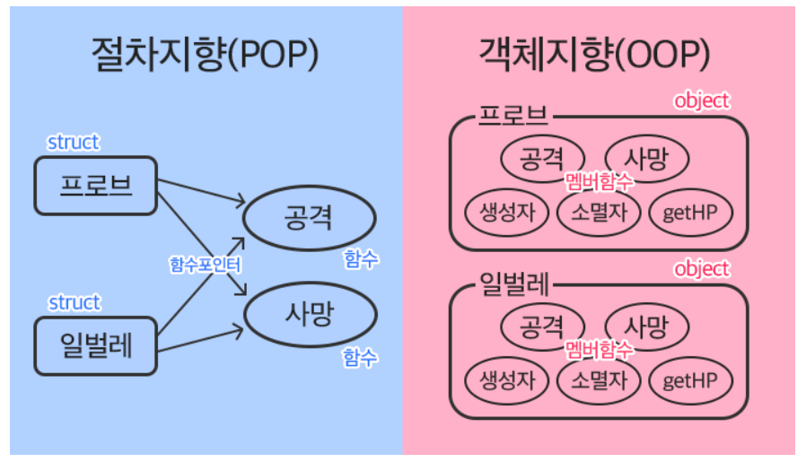
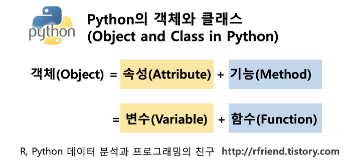

## 객체 지향 프로그래밍

### 절차 지향 프로그래밍(Procedural Programming)

- 프로그램을 ‘데이터’와 ‘절차’로 구성하는 방식의 프로그래밍 패러다임
    - 절차 = 순서가 중요하다
- 특징
    - ‘데이터’와 해당 데이터를 처리하는 ‘함수(절차)’가 분리되어 있으며, 함수 호출의 흐름이 중요
    - 코드의 순차적인 흐름과 함수 호출에 의해 프로그램이 진행
    - 실제로 실행되는 내용이 무엇인가가 중요
    - 데이터를 다시 재사용하거나 하기보다는 처음부터 끝까지 실행되는 결과물이 중요한 방식
- 소프트웨어 위기
    - 하드웨어의 발전으로 컴퓨터 계산용량과 문제의 복잡성이 급격히 증가함에 다라 소프트웨어에 발생한 충격
    - 함수의 호출끼리 충돌
    - 중간에 함수에 문제가 생겼을 때 그 함수에 연결된 프로그램이 모두 다운이 된다. → 다음 프로그램을 실행시킬 방법이 없음!!

### 객체 지향 프로그래밍(Object Oriented Programming)

- 데이터와 해당 데이터를 조작하는 메서드를 **하나의 객체로 묶어** 관리하는 방식의 프로그래밍 패러다임
- 절차지향 vs 객체지향
    
    
    | 절차 지향 | 객체 지향 |
    | --- | --- |
    | 데이터와 해당 데이터를 처리하는 함수가 분리 | 데이터와 해당 데이터를 처리하는 메서드(메시지)를 하나의 객체(클래스)로 묶음 |
    | 함수의 호출의 흐름이 중요 | 객체 간 상호작용과 메시지 전달이 중요 |
    
    


## 객체


### 클래스

- 파이썬에서 타입을 표현하는 방법
- 객체를 생성하기 위한 설계도
- 데이터와 기능을 함께 묶는 방법을 제공

### 객체

- 클래스에서 정의한 것을 토대로 메모리에 할당된 것
- ‘속성’과 ‘행동’으로 구성된 모든 것

### 클래스와 객체

ex) 가수 = 클래스  →  객체 = 아이유, BTS …

- 클래스로 만든 객체를 **인스턴스**라고도 함!
    
    ex) 아이유는 객체다 (O)
    
    아이유는 인스턴스다 (X)
    
    아이유는 가수의 인스턴스다 (O)
    
- 클래스를 만든다 == 타입을 만든다
- 클래스도 객체임
    - 파이썬의 모든 것은 객체!

ex) 

```python
name = 'Alice'
print(type(name))   # <class 'str'>
```

- 변수 name 의 타입은 str 클래스
- 변수 name은 str 클래스의 인스턴스
- **데이터 타입은 모두 클래스!!**

ex) `'hello'.upper()`

= 문자열.대문자로()

= 객체.행동()

= 인스턴스.메서드()

- **하나의 객체(object)는 특정 타입의 인스턴스(instance)이다**

### 객체 특징

- 타입(type) : 어떤 연산자(operator)와 조작(method)이 가능한가?
- 속성(attribute) : 어떤 상태(데이터)를 가지는가?
- 조작법(method) : 어떤 행위(함수)를 할 수 있는가?

    


## 클래스


### 클래스 구조
- 사용법
    ```python
    # 클래스 정의
    class Person:
        pass

    # 인스턴스 생성
    iu = Person()

    # 메서드 호출
    iu.메서드()

    # 속성(변수) 접근
    iu.attribute
    ```

    - 클래스 이름은 Pascal Case 사용 → 키워드마다 대문자로 !
    - 클래스 정의할 때, 매개변수가 없으면 괄호 생략 가능!


```python
class Person:
    blood_color = 'red'

    def __init__(self,name):
        self.name = name
    
    def singing(self):
        return f'{self.name}가 노래합니다.'

# 인스턴스 생성
singer1 = Person('iu')

# 메서드 호출
print(singer1.singing())        # iu가 노래합니다.

# 속성(변수) 접근
print(singer1.blood_color)      # red
```

- 생성자 함수
    - 객체를 생성할 때 자동으로 호출되는 특별한 메서드
    - `__init__` 이라는 이름의 메서드로 정의되며, 객체의 초기화를 담당
    - 생성자 함수를 통해 인스턴스를 생성하고 필요한 초기값을 설정
    - 인스턴스 생성할 때 자동 실행!
- 인스턴스 변수
    - 인스턴스(객체)마다 별도로 유지되는 변수
    - 인스턴스마다 독립적인 값을 가지며, 인스턴스가 생성될 때마다 초기화됨
- 클래스 변수
    - 클래스 내부에 선언된 변수
    - 클래스로 생성된 모든 인스턴스들이 공유하는 변수
- 인스턴스 메서드
    - 각각의 인스턴스에서 호출할 수 있는 메서드
    - 인스턴스 변수에 접근하고 수정하는 등의 작업을 수행

### 인스턴스와 클래스 간의 이름공간(namespace)

- 클래스를 정의하면, 클래스와 해당하는 이름 공간 생성
- 인스턴스를 만들면, 인스턴스 객체가 생성되고 독립적인 이름 공간 생성
- 인스턴스에서 특정 속성에 접근하면, 인스턴스 → 클래스 순으로 탐색
    
    ```python
    class Person:
        name = 'unknown'
    
        def talk(self):
            print(self.name)
    
    p1 = Person()
    p1.talk()           # unknown
    
    # 인스턴스 변수 설정
    p2 = Person()
    p2.name = 'Kim'
    p2.talk()           # Kim
    
    print(Person.name)  # unknown
    print(p1.name)      # unknown
    print(p2.name)      # Kim
    ```
    

- 독립적인 이름공간을 가지는 이점
    - 각 인스턴스는 독립적인 메모리 공간을 가지며, 클래스와 다른 인스턴스 간에는 서로의 데이터나 상태에 직접적인 접근이 불가능
    - 객체 지향 프로그래밍의 중요한 특성 중 하나로, 클래스와 인스턴스를 모듈화하고 각각의 객체가 독립적으로 동작하도록 보장
    - 이를 통해 클래스와 인스턴스는 다른 객체들과의 상호작용에서 서로 충돌이나 영향을 주지 않으면서 **독립적으로 동작**할 수 있음
    
    → 코드의 가독성, 유지보수성, 재사용성을 높이는데 도움을 줌
    

### 인스턴스 변수와 클래스 변수

- 인스턴스가 생성될 때마다 클래스 변수가 늘어나도록 설정할 수 있음
    
    ```python
    class Person:
        count = 0
    
        def __init__(self, name):
            self.name = name
            Person.count += 1
    
    person1 = Person('iu')
    person2 = Person('BTS')
    
    print(Person.count)     # 2
    ```
    
    - 클래스 변수를 변경할 때는 항상 `클래스.클래스변수` 형식으로 변경
    
    ```python
    class Circle:
        pi = 3.14
    
        def __init__(self, r):
            self.r = r
    
    c1 = Circle(5)
    c2 = Circle(10)
    
    print(Circle.pi)        # 3.14
    print(c1.pi)            # 3.14
    print(c2.pi)            # 3.14
    
    # 클래스 변수 변경
    Circle.pi = 5
    print(Circle.pi)        # 5
    print(c1.pi)            # 5
    print(c2.pi)            # 5
    
    # 인스턴스 변수 변경
    c2.pi = 10
    print(Circle.pi)        # 5
    print(c1.pi)            # 5
    print(c2.pi)            # 10
    ```
    

## 메서드

### 인스턴스 메서드

- 클래스로부터 생성된 각 인스턴스에서 호출할 수 있는 메서드
- 인스턴스의 상태를 조작하거나 동작을 수행
- 구조
    - 클래스 내부에 정의도는 메서드의 기본
    - 반드시 첫번째 매개변수로 인스턴스 자신**(self)을** 전달받음
        - self가 아닌 다른걸로 적어도 문제는 생기진 않음. 하지만 ‘약속’이기 때문에 무조건 self만 쓰도록 하자!
- self 동작 원리
    - upper 메서드를 사용해 문자열 ‘hello’ 대문자로 변경하기
        
        `'hello'.upper()`
        
    - 하지만 실제 파이썬 내부 동작은
        
        `str.upper('hello')`
        
    - str 클래스가 upper 메서드를 호출했고 그 첫번째 인자로 문자열 인스턴스가 들어간 것
    
    **→ 인스턴스 메서드의 첫번째 매개변수가 반드시 인스턴스 자기 자신인 이유!!!**
    
    - 즉 `'hello'.upper()` 는 `str.upper('hello')` 를 객체 지향 방식의 메서드로 호출하는 표현(단축형 호출)
    - ‘hello’라는 문자열 객체가 단순히 어딘가의 함수로 들어가는 인자가 아닌 객체 스스로 메서드를 호출하여 코드를 동작하는 객체 지향적 표현

### 생성자 메서드

- 인스턴스 객체가 생성될 때 **자동으로 호출**되는 메서드
- 인스턴스 변수들의 초기값을 설정
    
    ```python
    class Person:
        def __init__(self):
            print('인스턴스가 생성되었습니다.')
    
    person1 = Person()          # 인스턴스가 생성되었습니다.
    
    class Person:
        def __init__(self, name):
            print(f'인스턴스가 생성되었습니다. {name}')
    
    person1 = Person('iu')      # 인스턴스가 생성되었습니다. iu
    ```
    

### 클래스 메서드

- 클래스가 호출하는 메서드
- 클래스 변수를 조작하거나 클래스 레벨의 동작을 수행
- `@classmethod` 데코레이터를 사용하여 정의
- 호출시, 첫번째 인자로 호출하는 클래스(cls)가 전달됨
    
    ```python
    class Person:
        count = 0
    
        def __init__(self, name):
            self.name = name
            Person.count += 1
        
        @classmethod
        def number_of_population(cls):
            print(f'인구수는 {cls.count}입니다.')
    
    person1 = Person('iu')
    person2 = Person('BTS')
    
    Person.number_of_population()       # 인구수는 2입니다.
    ```
    

### 스태틱(정점) 메서드

- 클래스와 인스턴스와 상관없이 독립적으로 동작하는 메서드
- 주로 클래스와 관련이 있지만 인스턴스와 상호작용이 필요하지 않은 경우에 사용
- `@staticmethod` 데코레이터를 사용하여 정의
- 호출시, 필수적으로 작성해야 할 매개변수가 없음
- 즉, 객체 상태나 클래스 상태를 수정할 수 없으며 단지 기능(행동)만을 위한 메서드로 사용
    
    ```python
    class StringUtils:
        @staticmethod
        def reverse_string(string):
            return string[::-1]
        
        @staticmethod
        def capitalize_string(string):
            return string.capitalize()
        
    text = 'hello, world'
    
    reversed_text = StringUtils.reverse_string(text)
    print(reversed_text)        # dlrow ,olleh
    
    capitalized_text = StringUtils.capitalize_string(text)
    print(capitalized_text)     # Hello, world
    ```
    

### 메서드 정리

- 인스턴스 메서드
    - 인스턴스의 상태를 변경하거나, 해당 인스턴스의 특정 동작을 수행
- 클래스 메서드
    - 인스턴스의 상태에 의존하지 않는 기능을 정의
- 스태틱 메서드
    - 클래스 및 인스턴스와 관련이 없는 일반적인 기능을 수행

- 역할
    
    
    | 클래스 사용 | 인스턴스 사용 |
    | :---: | :---: |
    | 클래스 메서드<br>스태틱 메서드 | 인스턴스 메서드 |

- 클래스가 할 수 있는 것
    - 클래스는 모든 메서드를 호출할 수 있음
    - 하지만 클래스는 클래스 메서드와 스태틱 메서드만 사용하도록 한다
- 인스턴스가 할 수 있는 것
    - 인스턴스는 모든 메서드를 호출 할 수 있음
    - 하지만 인스턴스는 인스턴스 메서드만 사용하도록 한다

## 매직 메서드

- 인스턴스 메서드
- 특정 상황에서 자동으로 호출되는 메서드
- Double underscore(__)가 있는 메서드는  특수한 동작을 위해 만들어진 메서드
- 스페셜 메서드 혹은 매직 메서드라고 불림
    
    ```python
    class Circle:
        def __init__(self, r):
            self.r = r
        
        def area(self):
            return 3.14 * self.r * self.r
        
        def __str__(self):
            return f'[원] radius: {self.r}'
        
    c1 = Circle(10)
    c2 = Circle(1)
    
    print(c1)       # [원] radius: 10
    print(c2)       # [원] radius: 1
    ```
    

## 데코레이터

- 다른 함수의 코드를 유지한 체로 수정하거나 확장하기 위해 사용되는 함수
- 데코레이터 함수 정의
    
    ```python
    def my_decorator(func):
        def wrapper():
            # 함수 실행 전에 수행할 작엄
            print('함수 실행 전')
            # 원본 함수 호출
            result = func()
            # 함수 실행 후에 수행할 작업
            print('함수 실행 후')
            return result
        return wrapper
    
    @my_decorator
    def my_function():
        print('원본 함수 실행')
    
    my_function()
    
    '''
    함수 실행 전
    원본 함수 실행
    함수 실행 후
    '''
    ```
    

### 참고

- **절차 지향과 객체 지향은 대조되는 개념이 아님!**
- 객체지향은 기존 절차 지향을 기반으로 두고 보완하기 위해 객체라는 개념을 도입해 상속, 코드 재사용성, 유지보수성 등의 이점을 가지는 패러다임


#### 추가
- vscode에서 `__init__`을 입력시 자동완성으로 `-> None`이 입력됨
    ```py
    def __init__(self) -> None:
            pass
    ```
    - 이는 리턴 타입을 의미하는 부분임
    - `__init__`의 경우 리턴값이 없으므로 None이 자동완성됨
    - `__str__`같은 경우는
        ```py
        def __str__(self) -> str:
        pass
        ```
        리턴값이 str이므로 자동완성이 str을 가르키게 됨
    - 파이썬의 타입 힌트(or 어노테이션)는 강제성은 없고 데이터 타입의 명시를 위해 사용을 하고 있음 

    