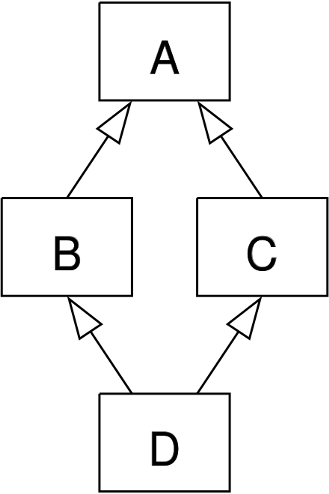

## 상속

- 기존 클래스의 속성과 메서드를 물려받아 새로운 하위 클래스를 생성하는 것
- 필요한 이유
    1. 코드 재사용
        - 상속을 통해 기존 클래스의 속성과 메서드를 재사용할 수 있음
        - 새로운 클래스를 작성할 때 기존의 클래스의 기능을 그래도 활용할 수 있으며, 중복된 코드를 줄일 수 있음
    2. 계층 구조
        - 상속을 통해 클래스들 간의 계층 구조를 형성할 수 있음
        - 부모 클래스와 자식 클래스 간의 관계를 표현하고, 더 구체적인 클래스를 만들 수 있음
    3. 유지 보수의 용이성
        - 상속을 통해 기존 클래스의 수정이 필요한 경우, 해당 클래스만 수정하면 되므로 유지 보수가 용이해짐
        - 코드의 일관성을 유지하고, 수정이 필요한 범위를 최소화할 수 있음

### 클래스 상속

- 상속없이 구현시, 메서드를 중복해서 정의해야한다

```python
class Person:
    def __init__(self, name, age) -> None:
        self.name = name
        self.age = age
    
    def talk(self):
        print(f'반갑습니다. {self.name}입니다')

class Professor(Person):
    def __init__(self, name, age, department) -> None:
        self.name = name
        self.age = age
        self.department = department

class Student(Person):
    def __init__(self, name, age, gpa) -> None:
        self.name = name
        self.age = age
        self.gpa = gpa

p1 = Professor('박교수', 49, '컴퓨터공학과')
s1 = Student('김학생', 20, 3.5)

# 부모 Person 클래스의 talk 메서드 활용
p1.talk()       # 반갑습니다. 박교수입니다
s1.talk()       # 반갑습니다. 김학생입니다
```

- `super()` : 부모 클래스 객체를 반환하는 내장 함수
    
    ```python
    class Student(Person):
        def __init__(self, name, age, gpa) -> None:
            super().__init__(name, age)
            self.gpa = gpa
    ```
    
    - 다중 상속 시 MRO를 기반으로 현재 클래스가 상속하는 모든 부모 클래스 중 다음에 호출된 메서드를 결정하여 자동으로 호출

### 다중 상속

- 둘 이상의 상위 클래스로부터 여러 행동이나 특징을 상속받을 수 있는 것
- 상속받은 모든 클래스의 요소를 활용 가능함
- 중복된 속성이나 메서드가 있는 경우 **상속 순서에 의해 결정**됨
    
    ```python
    class Person:
        def __init__(self, name) -> None:
            self.name = name
        
        def greeting(self):
            return f'안녕, {self.name}'
        
    class Mom(Person):
        gene = 'XX'
    
        def swim(self):
            return '엄마가 수영'
    
    class Dad(Person):
        gene = 'XY'
    
        def walk(self):
            return '아빠가 걷기'
    
    class FirstChild(Dad, Mom):
        def swim(self):
            return '첫째가 수영'
        def cry(self):
            return '첫째가 응애'
    
    baby1 = FirstChild('아가')
    print(baby1.cry())      # 첫째가 응애
    print(baby1.swim())     # 첫째가 수영
    print(baby1.walk())     # 아빠가 걷기
    print(baby1.gene)       # XY
    ```
    
    - FirstChild 클래스 정의 할 때 Mom을 먼저 상속받으면 baby1.gene의 결과는 XX가 된다

- 다이아몬드 문제
    - 두 클래스 B와 C가 A에서 상속되고, 클래스 D가 B와 C 모두에서 상속될 때 발생하는 모호함
    - B와 C가 재정의한 메서드가 A에 있고 D가 이를 재정의하지 않은 경우라면
    - D는 B의 메서드 중 어떤 버전을 상속하는가? 아니면 C의 메서드 버전을 상속하는가?
    



- 해결!
    - MRO(Method Resolution Order) 알고리즘을 사용하여 클래스 목록을 생성
    - 부모 클래스로부터 상속된 속성들의 검색을 깊이 우선으로, **왼쪽에서 오른쪽**으로, 계층구조에서 겹치는 같은 클래스를 두 번 검색하지 않음
        - 왼쪽에서 오른쪽이라는게 먼저 상속받은 것을 먼저 찾는다는 의미!
    - 그래서 속성이 D에서 발견되지 않으면 B에서 찾고, 거기에서 발견되지 않으면 C에서 찾는다
- example
    
    ```python
    class ParentA:
        def __init__(self) -> None:
            self.value_a = 'ParentA'
    
        def show_value(self):
            print(f'Value from ParentA: {self.value_a}')
    
    class ParentB:
        def __init__(self) -> None:
            self.value_b = 'ParentB'
    
        def show_value(self):
                print(f'Value from ParentB: {self.value_b}')
    
    class Child(ParentA, ParentB):
        def __init__(self) -> None:
              super().__init__()        # ParentA 클래스의 __init__ 메서드 호출
              self.value_c = 'Child'
        
        def show_value(self):
            super().show_value()
            print(f'Value from Child: {self.value_c}')
    
    child = Child()
    child.show_value()
    '''
    출력 결과 : 
    Value from ParentA: ParentA
    Value from Child: Child
    '''
    
    print(child.value_a)        # ParentA
    print(child.value_b)        # 오류!
    ```
    
    ```python
    class A:
        def __init__(self):
            print('A Constructor')
    
    class B(A):
        def __init__(self):
            super().__init__()
            print('B Constructor')
    
    class C(A):
        def __init__(self):
            super().__init__()
            print('C Constructor')
    
    class D(B, C):
        def __init__(self):
            super().__init__()
            print('D Constructor')
    
    obj = D()
    
    '''
    출력 결과 : 
    A Constructor
    C Constructor
    B Constructor
    D Constructor
    '''
    ```
    
- mro() 메서드
    - 해당 인스턴스의 클래스가 어떤 부모 클래스를 가지는지 확인하는 메서드
    - 기존의 인스턴스 → 클래스 순으로 이름 공간을 탐색하는 과정에서 상속 관계에 있으면 인스턴스 → 자식 클래스 → 부모 클래스로 확장
    
    ```python
    print(D.mro())
    
    '''
    [<class '__main__.D'>, 
    <class '__main__.B'>, 
    <class '__main__.C'>, 
    <class '__main__.A'>, 
    <class 'object'>]
    '''
    ```
    
- super 사용 사례
    1. 단일 상속 구조
        - 명시적으로 이름을 지정하지 않고 부모 클래스를 참조할 수 있으므로, 코드를 더 유지 관리하기 쉽게 만들 수 있음
        - 클래스 이름이 변경되거나 부모 클래스가 교체되어도 super()를 사용하면 코드 수정이 더 적게 필요
    2. 다중 상속 구조
        - MRO를 따른 메서드 호출
        - 복잡한 다중 상속 구조에서 발생할 수 있는 문제를 방지
- MRO가 필요한 이유
    - 부모 클래스들이 여러번 액세스 되지 않도록, 각 클래스에서 지정된 왼쪽에서 오른쪽으로 가는 순서를 보존하고, 각 부모를 오직 한번만 호출하고, 부모들의 우선순위에 영향을 주지 않으면서 서브 클래스를 만드는 단조적인 구조 형성
    - 프로그래밍 언어의 신뢰성있고 확장성있는 클래스를 설계할 수 있도록 도움
    - 클래스 간의 메서드 호출 순서가 예측 가능하게 유지되며, 코드의 재사용성과 유지보수성이 향상


## 에러와 예외


### 디버깅

- 버그 : 소프트웨어에서 발생하는 오류 또는 결함
    - 프로그램의 예상된 동작과 실제 동작 사이의 불일치
- 디버깅 : 소프트웨어에서 발생하는 버그를 찾아내고 수정하는 작업
    - 프로그램의 오작동 원인을 식별하여 수정하는 작업
- 디버깅 방법
    1. print 함수 활용
    2. 개발환경(IDE) 등에서 제공하는 기능 활용
    3. PYthon tutor 활용 (단순 파이썬 코드인 경우)
    4. 뇌 컴파일, 눈 디버깅 등

### 에러

- 프로그램 실행 중에 발생하는 예외 상황
- 문법 에러
    - 프로그램의 구문이 올바르지 않은 경우 발생
    - 오타, 괄호 및 콜론 누락 등의 문법적 오류
    - ex)
        - Invalid syntax (문법 오류)
        - assign to literal (잘못된 할당)
        - EOL (End of Line)
        - EOF (End of File)
    

### 예외

- 프로그램 실행 중에 감지되는 에러
- 내장 예외
    - 예외 상황을 나타내는 예외 클래스들
    - 파이썬에 이미 정의되어 있으며 특정 예외 상황에 대한 처리를 위해 사용
    - ex)
        - ZeroDivisionError : 나누기 또는 모듈로 연산의 두번째 인자가 0일 때 발생
        - NameError : 지역 또는 전역 이름을 찾을 수 없을 때 발생
        - TypeError : 타입 불일치 or 인자 누락 or 인자 초과 or 인자 타입 불일치
        - ValueError : 연산이나 함수에 문제가 없지만 부적절한 값을 가진 인자를 받았고, 상황이 IndexError처럼 더 구체적인 예외로 설명되지 않는 경우를 발생
        - IndexError : 시퀀스 인덱스 범위를 벗어날 때 발생
        - KeyError : 딕셔너리에 해당 키가 존재하지 않는 경우
        - ModuleNotfoundError : 모듈을 찾을 수 없을 때 발생
        - ImportError : 임포트 하려는 이름을 찾을 수 없을 때 발생
        - KeyboardInterrupt : 사용자가 Control-C 또는 Delete를 누를 때 발생
        - IndentationError : 잘못된 들여쓰기와 관련된 문법 오류

### 예외 처리

- try - except
    - try 블록 안에는 예외가 발생할 수 있는 코드를 작성
    - except 블록 안에는 예외가 발생했을 때 처리할 코드를 작성
    - 예외가 발생하면 프로그램 흐름은 try블록을 빠져나와 해당 예외에 대응하는 except 블록으로 이동
- 내장 예외 클래스는 상속 계층구조를 가지기 때문에 except 절로 분기시 반드시 하위 클래스를 먼저 확인할 수 있도록 작성해야 함


## 참고

### as 키워드

- 에러 메시지를 except 블록에서 사용할 수 있음
    
    ```python
    my_list = []
    
    try:
        number = my_list[1]
    except IndexError as error:
        print(f'{error}가 발생했습니다.')
        
    # list index out of range가 발생했습니다.
    ```
    

### EAFP & LBYL

- 예외처리와 값 검사에 대한 접근 방식
- EAFP (Easier to Ask for Forgiveness than Permission)
    - 예외처리를 중심으로 코드를 작성하는 접근 방식 (try-except)
    
    ```python
    try:
        result = my_dict['key']
        print(result)
    except KeyError:
        print('Key가 존재하지 않습니다.')
    
    ```
    

- LBYL (Look Before You Leap)
    - 값 검사를 중심으로 코드를 작성하는 접근 방식 (if-else)

| EAFP | LBYL |
| --- | --- |
| "일단 실행하고 예외를 처리" | "실행하기 전에 조건을 검사" |
| 코드를 실행하고 예외가 발생하면 예외처리를 수행 | 코드 실행 전에 조건문 등을 사용하여 예외 상황을 미리 검사하고, 예외 상황을 피하는 방식 |
| 코드에서 예외가 발생할 수 있는 부분을 미리 예측하여 대비하는 것이 아니라, 예외가 발생한 후에 예외를 처리 | 코드가 좀 더 예측 가능한 동작을 하지만, 코드가 더 길고 복잡해질 수 있음 |
| 예외 상황을 예측하기 어려운 경우에 유용 | 예외 상황을 미리 방지하고 싶을 때 유용 |