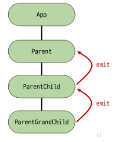

## Passing Props

### Props

부모 컴포넌트로부터 자식 컴포넌트로 데이터를 전달하는데 사용되는 속성

부모는 자식에게 데이터를 전달(Pass Props)하며, 자식은 자신에게 일어난 일을 부모에게 알림(Emit event)


#### 특징

부모 속성이 업데이트 되면 자식으로 전달 되지만, 그 반대는 안됨

즉, 자식 컴포넌트 내부에서 props를 변경하려고 시도해서는 안되며 불가능함

또한 부모 컴포넌트가 업데이트 될 때마다 이를 사용하는 자식 컴포넌트의 모든 props가 최신 값으로 업데이트 됨

-> 부모 컴포넌트에서만 변경하고 이를 내려 받는 자식 컴포넌트는 자연스럽게 갱신

#### one-way data flow

모든 props는 자식 속성과 부모 속성 사이에 **하향식 단방향 바인딩**을 형성

단방향인 이유
-> 하위 컴포넌트가 실수로 상위 컴포넌트의 상태를 변경하여 앱에서의 데이터 흐름을 이해하기 어렵게 만드는 것을 방지하기 위함

-> 데이터 흐름의 '일관성' 및 '단순화'

### Props 선언

#### 사전 준비

1. vue 프로젝트 생성
2. 초기 생성된 컴포넌트 모두 삭제 (App.vue 제외)
3. src/assets 내부 파일 모두 삭제
4. main.js 에서 `import './asset/main.css'` 코드 삭제
5. App > Parent > ParentChild 컴포넌트 관계 작성

```html
<!-- App.vue -->

<template>
  <div>
    <Parent />
  </div>
</template>

<script setup>
  import Parent from "@/components/Parent.vue";
</script>
```

```html
<!-- Parent.vue -->

<template>
  <div>
    <ParentChild />
  </div>
</template>

<script setup>
  import ParentChild from "@/components/ParentChild.vue";
</script>
```

```html
<!-- ParentChild.vue -->

<template>
  <div></div>
</template>

<script setup></script>
```

#### props 작성

부모 컴포넌트 Parent에서 자식 컴포넌트 ParentChild에 보낼 props 작성

props 이름 = props 값

```html
<!-- Parent.vue -->

<template>
  <div>
    <ParentChild my-msg="message" />
  </div>
</template>
```

#### props 선언

`defineProps()`를 사용하여 props 선언

작성하는 인자의 데이터 타입에 따라 선언 방식이 나뉨

```html
<script setup>
  defineProps();
</script>
```

방식 2가지

1. 문자열 배열을 사용한 선언
   배열의 문자열 요소로 props 선언

```html
<!-- ParentChild.vue -->
<script setup>
  defineProps(["myMsg"]);
</script>
```

2. 객체를 사용한 선언
   각 객체 속성은 키가 전달받은 props 이름이 되며, 객체 속성의 값은 값이 될 데이터 타입에 해당하는 생성자함수 (Number, String)여야 함

-> 객체 선언 문법 사용 권장

```html
<!-- ParentChild.vue -->
<script setup>
  defineProps({
    myMsg: String,
  });
</script>
```

#### props 데이터 사용

props 선언 후 템플릿에서 반응형 변수와 같은 방식으로 사용

```html
<!-- ParentChild.vue -->
<div>
  <p>{{ myMsg }}</p>
</div>
```

props를 객체로 반환하므로 필요한 경우 JS에서 접근 가능

```html
<script setup>
  const props = defineProps({ myMsg: String });
  console.log(props); // {myMsg: 'message'}
  console.log(props.myMsg); // 'message'
</script>
```

#### 한단계 더 props 내려 보내기

1. ParentChild 컴포넌트를 부모로 갖는 ParentGrandChild 컴포넌트 생성 및 등록

```html
<!-- ParentGrandChild.vue -->

<template>
  <div></div>
</template>

<script setup></script>
```

```html
<!-- ParentChild.vue -->

<template>
  <div>
    <p>{{ myMsg }}</p>
    <ParentGrandChild />
  </div>
</template>

<script setup>
  import ParentGrandChild from "@/components/ParentGrandChild.vue";
  defineProps({
    myMsg: String,
  });
</script>
```

2. ParentChild 컴포넌트에서 Parent로부터 받은 props인 myMsg를 ParentGrandChild에게 전달

```html
<!-- ParentChild.vue -->

<template>
  <div>
    <p>{{ myMsg }}</p>
    <ParentGrandChild :my-msg="myMsg" />
  </div>
</template>
```

```html
<!-- ParentGrandChild.vue -->

<template>
  <div>
    <p>{{ myMsg }}</p>
  </div>
</template>

<script setup>
  defineProps({
    myMsg: String,
  });
</script>
```

### Props 세부사항

#### 1. Props Name Casing (Props 이름 컨벤션)

자식 컴포넌트로 전달 시 (-> keybab-case)

```html
<ParentChild my-msg="message" />
```

선언 및 템플릿 참조시 (-> camelCase)

```js
defineProps({
  myMsg: String,
});
```

#### 2. Static Props와 Dynamic Props

지금까지 작성한 것은 Static(정적) Props

v-bind를 사용하여 동적으로 할당된 props를 사용할 수 있음!

1. Dynamic props 정의

```js
// Parent.vue
import { ref } from "vue";
const name = ref("Alice");
```

```html
<!-- Parent.vue -->

<ParentChild my-msg="message" :dynamic-props="name" />
```

2. Dynamic props 선언 및 출력

```js
// ParentChild.vue
defineProps({
  myMsg: String,
  dynamicProps: String,
});
```

```html
<!-- ParentChild.vue -->

<p>{{ dynamicProps }}</p>
```

### Props 활용

#### 다른 디렉티브와 함께 사용

v-for와 함께 사용하여 반복되는 요소를 props로 전달하기

```html
<!-- Parent.vue -->

<template>
  <div>
    <ParentItem v-for="item in items" :key="item.id" :my-prop="item" />
  </div>
</template>

<script setup>
  import { ref } from "vue";
  import ParentItem from "@/components/ParentItem.vue";

  const items = ref([
    { id: 1, name: "사과" },
    { id: 2, name: "바나나" },
    { id: 3, name: "딸기" },
  ]);
</script>
```

```html
<!-- ParentItem.vue -->

<template>
  <div>
    <p>{{ myProp.id }}</p>
    <p>{{ myProp.name }}</p>
  </div>
</template>

<script setup>
  defineProps({
    myProp: Object,
  });
</script>
```

## Component Events

### Emit

자식 컴포넌트가 이벤트를 발생시켜 부모 컴포넌트로 데이터를 전달하는 역할의 메서드

#### 구조

`$emit(event, ...args)`

- `$` 표기는 vue 인스턴스 내부 변수들을 가리킴
- event : 커스텀 이벤트 이름
- args : 추가 인자

### 이벤트 발신 및 수신

`$emit`을 사용하여 템플릿 표현식에서 직접 사용자 정의 이벤트를 발신

```html
<!-- ParentChild.vue -->
<button @click="$emit('someEvent')">클릭</button>
```

그런다음 부모는 v-on을 사용하여 수신할 수 있음

```html
<!-- Parent.vue -->
<ParentChild
  @some-event="someCallback"
  my-msg="message"
  :dynamic-props="name"
/>

<script setup>
  const someCallback = function () {
    console.log("ParentChild가 발신한 이벤트를 수신했어요.");
  };
</script>
```

### emit 이벤트 선언

defineEmit()를 사용하여 발신할 이벤트를 선언

props와 마찬가지로 defineEmits()에 작성하는 인자의 데이터 타입에 따라 선언 방식이 나뉨 (배열, 객체)

defineEmits()는 `$emit` 대신 사용할 수 있는 동등한 함수를 반환 (script에서는 `$emit` 메서드를 접근할 수 없기 때문)

```html
<!-- ParentChild.vue -->
<button @click="buttonClick">클릭</button>

<script setup>
  const emit = defineEmits(["someEvent"]);

  const buttonClick = function () {
    emit("someEvent");
  };
</script>
```

### 이벤트 전달

#### 이벤트 인자

이벤트 발신 시 추가 인자를 전달하여 값을 제공할 수 있음

1. ParentChild에서 이벤트를 발신하여 Parent로 추가 인자 전달

```html
<!-- ParentChild.vue -->
<button @click="emitArgs">추가 인자 전달</button>

<script setup>
  const emit = defineEmits(["someEvent", "emitArgs"]);

  const emitArgs = function () {
    emit("emitArgs", 1, 2, 3);
  };
</script>
```

2. ParentChild에서 발신한 이벤트를 Parent에서 수신

```html
<!-- Parent.vue -->
<ParentChild
  @some-event="someCallback"
  @emit-args="getNumbers"
  my-msg="message"
  :dynamic-props="name"
>
  <script setup>
    const getNumbers = function (...args) {
      console.log(args);
      console.log(`ParentChild가 전달한 추가인자 ${args}를 수신했어요.`);
    };
  </script>
  ></ParentChild
>
```

### 이벤트 세부사항

#### Event Name Casing

선언 및 발신 시(-> camelCase)

```html
<button @click="$emit('someEvent')">클릭</button>
```

```js
const emit = defineEmits(["someEvent"]);
```

부모 컴포넌트에서 수신 시 (-> kebab-case)

```html
<ParentChild @some-event="..." />
```

### emit 이벤트 활용

최하단 컴포넌트 ParentGrandChild에서 Parent 컴포넌트의 name 변수 변경 요청하기


1. ParentGrandChild에서 이름 변경을 요청하는 이벤트 발신

```html
<!-- ParentGrandChild.vue -->
<template>
  <div>
    <button @click="updateName">이름 변경</button>
  </div>
</template>

<script setup>
  const emit = defineEmits(["updateName"]);

  const updateName = function () {
    emit("updateName");
  };
</script>
```

2. 이벤트 수신 후 이름 변경을 요청하는 이벤트 발신

```html
<!-- ParentChild.vue -->

<template>
  <div>
    <ParentGrandChild :my-msg="myMsg" @update-name="updateName" />
  </div>
</template>

<script setup>
  import ParentGrandChild from "@/components/ParentGrandChild.vue";
  // 내려받은 props를 선언
  defineProps({
    myMsg: String,
    dynamicProps: String,
  });

  const emit = defineEmits(["myFocus", "emitArgs", "updateName"]);

  const updateName = function () {
    emit("updateName");
  };
</script>
```

3. 이벤트 수신 후 이름 변수 변경 메서드 호출

```html
<!-- Parent.vue -->
<template>
  <div>
    <ParentChild @update-name="updateName" />
  </div>
</template>

<script setup>
  import { ref } from "vue";
  import ParentChild from "@/components/ParentChild.vue";

  const name = ref("Alice");

  const updateName = function () {
    name.value = "Bella";
  };
</script>
```

## 참고

### props 선언 시 '객체 선언 문법'을 권장하는 이유

컴포넌트의 가독성이 좋게 문서화하는 데 도움이 되며, 다른 개발자가 잘못된 유형을 전달할 때에 브라우저 콘솔에 경고를 출력하도록 함

추가로 props에 대한 유효성 검사로써 활용 가능

### emit 이벤트도 '객체 선언 문법'으로 작성 가능

emit 이벤트 또한 객체 구문으로 선언된 경우 유효성을 검사할 수 있음

```js
const emit = defineEmits({
  // 유효성 검사 없음
  click: null,
  // submit 이벤트 유효성 검사
  submit: ({ email, password }) => {
    if (email && password) {
      return true
    } else {
      console.warn('submit 이벤트가 옳지 않음')
      return false
    }
  }
})

const submitForm = fucntion (email, password) {
  emit('submit', { email, password })
}
```
