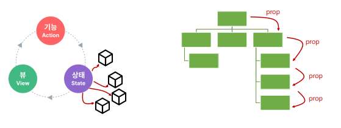
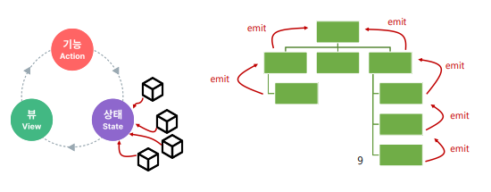
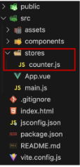
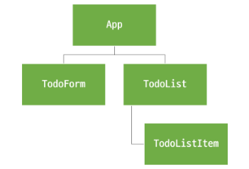
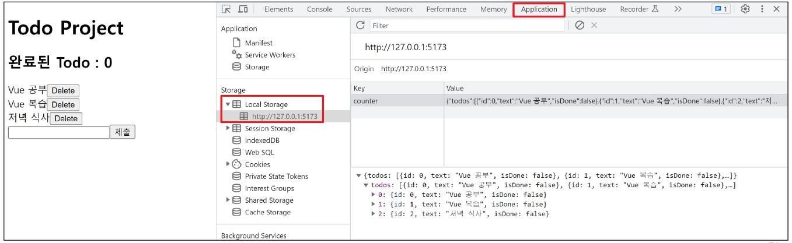

## State Management

상태 관리

vue 컴포넌트는 이미 반응형 상태를 관리하고 있음

(상태 === 데이터)

#### 컴포넌트 구조 단순화

- 상태(State)
  - 앱 구동에 필요한 기본 데이터
- 뷰 (View)
  - 상태를 선언적으로 매핑하여 시각화
- 기능 (Actions)
  - 뷰에서 사용자 입력에 대해 반응적으로 상태를 변경할 수 있게 정의된 동작

```vue
<template>
  <!-- View -->
  <div>{{ count }}</div>
</template>

<script setup>
import { ref } from "vue";

// State
const count = ref(0);

// Actions
const increment = function () {
  count.value++;
};
</script>
```


-> **단방향 데이터 흐름**의 간단한 표현!

#### 상태관리의 단순성이 무너지는 시점

여러 컴포넌트가 상태를 공유할 때!

1. 여러 뷰가 동일한 상태에 종속되는 경우

   - 공유 상태를 공통 조상 컴포넌트로 끌어올린 다음 props로 전달하는 것
   - 하지만 계층 구조가 깊어질 경우 비효율적, 관리가 어려워짐

   

2. 서로 다른 뷰의 기능이 동일한 상태를 변경시켜야 하는 경우

   - 발신(emit)된 이벤트를 통해 상태의 여러 복사본을 변경 및 동기화 하는 것
   - 마찬가지로 관리의 패턴이 깨지기 쉽고 유지 관리할 수 없는 코드가 됨

   

#### 해결책

각 컴포넌트의 공유 상태를 추출하여, 전역에서 참조할 수 있는 저장소에서 관리

컴포넌트 트리는 하나의 큰 view가 되고 모든 컴포넌트는 트리 계층 구조에 관계 없이 상태에 접근하거나 기능을 사용할 수 있음

-> vue의 공식 상태 관리 라이브러리 - Pinia

pinia는 기능과 상태를 중앙저장소로 옮긴다.

## State management library (Pinia)

### Pinia

상태 관리 라이브러리

#### 설치

vite 프로젝트 빌드 시 5번째 선택지 Yes로 설정해주기!

#### 구조 변화

- stores 폴더 신규 생성
  

### Pinia 구조

```js
// stores/counter.js

import { ref, computed } from "vue";
import { defineStore } from "pinia";

export const useCounterStore = defineStore("counter", () => {
  const count = ref(0);
  const doubleCount = computed(() => count.value * 2);
  function increment() {
    count.value++;
  }

  return { count, doubleCount, increment };
});
```

반환값 : pinia의 상태들을 사용하려면 무조건 return문이 있어야 함

store에서는 공유하지 않는 private한 상태 속성을 가지지 않음

#### 1. store

중앙 저장소

모든 컴포넌트가 공유하는 상태, 기능 등이 작성됨

defineStore() 의 반환 값의 이름은 use와 state를 사용하는 것을 권장

defineStore()의 첫번째 인자는 애플리케이션 전체에 걸쳐 사용하는 store의 고유 ID

#### 2. state

반응형 상태

**ref === state**

```js
const count = ref(0);
```

#### 3. getters

계산된 값

**computed === getters**

```js
const doubleCount = computed(() => count.value * 2);
```

#### 4. actions

메서드

**function === actions**

```js
function increment() {
  count.value++;
}
```

#### 5. plugin

애플리케이션의 상태 관리에 필요한 추가 기능을 제공하거나 확장하는 도구나 모듈

애플리케이션의 상태 관리를 더욱 간편하고 유언하게 만들어주며 패키지 매니저로 설치 이후 별도 설정을 통해 주가됨

#### 정리하자면,

Pinia는 store라는 저장소를 가지고,

store는 state, getters, actions로 이루어지며,

각각 ref(), computed(), function()과 동일하다.

### Pinia 구성 요소 활용

#### state

각 컴포넌트 깊이에 관계없이 store 인스턴스로 state에 접근하여 직접 읽고 쓸 수 있음

만약 store에 state를 정의하지 않았다면 컴포넌트에서 새로 추가 할 수 없음

```vue
<!-- App.vue -->

<template>
  <div>
    <p>state : {{ store.count }}</p>
  </div>
</template>

<script setup>
import { useCounterStore } from "@/stores/counter";

const store = useCounterStore();

// state 참조 및 변경
console.log(store.count);
const newNumber = store.count + 1;
</script>
```

#### Getters

store의 모든 getters 또한 state처럼 직접 접근할 수 있음

```vue
<!-- App.vue -->

<template>
  <div>
    <p>getters : {{ store.doubleCount }}</p>
  </div>
</template>

<script setup>
// getters 참조
console.log(store.doubleCount);
</script>
```

#### Actions

store의 모든 actions 또한 직접 접근 및 호출 할 수 있음

getters와 달리 state 조작, 비동기, API 호출이나 다른 로직을 진행할 수 있음

```vue
<!-- App.vue -->

<template>
  <div>
    <button @click="store.increment()">+++</button>
  </div>
</template>

<script setup>
// actions 호출
store.increment();
</script>
```

## Pinia 실습 - Todo 프로젝트 구현

#### 컴포넌트 구성



#### 사전 준비

1. 불필요한 컴포넌트, 코드 모두 삭제
2. TodoListItem 컴포넌트 작성

```vue
<!-- TodoListItem.vue -->

<template>
  <div>
    <h1>TodoListItem</h1>
  </div>
</template>
```

3. TodoList 컴포넌트 작성

```vue
<!-- TodoList.vue -->

<template>
  <div>
    <TodoListItem />
  </div>
</template>

<script setup>
import TodoListItem from "@/components/TodoListItem.vue";
</script>
```

4. TodoForm 컴포넌트 작성

```vue
<!-- TodoForm.vue -->

<template>
  <div>
    <h1>TodoForm</h1>
  </div>
</template>
```

5. App 컴포넌트에 TodoList, TodoForm 컴포넌트 등록

```vue
<!-- App.vue -->

<template>
  <div>
    <h1>Todo Project</h1>
    <TodoList />
    <TodoForm />
  </div>
</template>

<script setup>
import TodoForm from "@/components/TodoForm.vue";
import TodoList from "@/components/TodoList.vue";
</script>
```

### Read Todo

1. store에 임시 todos 목록 state 정의

```js
// stores/counter.js

import { ref, computed } from "vue";
import { defineStore } from "pinia";

export const useCounterStore = defineStore("counter", () => {
  let id = 0;
  const todos = ref([
    { id: id++, text: "할 일 1", isDone: false },
    { id: id++, text: "할 일 2", isDone: false },
  ]);

  return { todos };
});
```

2. store의 todos state 참조

```vue
<!-- TodoList.vue -->

<template>
  <div>
    <TodoListItem v-for="todo in store.todos" :key="todo.id" :todo="todo" />
  </div>
</template>

<script setup>
import { useCounterStore } from "@/stores/counter";
import TodoListItem from "@/components/TodoListItem.vue";

const store = useCounterStore();
</script>
```

3. props 정의

```vue
<!-- TodoListItem.vue -->

<template>
  <div>
    {{ todo.text }}
  </div>
</template>

<script setup>
defineProps({
  todo: Object,
});
</script>
```

### Create Todo

1. todo 목록에 todo를 생성 및 추가하는 addTodo 액션 정의

```js
// stores/counter.js

const addTodo = function (todoText) {
  todos.value.push({
    id: id++,
    text: todoText,
    isDone: false,
  });
};

return { todos, addTodo };
```

2. TodoForm에서 실시간으로 입력되는 사용자 데이터를 양방향 바인딩하여 반응형 변수로 할당

```vue
<!-- TodoForm.vue -->

<template>
  <div>
    <form>
      <input type="text" v-model="todoText" />
      <input type="submit" />
    </form>
  </div>
</template>

<script setup>
import { ref } from "vue";

const todoText = ref("");
</script>
```

3. submit 이벤트가 발생했을 때 사용자 입력 텍스트를 인자로 전달하여 stroe에 정의한 addTodo 액션 메서드를 호출

```vue
<!-- TodoForm.vue -->

<template>
  <div>
    <form @submit.prevent="createTodo(todoText)">
      <input type="text" v-model="todoText" />
      <input type="submit" />
    </form>
  </div>
</template>

<script setup>
import { useCounterStore } from "@/stores/counter";

const store = useCounterStore();

const createTodo = function (todoText) {
  store.addTodo(todoText);
};
</script>
```

4. form 요소를 선택하여 todo 입력 후 input 데이터를 초기화 할 수 있도록 처리

```vue
<!-- TodoForm.vue -->

<template>
  <div>
    <form @submit.prevent="createTodo(todoText)" ref="formElem">
      <input type="text" v-model="todoText" />
      <input type="submit" />
    </form>
  </div>
</template>

<script setup>
const formElem = ref(null);

const createTodo = function (todoText) {
  store.addTodo(todoText);
  formElem.value.reset();
};
</script>
```

### Delete Todo

1. todo 목록에서 특정 todo를 삭제하는 deleteTodo 액션 정의

```js
// stores/counter.js

const deleteTodo = function () {
  console.log("delete");
};

return { todos, addTodo, deleteTodo };
```

2. 각 todo에 삭제 버튼 작성

```vue
<!-- TodoListItem.vue -->

<template>
  <div>
    <span>{{ todo.text }}</span>
    <button @click="store.deleteTodo(todo.id)">Delete</button>
  </div>
</template>

<script setup>
import { useCounterStore } from "@/stores/counter";

const store = useCounterStore();
</script>
```

3. 전달받은 todo의 id 값을 활용해 선택된 todo의 인덱스를 구함

```js
// stores/counter.js

const deleteTodo = function (todoId) {
  const index = todos.value.findIndex((todo) => todo.id === todoId);
  todos.value.splice(index, 1);
};

return { todos, addTodo, deleteTodo };
```

### Update Todo

todo 상태의 isDone 속성을 변경하여 todo 완료 유무 처리

1. todos 목록에서 특정 todo의 isDone 속성을 변경하는 updateTdoo 액션 정의

```js
// stores/counter.js

const updateTodo = function () {
  console.log("update");
};

return { todos, addTodo, deleteTodo, updateTodo };
```

2. todo 내용을 클릭하면 선택된 todo의 id를 인자로 전달해 updateTodo 메서드 호출

```vue
<!-- TodoListItem.vue -->

<template>
  <div>
    <span @click="store.updateTodo(todo.id)">{{ todo.text }}</span>
    <button @click="store.deleteTodo(todo.id)">Delete</button>
  </div>
</template>
```

3. 전달받은 todo의 id 값을 활용해 선택된 todo와 동일 todo 목록을 검색 후 isDone 속성 재할당

```js
// stores/counter.js

const updateTodo = function (todoId) {
  todos.value = todos.value.map((todo) => {
    if (todo.id === todoId) {
      todo.isDone = !todo.isDone;
    }
    return todo;
  });
};
```

4. 스타일 바인딩 적용

```vue
<!-- TodoListItem.vue -->

<template>
  <div>
    <span
      @click="store.updateTodo(todo.id)"
      :class="{ 'is-done': todo.isDone }"
    >
      {{ todo.text }}
    </span>
  </div>
</template>

<style scoped>
.is-done {
  text-decoration: line-through;
}
</style>
```

### Counting Todo

1. todos 배열의 길이 값을 반환하는 함수 doneTodosCount 작성 (getters)

```js
// stores/counter.js

const doneTodosCount = computed(() => {
  const doneTodos = todos.value.filter((todo) => todo.isDone);
  return doneTodos.length;
});

return { todos, addTodo, deleteTodo, updateTodo, doneTodosCount };
```

2. app 컴포넌트에서 doneTodosCount 참조

```vue
<!-- App.vue -->

<template>
  <div>
    <h1>Todo Project</h1>
    <h2>완료된 Todo : {{ store.doneTodosCount }}</h2>
    <TodoList />
    <TodoForm />
  </div>
</template>

<script setup>
import { useCounterStore } from "@/stores/counter";

const store = useCounterStore();
</script>
```

### Local Storage

브라우저 내에 key-value 쌍을 저장하는 웹 스토리지 객체

#### 특징

페이지를 새로고침하고 브라우저를 다시 실행해도 데이터가 유지

쿠키와 다르게 네트워크 요청 시 서버로 전송되지 않음

여러 탭이나 창 간에 데이터 공유 할 수 있음

#### 사용 목적

웹 애플리케이션에서 사용자 설정, 상태 정보, 캐시 데이터 등을 클라이언트 측에서 보관하여

웹 사이트 성능을 향상시키고 사용자 경험을 개선하기 위함!

#### pinia-plugin-persistedstate

웹 애플리케이션의 상태(state)를 브라우저의 local storage나 session storage에 영구적으로 저장하고 복원하는 기능을 제공

- 설치 및 등록

```bash
$ npm i pinia-plugin-persistedstate
```

```js
// main.js

import piniaPluginPersistedstate from "pinia-plugin-persistedstate";

const app = createApp(App);
const pinia = createPinia();

pinia.use(piniaPluginPersistedstate);

// app.use(createPinia());
app.use(pinia);

app.mount("#app");
```

defineStore()의 3번째 인자로 관련 객체 추가

```js
// stores/counter.js

import { ref, computed } from "vue";
import { defineStore } from "pinia";

export const useCounterStore = defineStore("counter", () => {
    ...,

    return { todos, addTodo, deleteTodo, updateTodo, doneTodosCount };
  },
  { persist: true })
```

- 적용 결과

개발자도구 -> Application -> Local Storage

브라우저의 Local Storage에 저장되는 todos state 확인



## 참고

#### Pinia, 언제 사용할까?

Pinia는 공유된 상태를 관리하는데 유용하지만, 구조적인 개념에 대한 이해와 시작하는 비용이 크다.

즉, 애플리케이션이 단순하다면 pinia가 없는 것이 더 효율적일 수가 있음!!

그러나 중대형 규모의 SPA를 구축하는 경우 Pinia는 자연스럽게 선택할 수 있는 단계가 오게 됨

-> 결과적으로 적절한 상황에서 활용하였을 때 Pinia의 효용을 극대화 할 수 있다.
