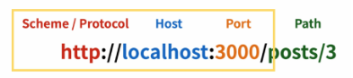
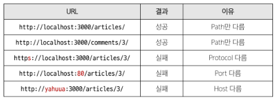
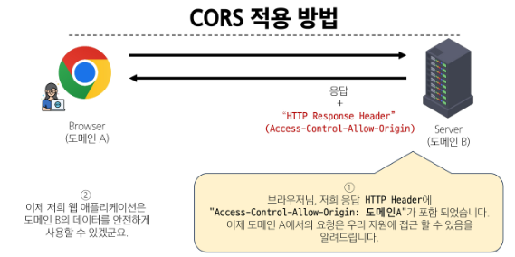

## 메인 페이지 구현

### 게시글 목록 출력

ArticleView 컴포넌트에서 ArticleList 컴포넌트와 ArticleListItem 컴포넌트 등록 및 출력하기

ArticleList와 ArticleListItem은 각각 게시글 출력을 담당

1. ArticleView의 route 등록

```js
// router/index.js

const router = createRouter({
  history: createWebHistory(import.meta.env.BASE_URL),
  routes: [
    {
      path: "/",
      name: "ArticleView",
      component: ArticleView,
    },
  ],
});
```

2. App 컴포넌트에 ArticleView 컴포넌트로 이동하는 RouterLink 작성

```vue
<!-- App.vue -->

<template>
  <header>
    <nav>
      <RouterLink :to="{ name: 'ArticleView' }">Articles</RouterLink>
    </nav>
  </header>
  <RouterView />
</template>

<script setup>
import { RouterView, RouterLink } from "vue-router";
</script>
```

3. ArticleView 컴포넌트에 ArticleList 컴포넌트 등록

```vue
<!-- views/ArticleView.vue -->

<template>
  <div>
    <h1>Article Page</h1>
    <ArticleList />
  </div>
</template>

<script setup>
import ArticleList from "@/components/ArticleList.vue";
</script>
```

4. store에 임시 데이터 articles 배열 작성

```js
// store/counter.js

export const useCounterStore = defineStore(
  "counter",
  () => {
    const articles = ref([
      { id: 1, title: "Article 1", content: "Content of article 1" },
      { id: 2, title: "Article 2", content: "Content of article 2" },
    ]);
    return { articles };
  },
  { persist: true }
);
```

5. ArticleList 컴포넌트에서 게시글 목록 출력

```vue
<!-- components/ArticleList.vue -->

<template>
  <div>
    <h3>Article List</h3>
    <ArticleListItem
      v-for="article in store.articles"
      :key="article.id"
      :article="article"
    />
  </div>
</template>

<script setup>
import { useCounterStore } from "@/stores/counter";
import ArticleListItem from "@/components/ArticleListItem.vue";

const store = useCounterStore();
</script>
```

6. ArticleListItem 컴포넌트는 내려받은 props를 정의 후 출력

```vue
<!-- components/ArticleListItem.vue -->

<template>
  <div>
    <h5>{{ article.id }}</h5>
    <p>{{ article.title }}</p>
    <p>{{ article.content }}</p>
  </div>
</template>

<script setup>
defineProps({
  article: Object,
});
</script>
```

### DRF와의 요청과 응답

임시데이터가 아닌 DRF 서버에 요청하여 데이터를 응답 받아 store에 저장 후 출력

1. DRF 서버로의 AJAX 요청을 위한 axios 설치 및 관련 코드 작성

```js
// store/counter.js

import axios from "axios";

export const useCounterStore = defineStore(
  "counter",
  () => {
    const articles = ref([]);
    const API_URL = "http://127.0.0.1:8000";
    return { articles };
  },
  { persist: true }
);
```

2. DRF 서버로 요청을 보내고 응답 데이터를 처리하는 getArticles 함수

```js
// store/counter.js

const API_URL = "http://127.0.0.1:8000";

const getArticles = function () {
  axios({
    method: "get",
    url: `${API_URL}/api/v1/articles/`,
  })
    .then((res) => {
      console.log(res);
      console.log(res.data);
    })
    .catch((err) => console.log(err));
};
```

3. ArticleView 컴포넌트가 마운트 될 때 getArticles 함수가 실행되도록 함

```vue
<!-- views/ArticleView.vue -->

<script setup>
import { onMounted } from "vue";
import { useCounterStore } from "@/stores/counter";
import ArticleList from "@/components/ArticleList.vue";

const store = useCounterStore();

onMounted(() => {
  store.getArticles();
});
</script>
```

-> 거절됨 -> CORS policy에 의해 차단되었다.

## CORS Policy

#### SOP (Same-origin policy)

동일 출처 정책

어떤 출처(Origin)에서 불러온 문서나 스크립트가 다른 출처에서 가져온 리소스와 상호작용하는 것을 제한하는 보안 방식

다른 곳에서 가져온 자료는 일단 막는다

웹 애플리케애션의 도메인이 다른 도메인의 리소스에 접근하는 것을 제어하여 사용자의 개인 정보와 데이터의 보안을 보호하고, 잠재적인 보안 위협을 방지

잠재저긍로 해로울 수 있는 문서를 분리함으로써 공격받을 수 있는 경로를 줄임

#### Origin (출처)

URL의 Protocol, Host, Port를 모두 포함하여 출처라고 부름

예시로,
아래 세 영역이 일치하는 경우에만 동일 출처(Same-origin)으로 인정



- same origin 예시

  - `http://localhost:3000/articles/3/` 을 기준으로 동일 출처 여부를 비교

  

#### CORS policy 등장

기본적으로 웹 브라우저는 같은 출처에서만 요청하는 것을 허용하며, 다른 출처로의 요청은 보안상의 이유로 차단됨

-> SOP에 의해 다른 출처의 리소스와 상호작용 하는 것이 기본적으로 제한되기 때문

하지만 현대 웹 애플리케이션은 다양한 출처로부터 리소스를 요청하는 경우가 많이 때문에 CORS 정책이 필요하게 됨

-> CORS는 웹 서버가 리소스에 대한 서로 다른 출처 간 접근을 허용하도록 선택할 수 있는 기능 제공

### CORS Policy

#### CORS

Cross-Origin Resource Sharing
(교차 출처 리소스 공유)

특정 출처에서 실행중인 웹 애플리케이션이 다른 출처의 자원에 접근할 수 있는 권한을 부여하도록 브라우저에게 알려주는 체제

만약 다른 출처의 리소스를 가져오기 위해 이를 제공하는 서버가 브라우저에게 다른 출처지만 접근해도 된다는 사실을 알려야 함

#### CORS Policy

다른 출처에서 온 리소스를 공유하는 것에 대한 정책

서버에서 설정되며, 브라우저가 해당 정책을 확인하여 요청이 허용되었는지 여부를 결정

-> 다른 출처의 리소스를 불러오려면 그 다른 출처에서 올바른 CORS header를 포함한 응답을 반환해야 함



서버가 약속된 CORS Header를 포함하여 응답한다면 브라우저는 해당 요청을 허용

### CORS Headers 설정

Django에 django-cors-headers 라이브러리를 활용하면 손쉽게 응답 객체에 CORS header를 추가해준다.

설치

```bash
$ pip install django-cors-headers
```

```py
# settings.py

INSTALLED_APPS = [
  ...
  'corsheaders',
  ...
]

MIDDLEWARE = [
  ...
  'corsheaders.middleware.CorsMiddleware',
  ...
]
```

CORS를 허용할 vue 프로젝트의 도메인 등록

```py
# settings.py

CORS_ALLOWED_ORIGINS = [
    'http://127.0.0.1:5173',
    'http://localhost:5173',
]
```

## Article CR 구현

### 전체 게시글 조회

1. store에 게시글 목록 데이터 저장

```js
// store/counter.js

const getArticles = function () {
  axios({
    method: "get",
    url: `${API_URL}/api/v1/articles/`,
  })
    .then((res) => {
      articles.value = res.data;
    })
    .catch((err) => console.log(err));
};
```

### 단일 게시글 조회

1. DetailVue 관련 route 작성

```js
// router/index.jss

{
  path: '/articles/:id',
  name: 'DetailView',
  component: DetailView
},
```

2. ArticleListItem에 DetailView 컴포넌트로 가기 위한 RouterLink 작성

```vue
<!-- components/ArticleListItem.vue -->

<template>
  <div>
    <RouterLink :to="{ name: 'DetailView', params: { id: article.id } }">
      [DETAIL]
    </RouterLink>
  </div>
</template>

<script setup>
import { RouterLink } from "vue-router";
</script>
```

3. DetailView가 마운트 될 때 특정 게시글 조회하는 AJAX 요청 진행

```vue
<!-- views/DetailView.vue -->

<script setup>
import axios from "axios";
import { onMounted } from "vue";
import { useRoute } from "vue-router";
import { useCounterStore } from "@/stores/counter";

const store = useCounterStore();
const route = useRoute();

onMounted(() => {
  axios({
    method: "get",
    url: `${store.API_URL}/api/v1/articles/${route.params.id}/`,
  })
    .then((res) => {
      console.log(res.data);
    })
    .catch((err) => console.log(err));
});
</script>
```

4. 응답 데이터 저장 후 출력

```vue
<!-- views/DetailView.vue -->

<template>
  <div>
    <h1>Detail</h1>
    <div v-if="article">
      <p>글 번호: {{ article.id }}</p>
      <p>제목: {{ article.title }}</p>
      <p>내용: {{ article.content }}</p>
      <p>작성시간: {{ article.created_at }}</p>
      <p>수정시간: {{ article.updated_at }}</p>
    </div>
  </div>
</template>

<script setup>
import axios from "axios";
import { onMounted, ref } from "vue";
import { useRoute } from "vue-router";
import { useCounterStore } from "@/stores/counter";

const store = useCounterStore();
const route = useRoute();
const article = ref(null);

onMounted(() => {
  axios({
    method: "get",
    url: `${store.API_URL}/api/v1/articles/${route.params.id}/`,
  })
    .then((res) => {
      console.log(res.data);
      article.value = res.data;
    })
    .catch((err) => console.log(err));
});
</script>
```

### 게시글 작성

1. CreateView 관련 route 작성

```js
// router/index.js

{
  path: '/create',
  name: 'CreateView',
  component: CreateView
},
```

2. ArticleView에 CreateView 컴포넌트로 가기 위한 RouterLink 작성

```vue
<!-- views/ArticleView.vue -->

<RouterLink :to="{ name: 'CreateView' }"> [CREATE] </RouterLink>
```

3. 사용자 입력 데이터를 양방향 바인딩

```vue
<!-- views/CreateView.vue -->

<template>
  <div>
    <h1>게시글 작성</h1>
    <form>
      <label for="title">제목 :</label>
      <input type="text" id="title" v-model.trim="title" /><br />
      <label for="content">내용 :</label>
      <textarea id="content" v-model.trim="content"></textarea><br />
      <input type="submit" />
    </form>
  </div>
</template>

<script setup>
import { ref } from "vue";

const title = ref(null);
const content = ref(null);
</script>
```

4. 게시글 생성 요청 담당하는 createArticle 함수 작성

```js
// views/CreateView.vue

import axios from "axios";
import { useCounterStore } from "@/stores/counter";
import { useRouter } from "vue-router";
import { ref } from "vue";

const title = ref(null);
const content = ref(null);

const store = useCounterStore();
const router = useRouter();

const createArticle = function () {
  axios({
    method: "post",
    url: `${store.API_URL}/api/v1/articles/`,
    data: {
      title: title.value,
      content: content.value,
    },
  })
    .then(() => {
      router.push({ name: "ArticleView" });
    })
    .catch((err) => console.log(err));
};
```

5. submit 이벤트가 발생하면 createArticle 함수 호출

```vue
<!-- views/CreateView.vue -->

<form @submit.prevent="createArticle">
  <label for="title">제목 :</label>
  <input type="text" id="title" v-model.trim="title" /><br />
  <label for="content">내용 :</label>
  <textarea id="content" v-model.trim="content"></textarea><br />
  <input type="submit" />
</form>
```
