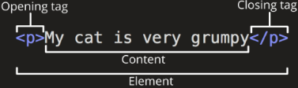
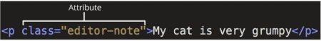
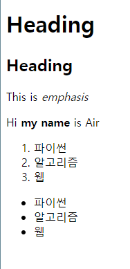
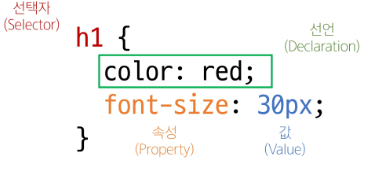
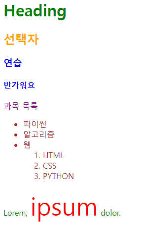

# Web

- World Wide Web (www) = 인터넷으로 연결된 컴퓨터들이 정보를 공유하는 거대한 정보 공간
- Web = Web site, Web application 등을 통해 사용자들이 정보를 검색하고 상호 작용하는 기술
- Web site = 인터넷에서 여러 개의 web page가 모인 것으로, 사용자들에게 정보나 서비스를 제공하는 공간
- Web page = HTML, CSS등의 웹 기술을 이용하여 만들어진, web site를 구성하는 하나의 요소
- 웹페이지 구성 요소
    - HTML : Structure
    - CSS : Styling
    - Javascript : Behavior


## 웹 구조화

### HTML

Hyper Text Markup Language ⇒ 웹페이지의 **의미**와 **구조를 정의**하는 언어

- Hypertext = 웹 페이지를 다른 페이지로 연결하는 링크
    - 참조를 통해 사용자가 한 문서에서 다른 문서로 즉시 접근할 수 있는 텍스트
    - 장점 = 선형적인 구조가 사라짐 (선형적인 구조 = 페이지를 이전, 앞만 이동 가능)
- Markup Language = 태그 등을 이용하여 문서나 데이터의 구조를 명시하는 언어
    - HTML, Markdown

### HTML의 구조

```html
<!DOCTYPE html>
<html lang="en">
<head>
	<meta charset="UTF-8">
	<title>My page</title>
</head>
<body>
	<p>This is my page</p>
</body>
</html>
```

`<!DOCTYPE html>`  : 해당 문서가 html로 문서라는 것을 나타냄

`<html></html>` : 전체 페이지의 콘텐츠를 포함

`<title></title>`  : 브러우저 탭 및 즐겨찾기 시 표시되는 제목으로 사용

`<head></head>`  : HTML, 문서에 관련된 설명, 설정 등을 나타냄. 사용자에게 보이지 않음

`<body></body>`  : 페이지에 표시되는 모든 콘텐츠

#### HTML 요소(element)
    


- 하나의 요소는 여는 태그와 닫는 태그 그리고 그 안의 내용으로 구성
- 닫는 태그는 이름 앞에 슬래시가 포함되며 닫는 태그가 없는 태그도 존재

#### HTML 속성(attributes)



- 규칙
    - 속성은 요소 이름과 속성 사이에 공백이 있어야 함
    - 하나 이상의 속성들이 있는 경우엔 속성 사이에 공백으로 구분함
    - 속성 값은 열고 닫는 따옴표로 감싸야 함
- 목적
    - 나타내고 싶지 않지만 추가적인 기능, 내용을 담고 싶을때 사용
    - CSS에서 해당 요소를 선택하기 위한 값으로 활용
        


### 텍스트 구조

HTML의 주요 목적 중 하나는 **텍스트 구조와 의미**를 제공하는 것

- 예를 들어 h1 요소는 단순히 텍스트를 크게만 만드는 것이 아닌 현재 문서의 **최상위 제목**이라는 의미를 부여하는 것

- 대표적인 HTML text structure
    - Heading & Paragraphs : h1~6, p
    - Lists : ol, ul, li
    - Emphasis & Importance : em, strong
    
    ```html
    <body>
        <h1>Heading</h1>
        <h2>Heading</h2>
        <p>This is <em>emphasis</em></p>
        <p>Hi <strong>my name</strong> is Air</p>
        <ol>
            <li>파이썬</li>
            <li>알고리즘</li>
            <li>웹</li>
        </ol>
        <ul>
            <li>파이썬</li>
            <li>알고리즘</li>
            <li>웹</li>
        </ul>
    </body>
    ```
    
    
    

`` : alt 속성은 이미지를 보여줄 수 없을 때 해당 이미지를 대체할 텍스트를 명시

mdn : 개발자 네트워크 사이트 → 웹 표준을 정리해놓음 


## 웹 스타일링

### CSS

Cascading Style Sheet. 웹 페이지의 디자인과 레이아웃을 구성하는 언어



### CSS 적용 방법

1. 인라인(Inline) 스타일 시트
    - HTML 요소 안에 style 속성 값으로 작성
2. 내부(Internal) 스타일 시트
    - head 태그 안에 style 태그에 작성
3. 외부(external) 스타일 시트
    - 별도의 css 파일 생성 후 HTML link 태그를 사용해 불러오기

```html
<head>
  <meta charset="UTF-8">
  <meta name="viewport" content="width=device-width, initial-scale=1.0">
  <title>Document</title>
  <style>
    h2{
      color: white;
      background-color: black;
    }
  </style>
  <link rel="stylesheet" href="style.css">
</head>

<body>
  <h1 style="color: blue; background-color: yellow;">Inline Style</h1>
  <h2>Internal Style</h2>
  <h3>External Style</h3>
</body>
```

```css
/* style.css */
h3 {
  color: brown;
}
```

internal과 external을 주로 사용함!!!!

### CSS 선택자

HTML 요소를 선택하여 스타일을 적용할 수 있도록 하는 선택자

- 종류
    - 기본 선택자
        - 전체(*) 선택자
        - 요소(tag) 선택자
        - 클래스(class) 선택자
        - 아이디(id) 선택자
        - 속성(attr) 선택자
    - 결합자
        - 자손 (” ” (space))
        - 자식 (>)
- 특징
    - 전체 선택자 (`*`) : HTML 모든 요소를 선택
    - 요소 선택자 : 지정한 모든 태그를 선택
    - 클래스 선택자(`.`) : 주어진 클래스 속성을 가진 모든 요소를 선택
    - 아이디 선택자(`#`) : 주어진 아이디 속성을 가진 요소 선택. 문서에는 주어진 아이디를 가진 요소가 하나만 있어야 함
    - 자손 결합자(` `) : 첫 번째 요소의 자손 요소들 선택
        - ex) `p span` 은 `<p>`안에 있는 모든 `<span>`을 선택
    - 자식 결합자(`>`) : 첫 번쨰 요소의 직계 자식만 선택

```html
<!DOCTYPE html>
<html lang="en">

<head>
  <meta charset="UTF-8">
  <meta http-equiv="X-UA-Compatible" content="IE=edge">
  <meta name="viewport" content="width=device-width, initial-scale=1.0">
  <title>Document</title>
  <style>
    * {
      color: red;
    }

    h2 {
      color: orange;
    }

    h3, 
    h4 {
      color: blue;
    }

    .green {
      color: green;
    }

    #purple {
      color: purple;
    }
    .green > span {
      font-size: 50px;
    }

    .green li {
      color: brown;
    }

  </style>
</head>

<body>
  <h1 class="green">Heading</h1>
  <h2>선택자</h2>
  <h3>연습</h3>
  <h4>반가워요</h4>
  <p id="purple">과목 목록</p>
  <ul class="green">
    <li>파이썬</li>
    <li>알고리즘</li>
    <li>웹
      <ol>
        <li>HTML</li>
        <li>CSS</li>
        <li>PYTHON</li>
      </ol>
    </li>
  </ul>
  <p class="green">Lorem, <span>ipsum</span> dolor.</p>
</body>

</html>

```



### 명시도

결과적으로 요소에 적용할 css 선언을 결정하기 위한 알고리즘

- CSS selector에 가중치를 계산하여 어떤 스타일을 적용할지 결정
- 동일한 요소를 가리키는 2개 이상의 css 규칙이 있는 경우 가장 높은 명시도를 가진 selector가 승리하여 스타일 적용

- Cascade(계단식) : 한 요소에 **동일한 가중치**를 가진 선택자가 적용될 때 css에서 **마지막에 나오는 선언**이 사용됨
    
    ```css
    h1{
    	color: red;
    }
    h1 {
    	color: purple;
    }
    
    /* h1에는 purple이 적용됨 */
    
    /* ------------------------------ */
    
    .make-red {
    	color: red;
    }
    h1 {
    	color: purple;
    }
    
    /* h1에 make-red 클래스가 있다면 h1은 red 적용*/
    ```
    
- `!important`
    - 다른 우선순위 규칙보다 우선하여 적용하는 키워드
    - cascade 구조를 무시하고 강제로 스타일을 적용하는 방식이므로 사용을 권장하지 않음


#### ⭐ 우선 순위

1. Importance
2. Inline 스타일
3. 선택자
    - id > class > 요소
4. 소스 코드 선언 순서

<br>

```html

<head>
  <meta charset="UTF-8">
  <meta http-equiv="X-UA-Compatible" content="IE=edge">
  <meta name="viewport" content="width=device-width, initial-scale=1.0">
  <title>Document</title>
  <style>
    h2 {
      color: darkviolet !important;
    }

    p {
      color: blue;
    }

    .orange {
      color: orange;
    }

    .green {
      color: green;
    }

    #red {
      color: red;
    }
  </style>
</head>

<body>
  <p>1</p>
  <p class="orange">2</p>                 <!--orange-->
  <p class="green orange">3</p>           <!--orange-->
  <p class="orange green">4</p>           <!--green-->
  <p id="red" class="orange">5</p>        <!--red-->
  <h2 id="red" class="orange">6</h2>      <!--darkviolet-->
  <p id="red" class="orange" style="color: brown;">7</p>      <!--brown-->
  <h2 id="red" class="orange" style="color: brown;">8</h2>    <!--darkviolet-->
</body>
```

### 상속

CSS는 상속을 통해 부모 요소의 속성을 자식에게 상속해 재사용성 높임

- 상속 되는 속성 : text 관련 요소(font, color, text-align), opacity, visibility등
- 상속 되지 않는 속성 : box model 관련 요소, position 관련 요소

```html
<head>
  <meta charset="UTF-8">
  <meta name="viewport" content="width=device-width, initial-scale=1.0">
  <title>Document</title>
  <style>
    .parent {
      color: #ff0000;             /* 상속 되는 속성*/
      border: 1px solid black;    /* 상속 되지 않는 속성*/
    }
  </style>
</head>

<body>
  <ul class="parent">
    <li class="child">Hello</li>
    <li class="child">Bye</li>
  </ul>
</body>
```


## 참고

### html 관련 사항

- 태그 이름은 대소문자를 구분하지 않지만 소문자 사용 권장
- 속성의 따옴표는 작은 따옴표와 큰따옴표 구분하지 않지만 큰따옴표 권장
- 에러를 반환하지 않기 때문에 작성시 주의