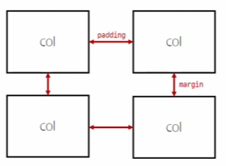
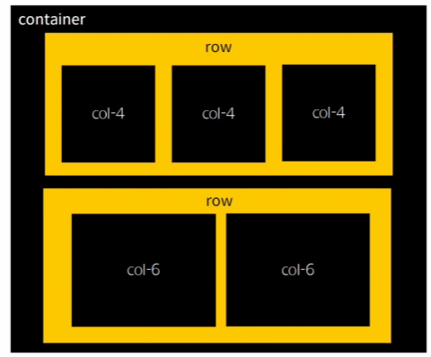
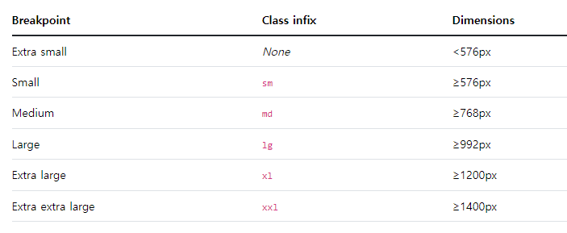

# Responsive Web

디바이스 종류나 화면 크기에 상관없이, 어디서든 일관된 레이아웃 및 사용자 경험을 제공하는 디자인 기술

## bootstrap grid system

웹 페이지의 레이아웃을 조정하는데 사용되는 **12개의 컬럼**으로 구성된 시스템

- Grid system 목적
    - 반응형 디자인을 지원해 웹 페이지를 모바일, 태블릿, 데스크탑 등 다양한 기기에서 적절하게 표시할 수 있도록 도움

## grid system 구조

1. container : column들을 담고 있는 공간
    
2. Column : 실제 컨텐츠를 포함하는 부분

3. Gutter : 컬럼과 컬럼 사이의 여백 영역

- 1개의 row안에 12개의 column 영역이 구성
    - 각 요소는 12개 중 몇 개를 차지할 것인지 지정됨

- Gutters
    - grid system에서 column 사이에 여백 영역
    - x축은 padding, y축은 margin으로 여백 생성
    
    
    

## 참고

### The grid system

- CSS가 아닌 편집 디자인에서 나온 개념으로 구성 요소를 잘 배치해서 시각적으로 좋은 결과물을 만들기 위함
- 기본적으로 안쪽에 있는 요소들의 오와 열을 맞추는 것에서 기인
- 정보 구조와 배열을 체계적으로 작성하여 정보의 질서를 부여하는 시스템
    
    
    

## Grid system for responsive web

bootstrap grid system에서는 12개의 column과 6 breakpoints를 사용하여 반응형 웹 디자인을 구현

### grid system breakpoints

웹 페이지를 다양한 화면 크기에서 적절하게 배치하기 위한 분기점

- 화면 너비에 따라 6개의 분기점 제공 (xs, sm, md, lg, xl, xxl)
- 각 breakpoints마다 설정된 최대 너비 값 이상으로 화면이 커지면 grid system 동작이 변경됨
    
    

## 참고

### Grid cards

row-cols 클래스를 사용하여 행당 표시할 열(카드) 수를 손쉽게 제어할 수 있음

### VScode 단축어 정리

1. ctrl + l : 한 줄 선택
2. ctrl + d : 동일한 키워드 연속 선택
3. ctrl + alt + 화살표 : 멀티 커서
4. alt + 클릭 : 멀티 커서
5. alt + 화살표 : 선택한 라인 이동
6. alt + shift + 화살표 : 선택한 라인 복사