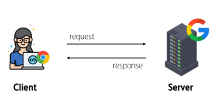
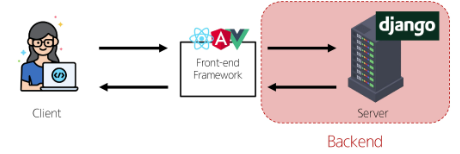
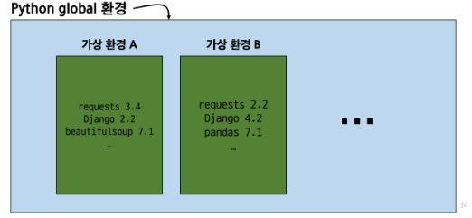
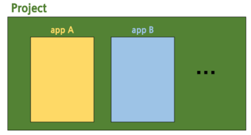

## Web Application

### Web service 개발

인터넷을 통해 사용자에게 제공되는 소프트웨어 프로그램을 구축하는 과정

- 다양한 디바이스(모바일, 태블릿, PC등)에서 웹 브라우저를 통해 접근하고 사용할 수 있음

### 클라이언트-서버
- 클라이언트
    - 서비스를 요청하는 주체
    - 웹 사용자의 인터넷이 연결된 장치, 웹 브라우저
- 서버
    - 클라이언트의 요청에 응답하는 주체
    - 웹페이지, 앱을 저장하는 컴퓨터

- 우리가 웹 페이지를 보게 되는 과정
    
    
    
    1. 웹 브라우저(**클라이언트**)에서 ‘google.com’을 입력
    2. 브라우저는 인터넷에 연결된 전세계 어딘 가에 있는 구글 컴퓨터(**서버**)에게 ‘google 홈페이지.html’ 파일을 달라고 요청
    3. 요청을 받은 구글 컴퓨터는 데이터베이스에서 ‘google 홈페이지.html’ 파일을 찾아 응답
    4. 전달받은 ‘google 홈페이지.html’ 파일을 사람이 볼 수 있도록 웹 브라우저가 해석해주면서 사용자는 구글의 메인 페이지를 보게 됨
    

### Frontend & Backend

- 프론트엔드
    - 사용자의 인터페이스(UI)를 구성하고, 사용자가 애필리케이션과 상호작용할 수 있도록 함
    - HTML, CSS, JavaScript, 프론트엔드 프레임워크 등
- 백엔드
    - 서버 측에서 동작하며, 클라이언트의 요청에 대한 처리와 데이터베이스와의 상호작용 등을 담당
    - 서버 언어(Python, Java 등) 및 백엔드 프레임워크, 데이터베이스, API, 보안 등
    
    
    

## Framwork

### web framwork

웹 애플리케이션을 빠르개 개발할 수 있도록 도와주는 도구

- 개발에 필요한 기본 구조, 규칙, 라이브러리 등을 제공

### Django framwork

Python 기반의 대표적인 웹 프레임워크

- 사용 이유
    - 다양성
        - python 기반으로 소셜 미디어 및 빅데이터 관리 등 광범위한 서비스 개발에 적함
    - 확장성
        - 대량의 데이터에 대해 빠르고 유연하게 확장할 수 있는 기능을 제공
    - 보안
        - 취약점으로 보호하는 보안 기능이 기본적으로 내장되어 있음
    - 커뮤니티 지원
        - 개발자를 위한 지원, 문서 및 업데이트를 제공하는 활성화 된 커뮤니티

### 가상 환경

python 애플리케이션과 그에 따른 패키지들을 격리하여 관리할 수 있는 **독립적인** 실행 환경

1. 가상 환경 venv 생성
    
    `$ python -m venv venv`
    
    - 마지막 venv가 가상환경 이름
2. 가상 환경 활성화
    
    `$ source venv/Scripts/activate`
    
3. 환경에 설치된 패키지 목록 확인
    
    `$ pip list`  
    
    - 가상환경에 대한 정보가 공유되어야 함
4. 의존성 패키지 목록 생성
    
    `$ pip freeze > requirements.txt`
    

- 의존성 패키지
    - 한 소프트웨어 패키지가 다른 패키지의 기능이나 코드를 사용하기 때문에 그 패키지가 존재해야만 제대로 작동하는 관계
    - 사용하려는 패키지가 설치되지 않았거나, 호환되는 버전이 아니면 오류가 발생하거나 예상치 못한 동작을 보일 수 있음
- 의존성 패키지 관리의 중요성
    - 개발 환경에서는 각각의 프로젝트가 사용하는 패키지와 그 버전을 정확히 관리하는 것이 중요

### 가상 환경을 사용하는 이유

- 의존성 관리
    - 라이브러리 및 패키지를 각 프로젝트마다 독립적으로 사용 가능
- 팀 프로젝트 협업
    - 모든 팀원이 동일한 환경과 의존성 위에서 작업하여 버전간 충돌을 방지

### LTS(Long-Term Support)

- 프레임워크나 라이브러리 등의 소프트웨어에서 장기간 지원되는 안정적인 버전을 의미할 때 사용
- 기업이나 대규모 프로젝트에서는 소프트웨어 업그레이드에 많은 비용과 시간이 필요하기 ㄸ매ㅜㄴ에 안정적이고 장기간 지원되는 버전이 필요

### Django_full stack framework

풀스택이 맞긴 하지만 frontend 기능은 다른 전문적인 프레임워크들에 비해 미흡하므로 백엔드 쪽에 속한다고 볼 수 있음

## Django Design Pattern

### 디자인 패턴

소프트웨어 설계에서 발생하는 문제를 해결하기 위해 일반적ㅇ니 해결책

- 공통적인 문제를 해결하는데 쓰이는 형식화 된 관행

### MVC 디자인 패턴

(Model, View, Controller)

애플리케이션을 구조화하는 대표적인 패턴

- 데이터 & 사용자 인터페이스 & 비즈니스 로직을 분리
- 시각적 요소와 뒤에서 실행되는 로직을 서로 영향없이, 독립적이고 쉽게 유지 보수 할 수 있는 애플리케이션을 만들기 위해

### MTV 디자인 패턴

Model, Template, View

Django에서 애플리케이션을 구조화하는 패턴

- 기존 MVC패턴과 동일하나 단순히 명칭을 다르게 정의한 것
    - View → Template
    - Controller → View

### 프로젝트와 앱

- Django project
    - 애플리케이션의 집합
    - DB 설정, URL 연결, 전체 앱 설정 등을 처리
- Django application
    - 독립적으로 작동하는 기능 단위 모듈
    - 각자 특정한 기능을 담당하며 다른 앱들과 함께 하나의 프로젝트를 구성
    
    
    
- 앱 사용 순서
    1. 앱 생성
        
        `$ python manage.py startapp articles` 
        
        - 앱 이름은 복수형으로 지정하는 것을 권장
        - 여기서는 articles가 앱 이름!
    2. 앱 등록
        - 반드시 앱을 생성한 후에 등록해야 함!!!!
            

### 프로젝트 구조

- settings.py
    - 프로젝트의 모든 설정을 관리
- urls.py
    - 요청 들어오는 URL에 따라 이에 해당하는 적절한 views를 연결
- `__init__.py`
    - 해당 폴더를 패키지로 인식하도록 설정하는 파일
- asgi.py
    - 비동기식 웹 서버와의 연결 관련 설정
- wsgi.py
    - 웹 서버와의 연결 관련 설정
- manage.py
    - Django 프로젝트와 다양한 방법으로 상호작용하는 커맨드라인 유틸리티

### 앱 구조

- admin.py
    - 관리자용 페이지 설정
- models.py
    - DB와 관련된 Model을 정의
    - MTV 패턴의 M
- view.py
    - HTTP 요청을 처리하고 해당 요청에 대한 응답을 반환
    - MTV 패턴의 V
- apps.py
    - 앱의 정보가 작성된 곳
- test.py
    - 프로젝트 테스트 코드를 작성하는 곳

### 요청과 응답

1. URLs
    - [http://127.0.0.1:8000/index/](http://127.0.0.1:8000/index/로) 로 요청이 왔을 때 views 모듈의 view 함수 index를 호출
        
2. View
    - 특정 경로에 있는 template과 request 객체를 결합해 응답 객체를 반환하는 index view 함수 정의
    - 모든 view 함수는 첫번째 인자로 request 요청 객체를 필수적으로 받음
    - 매개변수 이름이 request가 아니여도 되지만 그렇게 작성하지 않음

        
3. Template
    1. articles 앱 폴더 안에 templates 폴더 생성
        폴더명은 반드시 templates 여야 함!!!!
        
    2. templates 폴더 안에 articles 폴더 생성
    3. articles 폴더 안에 템플릿 파일 생성

# 참고

ctrl + c : 서버 종료