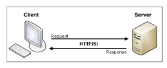

## Template System

데이터 표현을 제어하면서, 표현과 관련된 부분을  담당

- HTML의 콘텐츠를 변수 값에 따라 바꾸고 싶다면
    
    ```py
    def index(request):
    context = {
        'name' : 'Alice',
    }
    return render(request, 'articles/index.html',context)
    ```

### Django Template Language(DTL)

Template에서 조건, 반복, 변수 등의 프로그래밍적 기능을 제공하는 시스템

### DTL Syntax

1. Variable
    - render 함수의 세번째 인자로 딕셔너리 데이터를 사용
    - 딕셔너리 key에 해당하는 문자열이 template에서 사용 가능한 변수명이 됨
    - dot(`.`)을 사용하여 변수 속성에 접근할 수 있음
2. Filters
    - 표시할 변수를 수정할 때 사용 (변수 + | + 필터)
    - chained(연결)이 가능하며 일부 필터는 인자를 받기도 함
    - 약 60개의 built-in template filters를 제공
        
        [https://docs.djangoproject.com/en/5.0/ref/templates/builtins/](https://docs.djangoproject.com/en/5.0/ref/templates/builtins/)
        
3. Tags
    - 반복 또는 논리를 수행하여 제어 흐름을 만듦
    - 일부 태그는 시작과 종료 태그가 필요
    - 약 24개의 built-in template tags를 제공
4. Comments
    - DTL에서의 주석
    

### 템플릿 상속

**페이지의 공통요소를 포함**하고, **하위 템플릿이 재정의 할 수 있는 공간**을 정의하는 기본 ‘skeleton’ 템플릿을 작성하여 상속 구조를 구축

- ‘extends’ tag :
    - 자식 템플릿이 부모 템플릿을 확장한다는 것을 알림
    - 반드시 자식 템플릿 최상단에 작성되어야 함
- ‘block’ tag :
    - 하위 템플릿에서 재정의 할 수 있는 블록을 정의
    - 상위 템플릿에서 작성하며 하위 템플릿이 적성할 수 있는 공간을 지정하는 것

## HTML form (요청과 응답)

HTTP 요청을 서버에 보내는 가장 편리한 방법



### ‘form’ element

사용자로부터 할당된 데이터를 서버로 전송

- ‘action’ & ‘method’
    
    데이터를 어디(action)로 어떤 방식(method)으로 요청할지
    
    form의 핵심 속성 2가지
    
    - action
        - 입력 데이터가 전송될 URL을 지정(목적지)
        - 이 속성을 지정하지 않으면 데이터는 현재 form이 있는 페이지의 URL로 보내짐
    - method
        - 데이터를 어떤 방식으로 보낼 것인지 정의
        - 데이터의 HTTP request methods(GET, POST)를 지정
        - GET은 URL에 노출되고
        - POST는 노출되지 않는다 → 로그인에 사용하겠져??
- ‘input’ element
    - 사용자의 데이터를 입력 받을 수 있는 요소
    - type 속성 값에 따라 다양한 유형의 입력 데이터를 받음
- ‘name’ attribute
    - 입력한 데이터에 붙이는 이름(key)
    - 데이터를 제출했을 때 서버는 name 속성에 설정된 값을 통해서만 사용자가 입력한 데이터에 접근할 수 있음

- Query String Parameters
    - 사용자의 입력 데이터를 URL 주소에 파라미터를 통해 서버로 보내는 방법
    - 문자열은 앰퍼샌드(&)로 연결된 key=value쌍으로 구성되며, 기본 URL과는 물음표(?)로 구분됨
    - ex) `http://host:port/path**?key=value&key=value**`
    

### form 활용

- HTTP request 객체
    - form으로 전송한 데이터 뿐만 아니라 모든 요청 관련 데이터가 담겨있음
    - view 함수의 첫번째 인자

## Django URLs


- URL dispatcher
    - URL 패턴을 정의하고 해당 패턴이 일치하는 요청을 처리할 view함수를 연결(매핑)

### 변수와 URL

- Variable Routing
    - URL 일부에 변수를 포함시키는 것
    - 변수는 view 함수의 인자로 전달 할 수 있음
    - `<path_converter:variable_name>`
- path converters
    - URL 변수의 타입을 지정
    - str, int등 5가지 타입 지원