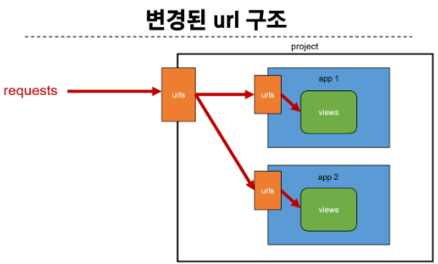

# Django URLs

### URL dispatcher

URL 패턴을 정의하고 해당 패턴이 일치하는 요청을 처리할 view함수를 연결(매핑)

## APP과 URL

### App URl mapping

각 앱에 URL을 정의하는 것

- 프로젝트와 각 앱이 URL을 나누어 관리를 편하게 하기 위함
    
    
    
- `include()`
    - 프로젝트 내부 앱들이 URL을 참조할 수 있도록 매핑하는 함수
    - URL의 일치하는 부분까지 잘라내고, 남은 문자열 부분은 후속 처리를 위해 include된 URL로 전달

### Naming URL patterns

URL에 이름을 지정하는 것

- path함수의 name 인자를 정의해서 사용
- URl 표기 변화
    - a태그의 href 속성 값 뿐만 아니라 form의 action 속성처럼 url을 작성하는 모든 위치에서 변경
- ‘url’ tag
    - ``
    - 주어진 URL 패턴의 이름과 일치하는 절대 경로 주소를 반환

## URL 이름 공간

- 단순히 이름만으로는 완벽하게 분리할 수 없어서 이름에 key를 붙이는 것
- app_name 속성을 지정 한 후 url 태그가 사용하는 모든 곳의 표기를 변경

# Model

DB의 테이블을 정의하고 데이터를 조작할 수 있는 기능들을 제공

테이블 구조를 설계하는 청사진(blueprint)

- 모델 클래스는 최종적으로 DB에 테이블 구조를 만듦
- django.db.models 모듈의 Model이라는 부모 클래스를 상속받음
- 테이블 구조를 어떻게 설계할 지에 대한 코드만 작성하도록 하기 위한 것(상속을 활용한 프레임워크의 기능 제공)
    1. 클래스 변수명 : 테이블의 각 필드(열) 이름
    2. model Field 클래스 : 테이블 필드의 데이터 타입
    3. model Field 클래스의 키워드 인자 : 테이블 필드의 제약조건 관련 설정
- 제약 조건
    - 데이터가 올바르게 저장되고 관리되도록 하기 위한 규칙

## Migrations

model 클래스의 변경사항(필드 생성, 수정 삭제 등)을 DB에 최종 반영하는 방법
  

- 핵심 명령어 2가지
    - `python [manage.py](http://manage.py) makemigrations`
        - model cass를 기반으로 최종 설계도(migration) 작성
    - `python [manage.py](http://manage.py) migrate`
        - 최종 설계도를 DB에 전달하여 반영

- 추가 모델 필드 작성
    - 이미 기존 테이블이 존재하기 때문에 필드를 추가할 때 필드의 기본 값 설정이 필요
        
- model class에 **변경사항**이 생겼다면, 반드시 새로운 설계도를 **생성**하고, 이를 DB에 **반영**해야한다.
    1. model class 변경 → 2. makemigrations → 3. migrate

## 모델 필드

DB 테이블의 필드(열)을 정의하며, 해당 필드에 저장되는 데이터 타입과 제약조건을 정의

- CharField()
    - 길이의 제한이 있는 문자열을 넣을 때 사용
    - 필드의 최대 길이를 결정하는 max_length는 필수 인자
- TextField()
    - 글자의 수가 많을 때 사용
- DataTimeField()
    - 날짜와 시간을 넣을 때 사용
    - 선택인자
        - auto_now : 데이터가 저장될 때마다 자동으로 현재 날짜시간을 저장
        - auto_now_add : 데이터가 처음 생성될 때만 자동으로 현재 날짜시간을 저장
        

## Admin site

- Automatic admin interface
    - Django는 추가 설치 및 설정 없이 자동으로 관리자 인터페이스를 제공
    - 데이터 확인 및 테스트 등을 진항하는데 매우 유용
1. admin 계정 생성
    - `python [manage.py](http://manage.py) createsuperuser`
    - email은 선택사항이기 때문에 입력하지 않고 진행 가능
    - 비밀번호 입력시 보안상 터미널에 출력되지 않으니 무시하고 입력 이어가기
2. DB에 생성된 admin 계정 확인
3. admin에 모델 클래스 등록
    - admin.py에서 작성한 모델 클래스를 등록해야만 admin site에서 확인 가능
4. admin site 로그인 후 등록된 모델 클래스 확인
5. 데이터 생성, 수정, 삭제 테스트
6. 테이블 확인