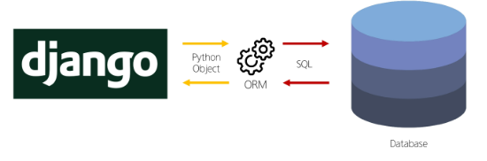
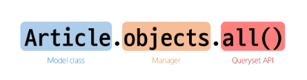

## ORM

Object-Relational-Mapping

객체 지향 프로그래밍 언어를 사용하여 호환되지 않는 유형의 시스템 간에 데이터를 변환하는 기술

### ORM의 역할

django와 database는 사용하는 언어가 다르기 때문에 소통 불가능

→ Django에 내장된 ORM이 중간에서 이를 해석

## QuerySet API

ORM에서 데이터를 검색, 필터링, 정렬 및 그룹화 하는데 사용하는 도구

- API를 사용하여 SQL이 아닌 **Python 코드로 데이터를 처리**
- QuerySet API 구문
  

### Query

- 데이터베이스에 특정한 데이터를 보여 달라는 요청
- “쿼리문을 작성한다” = 원하는 데이터를 얻기 위해 데이터베이스에 요청을 보낼 코드를 작성한다.
- 파이썬으로 작성한 코드가 ORM에 의해 SQL로 변환되어 데이터베이스에 전달되며, 데이터베이스의 응답 데이터를 ORM이 QuerySet이라는 자료 형태로 변환하여 우리에게 전달

### QuerySet

- 데이터베이스에게서 전달 받은 **객체 목록**(데이터 모음)
  - 순회 가능한 데이터로써 1개 이상의 데이터를 불러와 사용할 수 있음
- Django ORM을 통해 만들어진 자료형
- 단, 데이터베이스가 단일한 객체를 반환할 때는 QuerySet이 아닌 모델(Class)의 인스턴스로 반환됨

### 즉, QuerySet API는

python의 모델 클래스와 인스턴스를 활용해 DB에 데이터를 저장, 조회, 수정, 삭제(CRUD)하는 것!!!

## 실습

### create

- Django shell
  - Django환경 안에서 실행되는 python shell
  - terminal창에 python -i 후 작성하면 shell이 작성됨
  - 입력하는 QuerySet API 구문이 Django 프로젝트에 영항을 미침
  - 실행은, `python manage.py shell_plus`
  - 나가는 법은 `exit()`
- 데이터 객체를 만드는(생성하는) 3가지 방법

  1. 특정 테이블에 새로운 행을 추가하여 데이터 추가

  2. 테이블에 한줄(행)이 쓰여진 것

  3. create() 메서드 활용
     - save까지 한번에 해줌!!!

- save()
  - 객체를 데이터베이스에 저장하는 메서드

### Read

- 대표적인 조회 메서드

  - return new QuerySet
    - all() : 전체 데이터 조회
    - filter() : 특정 조건 데이터 조회
  - do not return QuerySet
    - get() : **단일** 데이터 조회

- get() 특징
  - 객체를 찾을 수 없으면 DoesNotExist 예외를 발생시키고,
  - 둘 이상의 객체를 찾으면 MultipleObjectsReturned 예외를 발생시킴
  - 위와 같은 특징을 가지고 있기 때문에 primary key와 같이 **고유성을 보장하는 조회에서 사용해야 함**

### update

인스턴스 변수를 변경 후 save 메서드 호출

### delete

삭제하려는 데이터 조회 후 delete 메서드 호출
삭제 후 pk값을 재사용하지 않음!!!

## QuerySet API 사용 이유

- 데이터베이스 쿼리를 추상화하여 Django 개발자가 데이터베이스와 직접 상호작용하지 않아도 되도록 함
- 데이터베이스와의 결합도를 낮추고 개발자가 더욱 직관적이고 생산적으로 개발할 수 있도록 도움
